# Sơ đồ lớp hệ thống WorkSphere

## Tổng quan

Hệ thống WorkSphere là một ứng dụng quản lý công việc với các module chính:

- **Quản lý người dùng**: User, Role, Permission
- **Quản lý dự án**: Project, ProjectMember, Version
- **Quản lý công việc**: Task, Tracker, Status, Priority
- **Theo dõi thời gian**: TimeLog, TimeEntryActivity
- **Hệ thống phụ trợ**: Notification, AuditLog, Comment, Attachment

---

## 1. Danh sách các lớp (Classes) với Thuộc tính và Phương thức

### 1.1. User Management

#### User

| Thuộc tính      | Kiểu     | Visibility | Mô tả                     |
| --------------- | -------- | ---------- | ------------------------- |
| id              | String   | +          | Khóa chính (CUID)         |
| email           | String   | +          | Email (unique)            |
| name            | String   | +          | Họ tên                    |
| password        | String   | -          | Mật khẩu (private)        |
| avatar          | String?  | +          | Ảnh đại diện              |
| isAdministrator | Boolean  | +          | Là quản trị viên hệ thống |
| isActive        | Boolean  | +          | Trạng thái hoạt động      |
| createdAt       | DateTime | +          | Ngày tạo                  |
| updatedAt       | DateTime | +          | Ngày cập nhật             |

| Phương thức       | Tham số                           | Trả về | Mô tả                      |
| ----------------- | --------------------------------- | ------ | -------------------------- |
| +getAll()         | -                                 | User[] | Lấy danh sách tất cả users |
| +getById(id)      | id: String                        | User   | Lấy user theo ID           |
| +create(data)     | data: CreateUserInput             | User   | Tạo user mới               |
| +update(id, data) | id: String, data: UpdateUserInput | User   | Cập nhật user              |
| +delete(id)       | id: String                        | void   | Xóa user                   |

---

### 1.2. RBAC (Role-Based Access Control)

#### Role

| Thuộc tính       | Kiểu     | Visibility | Mô tả                               |
| ---------------- | -------- | ---------- | ----------------------------------- |
| id               | String   | +          | Khóa chính                          |
| name             | String   | +          | Tên vai trò (unique)                |
| description      | String?  | +          | Mô tả                               |
| isActive         | Boolean  | +          | Trạng thái hoạt động                |
| assignable       | Boolean  | +          | Có thể được gán công việc           |
| canAssignToOther | Boolean  | +          | Có thể gán công việc cho người khác |
| createdAt        | DateTime | +          | Ngày tạo                            |
| updatedAt        | DateTime | +          | Ngày cập nhật                       |

| Phương thức                  | Tham số                                      | Trả về | Mô tả               |
| ---------------------------- | -------------------------------------------- | ------ | ------------------- |
| +getAll()                    | -                                            | Role[] | Lấy danh sách roles |
| +getById(id)                 | id: String                                   | Role   | Lấy role theo ID    |
| +create(data)                | data: CreateRoleInput                        | Role   | Tạo role mới        |
| +clone(role)                 | role: Role                                   | Role   | Nhân bản role       |
| +update(id, data)            | id: String, data: UpdateRoleInput            | Role   | Cập nhật role       |
| +delete(id)                  | id: String                                   | void   | Xóa role            |
| +updatePermissions(id, data) | id: String, data: UpdateRolePermissionsInput | void   | Cập nhật quyền      |
| +updateTrackers(id, data)    | id: String, data: UpdateRoleTrackersInput    | void   | Cập nhật trackers   |

#### Permission

| Thuộc tính  | Kiểu     | Visibility | Mô tả             |
| ----------- | -------- | ---------- | ----------------- |
| id          | String   | +          | Khóa chính        |
| key         | String   | +          | Mã quyền (unique) |
| name        | String   | +          | Tên quyền         |
| description | String?  | +          | Mô tả             |
| module      | String   | +          | Module thuộc về   |
| createdAt   | DateTime | +          | Ngày tạo          |

| Phương thức          | Tham số        | Trả về       | Mô tả                     |
| -------------------- | -------------- | ------------ | ------------------------- |
| +getAll()            | -              | Permission[] | Lấy danh sách permissions |
| +getByModule(module) | module: String | Permission[] | Lấy theo module           |

#### RolePermission (Association Class)

| Thuộc tính   | Kiểu     | Visibility | Mô tả           |
| ------------ | -------- | ---------- | --------------- |
| id           | String   | +          | Khóa chính      |
| roleId       | String   | +          | FK → Role       |
| permissionId | String   | +          | FK → Permission |
| createdAt    | DateTime | +          | Ngày tạo        |

#### RoleTracker (Association Class)

| Thuộc tính | Kiểu     | Visibility | Mô tả        |
| ---------- | -------- | ---------- | ------------ |
| id         | String   | +          | Khóa chính   |
| roleId     | String   | +          | FK → Role    |
| trackerId  | String   | +          | FK → Tracker |
| createdAt  | DateTime | +          | Ngày tạo     |

---

### 1.3. Task Configuration

#### Tracker

| Thuộc tính  | Kiểu     | Visibility | Mô tả                                |
| ----------- | -------- | ---------- | ------------------------------------ |
| id          | String   | +          | Khóa chính                           |
| name        | String   | +          | Tên loại công việc (Bug, Feature...) |
| description | String?  | +          | Mô tả                                |
| position    | Int      | +          | Thứ tự hiển thị                      |
| isDefault   | Boolean  | +          | Là mặc định                          |
| createdAt   | DateTime | +          | Ngày tạo                             |
| updatedAt   | DateTime | +          | Ngày cập nhật                        |

| Phương thức       | Tham số                              | Trả về    | Mô tả                  |
| ----------------- | ------------------------------------ | --------- | ---------------------- |
| +getAll()         | -                                    | Tracker[] | Lấy danh sách trackers |
| +create(data)     | data: CreateTrackerInput             | Tracker   | Tạo tracker mới        |
| +update(id, data) | id: String, data: UpdateTrackerInput | Tracker   | Cập nhật tracker       |
| +delete(id)       | id: String                           | void      | Xóa tracker            |
| +setDefault(id)   | id: String                           | void      | Đặt làm mặc định       |

#### Status

| Thuộc tính       | Kiểu     | Visibility | Mô tả                                |
| ---------------- | -------- | ---------- | ------------------------------------ |
| id               | String   | +          | Khóa chính                           |
| name             | String   | +          | Tên trạng thái (New, In Progress...) |
| description      | String?  | +          | Mô tả                                |
| position         | Int      | +          | Thứ tự hiển thị                      |
| isClosed         | Boolean  | +          | Là trạng thái đóng                   |
| isDefault        | Boolean  | +          | Là mặc định                          |
| defaultDoneRatio | Int?     | +          | Tỷ lệ hoàn thành mặc định            |
| createdAt        | DateTime | +          | Ngày tạo                             |
| updatedAt        | DateTime | +          | Ngày cập nhật                        |

| Phương thức       | Tham số                             | Trả về   | Mô tả                  |
| ----------------- | ----------------------------------- | -------- | ---------------------- |
| +getAll()         | -                                   | Status[] | Lấy danh sách statuses |
| +create(data)     | data: CreateStatusInput             | Status   | Tạo status mới         |
| +update(id, data) | id: String, data: UpdateStatusInput | Status   | Cập nhật status        |
| +delete(id)       | id: String                          | void     | Xóa status             |
| +setDefault(id)   | id: String                          | void     | Đặt làm mặc định       |

#### Priority

| Thuộc tính | Kiểu     | Visibility | Mô tả                                 |
| ---------- | -------- | ---------- | ------------------------------------- |
| id         | String   | +          | Khóa chính                            |
| name       | String   | +          | Tên độ ưu tiên (Low, Normal, High...) |
| position   | Int      | +          | Thứ tự hiển thị                       |
| color      | String?  | +          | Màu hiển thị                          |
| isDefault  | Boolean  | +          | Là mặc định                           |
| createdAt  | DateTime | +          | Ngày tạo                              |
| updatedAt  | DateTime | +          | Ngày cập nhật                         |

| Phương thức       | Tham số                               | Trả về     | Mô tả                    |
| ----------------- | ------------------------------------- | ---------- | ------------------------ |
| +getAll()         | -                                     | Priority[] | Lấy danh sách priorities |
| +create(data)     | data: CreatePriorityInput             | Priority   | Tạo priority mới         |
| +update(id, data) | id: String, data: UpdatePriorityInput | Priority   | Cập nhật priority        |
| +delete(id)       | id: String                            | void       | Xóa priority             |
| +setDefault(id)   | id: String                            | void       | Đặt làm mặc định         |

#### WorkflowTransition

| Thuộc tính   | Kiểu     | Visibility | Mô tả                          |
| ------------ | -------- | ---------- | ------------------------------ |
| id           | String   | +          | Khóa chính                     |
| trackerId    | String   | +          | FK → Tracker                   |
| roleId       | String?  | +          | FK → Role (null = tất cả role) |
| fromStatusId | String   | +          | FK → Status (trạng thái nguồn) |
| toStatusId   | String   | +          | FK → Status (trạng thái đích)  |
| createdAt    | DateTime | +          | Ngày tạo                       |

| Phương thức              | Tham số                     | Trả về               | Mô tả            |
| ------------------------ | --------------------------- | -------------------- | ---------------- |
| +getByTracker(trackerId) | trackerId: String           | WorkflowTransition[] | Lấy theo tracker |
| +create(data)            | data: CreateTransitionInput | WorkflowTransition   | Tạo transition   |
| +delete(id)              | id: String                  | void                 | Xóa transition   |

#### ProjectTracker (Association Class)

| Thuộc tính | Kiểu     | Visibility | Mô tả        |
| ---------- | -------- | ---------- | ------------ |
| id         | String   | +          | Khóa chính   |
| projectId  | String   | +          | FK → Project |
| trackerId  | String   | +          | FK → Tracker |
| createdAt  | DateTime | +          | Ngày tạo     |

---

### 1.4. Project Management

#### Project

| Thuộc tính  | Kiểu      | Visibility | Mô tả                    |
| ----------- | --------- | ---------- | ------------------------ |
| id          | String    | +          | Khóa chính               |
| name        | String    | +          | Tên dự án                |
| description | String?   | +          | Mô tả                    |
| identifier  | String    | +          | Mã định danh (unique)    |
| startDate   | DateTime? | +          | Ngày bắt đầu             |
| endDate     | DateTime? | +          | Ngày kết thúc            |
| isArchived  | Boolean   | +          | Đã lưu trữ               |
| isPublic    | Boolean   | +          | Công khai                |
| creatorId   | String    | +          | FK → User (người tạo)    |
| parentId    | String?   | +          | FK → Project (dự án cha) |
| createdAt   | DateTime  | +          | Ngày tạo                 |
| updatedAt   | DateTime  | +          | Ngày cập nhật            |

| Phương thức                           | Tham số                               | Trả về          | Mô tả                    |
| ------------------------------------- | ------------------------------------- | --------------- | ------------------------ |
| +getAll()                             | -                                     | Project[]       | Lấy danh sách projects   |
| +getById(id)                          | id: String                            | Project         | Lấy project theo ID      |
| +create(data)                         | data: CreateProjectInput              | Project         | Tạo project mới          |
| +update(id, data)                     | id: String, data: UpdateProjectInput  | Project         | Cập nhật project         |
| +delete(id)                           | id: String                            | void            | Xóa project              |
| +archive(id)                          | id: String                            | void            | Lưu trữ project          |
| +getMembers(id)                       | id: String                            | ProjectMember[] | Lấy danh sách thành viên |
| +addMembers(id, data)                 | id: String, data: AddMemberInput      | void            | Thêm thành viên          |
| +updateMemberRole(id, memberId, data) | id: String, memberId: String, data    | void            | Cập nhật role thành viên |
| +removeMember(id, memberId)           | id: String, memberId: String          | void            | Xóa thành viên           |
| +getVersions(id)                      | id: String                            | Version[]       | Lấy danh sách versions   |
| +createVersion(id, data)              | id: String, data: CreateVersionInput  | Version         | Tạo version              |
| +updateTrackers(id, data)             | id: String, data: UpdateTrackersInput | void            | Cập nhật trackers        |

#### ProjectMember (Association Class)

| Thuộc tính | Kiểu     | Visibility | Mô tả         |
| ---------- | -------- | ---------- | ------------- |
| id         | String   | +          | Khóa chính    |
| projectId  | String   | +          | FK → Project  |
| userId     | String   | +          | FK → User     |
| roleId     | String   | +          | FK → Role     |
| createdAt  | DateTime | +          | Ngày tạo      |
| updatedAt  | DateTime | +          | Ngày cập nhật |

#### MemberNotificationSetting

| Thuộc tính      | Kiểu     | Visibility | Mô tả                    |
| --------------- | -------- | ---------- | ------------------------ |
| id              | String   | +          | Khóa chính               |
| projectMemberId | String   | +          | FK → ProjectMember (1:1) |
| notifyOnNew     | Boolean  | +          | Thông báo task mới       |
| notifyOnUpdate  | Boolean  | +          | Thông báo cập nhật       |
| notifyOnClose   | Boolean  | +          | Thông báo đóng           |
| notifyOnNote    | Boolean  | +          | Thông báo ghi chú        |
| notifyOnAssign  | Boolean  | +          | Thông báo gán task       |
| createdAt       | DateTime | +          | Ngày tạo                 |
| updatedAt       | DateTime | +          | Ngày cập nhật            |

| Phương thức            | Tham số          | Trả về                    | Mô tả            |
| ---------------------- | ---------------- | ------------------------- | ---------------- |
| +getByMember(memberId) | memberId: String | MemberNotificationSetting | Lấy cài đặt      |
| +update(id, data)      | id: String, data | MemberNotificationSetting | Cập nhật cài đặt |

#### Version (Milestone)

| Thuộc tính  | Kiểu      | Visibility | Mô tả                           |
| ----------- | --------- | ---------- | ------------------------------- |
| id          | String    | +          | Khóa chính                      |
| name        | String    | +          | Tên phiên bản                   |
| description | String?   | +          | Mô tả                           |
| status      | String    | +          | Trạng thái (open/locked/closed) |
| dueDate     | DateTime? | +          | Ngày đến hạn                    |
| projectId   | String    | +          | FK → Project                    |
| createdAt   | DateTime  | +          | Ngày tạo                        |
| updatedAt   | DateTime  | +          | Ngày cập nhật                   |

| Phương thức              | Tham số                              | Trả về    | Mô tả            |
| ------------------------ | ------------------------------------ | --------- | ---------------- |
| +getByProject(projectId) | projectId: String                    | Version[] | Lấy theo project |
| +create(data)            | data: CreateVersionInput             | Version   | Tạo version      |
| +update(id, data)        | id: String, data: UpdateVersionInput | Version   | Cập nhật version |
| +delete(id)              | id: String                           | void      | Xóa version      |

---

### 1.5. Task Management

#### Task

| Thuộc tính     | Kiểu      | Visibility | Mô tả                               |
| -------------- | --------- | ---------- | ----------------------------------- |
| id             | String    | +          | Khóa chính                          |
| number         | Int       | +          | Số thứ tự (auto-increment, unique)  |
| title          | String    | +          | Tiêu đề                             |
| description    | String?   | +          | Mô tả chi tiết                      |
| trackerId      | String    | +          | FK → Tracker                        |
| statusId       | String    | +          | FK → Status                         |
| priorityId     | String    | +          | FK → Priority                       |
| projectId      | String    | +          | FK → Project                        |
| assigneeId     | String?   | +          | FK → User (người được gán)          |
| creatorId      | String    | +          | FK → User (người tạo)               |
| parentId       | String?   | +          | FK → Task (công việc cha)           |
| versionId      | String?   | +          | FK → Version                        |
| path           | String?   | +          | Đường dẫn cây (hierarchy)           |
| level          | Int       | +          | Cấp độ trong cây                    |
| estimatedHours | Float?    | +          | Số giờ ước tính                     |
| doneRatio      | Int       | +          | Tỷ lệ hoàn thành (0-100%)           |
| startDate      | DateTime? | +          | Ngày bắt đầu                        |
| dueDate        | DateTime? | +          | Ngày đến hạn                        |
| isPrivate      | Boolean   | +          | Riêng tư                            |
| lockVersion    | Int       | +          | Phiên bản khóa (optimistic locking) |
| createdAt      | DateTime  | +          | Ngày tạo                            |
| updatedAt      | DateTime  | +          | Ngày cập nhật                       |

| Phương thức                            | Tham số                                        | Trả về           | Mô tả               |
| -------------------------------------- | ---------------------------------------------- | ---------------- | ------------------- |
| +getAll(filters)                       | filters: TaskFilters                           | TaskListResponse | Lấy danh sách tasks |
| +getById(id)                           | id: String                                     | Task             | Lấy task theo ID    |
| +create(data)                          | data: CreateTaskInput                          | Task             | Tạo task mới        |
| +update(id, data)                      | id: String, data: UpdateTaskInput              | Task             | Cập nhật task       |
| +delete(id)                            | id: String                                     | void             | Xóa task            |
| +addComment(id, content)               | id: String, content: String                    | Comment          | Thêm comment        |
| +updateComment(id, commentId, content) | id: String, commentId: String, content: String | Comment          | Sửa comment         |
| +deleteComment(id, commentId)          | id: String, commentId: String                  | void             | Xóa comment         |

#### Comment

| Thuộc tính | Kiểu     | Visibility | Mô tả         |
| ---------- | -------- | ---------- | ------------- |
| id         | String   | +          | Khóa chính    |
| content    | String   | +          | Nội dung      |
| taskId     | String   | +          | FK → Task     |
| userId     | String   | +          | FK → User     |
| createdAt  | DateTime | +          | Ngày tạo      |
| updatedAt  | DateTime | +          | Ngày cập nhật |

| Phương thức              | Tham số                         | Trả về    | Mô tả                  |
| ------------------------ | ------------------------------- | --------- | ---------------------- |
| +getByTask(taskId)       | taskId: String                  | Comment[] | Lấy comments theo task |
| +create(taskId, content) | taskId: String, content: String | Comment   | Tạo comment            |
| +update(id, content)     | id: String, content: String     | Comment   | Cập nhật comment       |
| +delete(id)              | id: String                      | void      | Xóa comment            |

#### Attachment

| Thuộc tính | Kiểu     | Visibility | Mô tả              |
| ---------- | -------- | ---------- | ------------------ |
| id         | String   | +          | Khóa chính         |
| filename   | String   | +          | Tên file           |
| path       | String   | +          | Đường dẫn file     |
| size       | Int      | +          | Kích thước (bytes) |
| mimeType   | String   | +          | Loại MIME          |
| taskId     | String   | +          | FK → Task          |
| userId     | String   | +          | FK → User          |
| createdAt  | DateTime | +          | Ngày tạo           |

| Phương thức           | Tham số                    | Trả về       | Mô tả                     |
| --------------------- | -------------------------- | ------------ | ------------------------- |
| +getByTask(taskId)    | taskId: String             | Attachment[] | Lấy attachments theo task |
| +upload(taskId, file) | taskId: String, file: File | Attachment   | Upload file               |
| +download(id)         | id: String                 | File         | Download file             |
| +delete(id)           | id: String                 | void         | Xóa attachment            |

#### Watcher (Association Class)

| Thuộc tính | Kiểu     | Visibility | Mô tả      |
| ---------- | -------- | ---------- | ---------- |
| id         | String   | +          | Khóa chính |
| taskId     | String   | +          | FK → Task  |
| userId     | String   | +          | FK → User  |
| createdAt  | DateTime | +          | Ngày tạo   |

| Phương thức             | Tham số                        | Trả về    | Mô tả        |
| ----------------------- | ------------------------------ | --------- | ------------ |
| +getByTask(taskId)      | taskId: String                 | Watcher[] | Lấy watchers |
| +add(taskId, userId)    | taskId: String, userId: String | Watcher   | Thêm watcher |
| +remove(taskId, userId) | taskId: String, userId: String | void      | Xóa watcher  |

#### IssueRelation (Self-Association Class)

| Thuộc tính   | Kiểu     | Visibility | Mô tả             |
| ------------ | -------- | ---------- | ----------------- |
| id           | String   | +          | Khóa chính        |
| issueFromId  | String   | +          | FK → Task (nguồn) |
| issueToId    | String   | +          | FK → Task (đích)  |
| relationType | String   | +          | Loại quan hệ      |
| delay        | Int?     | +          | Độ trễ (ngày)     |
| createdAt    | DateTime | +          | Ngày tạo          |

| Phương thức        | Tham số                   | Trả về          | Mô tả         |
| ------------------ | ------------------------- | --------------- | ------------- |
| +getByTask(taskId) | taskId: String            | IssueRelation[] | Lấy relations |
| +create(data)      | data: CreateRelationInput | IssueRelation   | Tạo relation  |
| +delete(id)        | id: String                | void            | Xóa relation  |

---

### 1.6. Time Tracking

#### TimeEntryActivity

| Thuộc tính | Kiểu     | Visibility | Mô tả                                   |
| ---------- | -------- | ---------- | --------------------------------------- |
| id         | String   | +          | Khóa chính                              |
| name       | String   | +          | Tên hoạt động (Development, Testing...) |
| position   | Int      | +          | Thứ tự hiển thị                         |
| isDefault  | Boolean  | +          | Là mặc định                             |
| isActive   | Boolean  | +          | Đang hoạt động                          |
| createdAt  | DateTime | +          | Ngày tạo                                |
| updatedAt  | DateTime | +          | Ngày cập nhật                           |

| Phương thức               | Tham số                            | Trả về              | Mô tả         |
| ------------------------- | ---------------------------------- | ------------------- | ------------- |
| +getAll(includeInactive?) | includeInactive?: Boolean          | TimeEntryActivity[] | Lấy danh sách |
| +create(data)             | data: CreateTimeEntryActivityInput | TimeEntryActivity   | Tạo activity  |
| +update(id, data)         | id: String, data: UpdateInput      | TimeEntryActivity   | Cập nhật      |
| +delete(id)               | id: String                         | void                | Xóa activity  |

#### TimeLog

| Thuộc tính | Kiểu     | Visibility | Mô tả                  |
| ---------- | -------- | ---------- | ---------------------- |
| id         | String   | +          | Khóa chính             |
| hours      | Float    | +          | Số giờ                 |
| comments   | String?  | +          | Ghi chú                |
| spentOn    | DateTime | +          | Ngày thực hiện         |
| userId     | String   | +          | FK → User              |
| taskId     | String?  | +          | FK → Task (optional)   |
| projectId  | String   | +          | FK → Project           |
| activityId | String   | +          | FK → TimeEntryActivity |
| createdAt  | DateTime | +          | Ngày tạo               |
| updatedAt  | DateTime | +          | Ngày cập nhật          |

| Phương thức              | Tham số                              | Trả về    | Mô tả            |
| ------------------------ | ------------------------------------ | --------- | ---------------- |
| +getAll(filters)         | filters: TimeLogFilters              | TimeLog[] | Lấy danh sách    |
| +getByProject(projectId) | projectId: String                    | TimeLog[] | Lấy theo project |
| +getByUser(userId)       | userId: String                       | TimeLog[] | Lấy theo user    |
| +create(data)            | data: CreateTimeLogInput             | TimeLog   | Tạo time log     |
| +update(id, data)        | id: String, data: UpdateTimeLogInput | TimeLog   | Cập nhật         |
| +delete(id)              | id: String                           | void      | Xóa time log     |

---

### 1.7. System & Audit

#### Notification

| Thuộc tính | Kiểu     | Visibility | Mô tả           |
| ---------- | -------- | ---------- | --------------- |
| id         | String   | +          | Khóa chính      |
| type       | String   | +          | Loại thông báo  |
| title      | String   | +          | Tiêu đề         |
| message    | String   | +          | Nội dung        |
| isRead     | Boolean  | +          | Đã đọc          |
| userId     | String   | +          | FK → User       |
| metadata   | Json?    | +          | Dữ liệu bổ sung |
| createdAt  | DateTime | +          | Ngày tạo        |

| Phương thức            | Tham số        | Trả về         | Mô tả                  |
| ---------------------- | -------------- | -------------- | ---------------------- |
| +getByUser(userId)     | userId: String | Notification[] | Lấy theo user          |
| +markAsRead(id)        | id: String     | void           | Đánh dấu đã đọc        |
| +markAllAsRead(userId) | userId: String | void           | Đánh dấu tất cả đã đọc |
| +delete(id)            | id: String     | void           | Xóa notification       |

#### AuditLog

| Thuộc tính | Kiểu     | Visibility | Mô tả                              |
| ---------- | -------- | ---------- | ---------------------------------- |
| id         | String   | +          | Khóa chính                         |
| action     | String   | +          | Hành động (CREATE, UPDATE, DELETE) |
| entityType | String   | +          | Loại entity                        |
| entityId   | String   | +          | ID entity                          |
| changes    | Json?    | +          | Thay đổi (before/after)            |
| userId     | String   | +          | FK → User                          |
| createdAt  | DateTime | +          | Ngày tạo                           |

| Phương thức                        | Tham số                              | Trả về     | Mô tả           |
| ---------------------------------- | ------------------------------------ | ---------- | --------------- |
| +getAll(filters)                   | filters: AuditLogFilters             | AuditLog[] | Lấy danh sách   |
| +getByEntity(entityType, entityId) | entityType: String, entityId: String | AuditLog[] | Lấy theo entity |
| +create(data)                      | data: CreateAuditLogInput            | AuditLog   | Ghi log         |

#### Query (Saved Filters)

| Thuộc tính | Kiểu     | Visibility | Mô tả                        |
| ---------- | -------- | ---------- | ---------------------------- |
| id         | String   | +          | Khóa chính                   |
| name       | String   | +          | Tên bộ lọc                   |
| projectId  | String?  | +          | FK → Project (null = global) |
| userId     | String   | +          | FK → User                    |
| isPublic   | Boolean  | +          | Công khai                    |
| filters    | String   | +          | Điều kiện lọc (JSON)         |
| columns    | String?  | +          | Các cột hiển thị (JSON)      |
| sortBy     | String?  | +          | Sắp xếp theo                 |
| sortOrder  | String?  | +          | Thứ tự (asc/desc)            |
| groupBy    | String?  | +          | Nhóm theo                    |
| createdAt  | DateTime | +          | Ngày tạo                     |
| updatedAt  | DateTime | +          | Ngày cập nhật                |

| Phương thức              | Tham số                            | Trả về  | Mô tả                |
| ------------------------ | ---------------------------------- | ------- | -------------------- |
| +getByUser(userId)       | userId: String                     | Query[] | Lấy queries của user |
| +getByProject(projectId) | projectId: String                  | Query[] | Lấy theo project     |
| +create(data)            | data: CreateQueryInput             | Query   | Tạo query            |
| +update(id, data)        | id: String, data: UpdateQueryInput | Query   | Cập nhật query       |
| +delete(id)              | id: String                         | void    | Xóa query            |
| +execute(id)             | id: String                         | Task[]  | Thực thi query       |

---

## 2. Các loại quan hệ UML

### 2.1. Giải thích ký hiệu

| Quan hệ         | Ký hiệu UML | Ký hiệu Mermaid | Mô tả                                          |
| --------------- | ----------- | --------------- | ---------------------------------------------- |
| **Association** | ───────     | `--`            | Quan hệ liên kết cơ bản                        |
| **Aggregation** | ◇───────    | `o--`           | "Has-a" - Phần tử có thể tồn tại độc lập       |
| **Composition** | ◆───────    | `*--`           | "Contains" - Phần tử không thể tồn tại độc lập |
| **Inheritance** | △───────    | `<\|--`         | Kế thừa (is-a)                                 |
| **Dependency**  | - - - ->    | `..>`           | Phụ thuộc                                      |

### 2.2. Multiplicity (Bội số)

| Ký hiệu         | Ý nghĩa          |
| --------------- | ---------------- |
| `1`             | Chính xác 1      |
| `0..1`          | 0 hoặc 1         |
| `*` hoặc `0..*` | Không hoặc nhiều |
| `1..*`          | Một hoặc nhiều   |

---

## 3. Sơ đồ lớp UML đầy đủ (với Methods)

```mermaid
classDiagram
    direction TB

    %% ==========================================
    %% USER MANAGEMENT
    %% ==========================================
    class User {
        +String id
        +String email
        +String name
        -String password
        +String avatar
        +Boolean isAdministrator
        +Boolean isActive
        +DateTime createdAt
        +DateTime updatedAt
        --
        +getAll() User[]
        +getById(id) User
        +create(data) User
        +update(id, data) User
        +delete(id) void
    }

    %% ==========================================
    %% RBAC
    %% ==========================================
    class Role {
        +String id
        +String name
        +String description
        +Boolean isActive
        +Boolean assignable
        +Boolean canAssignToOther
        +DateTime createdAt
        +DateTime updatedAt
        --
        +getAll() Role[]
        +getById(id) Role
        +create(data) Role
        +clone(role) Role
        +update(id, data) Role
        +delete(id) void
        +updatePermissions(id, data) void
        +updateTrackers(id, data) void
    }

    class Permission {
        +String id
        +String key
        +String name
        +String description
        +String module
        +DateTime createdAt
        --
        +getAll() Permission[]
        +getByModule(module) Permission[]
    }

    class RolePermission {
        <<Association Class>>
        +String id
        +String roleId
        +String permissionId
        +DateTime createdAt
    }

    class RoleTracker {
        <<Association Class>>
        +String id
        +String roleId
        +String trackerId
        +DateTime createdAt
    }

    %% ==========================================
    %% TASK CONFIGURATION
    %% ==========================================
    class Tracker {
        +String id
        +String name
        +String description
        +Int position
        +Boolean isDefault
        +DateTime createdAt
        +DateTime updatedAt
        --
        +getAll() Tracker[]
        +create(data) Tracker
        +update(id, data) Tracker
        +delete(id) void
        +setDefault(id) void
    }

    class Status {
        +String id
        +String name
        +String description
        +Int position
        +Boolean isClosed
        +Boolean isDefault
        +Int defaultDoneRatio
        +DateTime createdAt
        +DateTime updatedAt
        --
        +getAll() Status[]
        +create(data) Status
        +update(id, data) Status
        +delete(id) void
        +setDefault(id) void
    }

    class Priority {
        +String id
        +String name
        +Int position
        +String color
        +Boolean isDefault
        +DateTime createdAt
        +DateTime updatedAt
        --
        +getAll() Priority[]
        +create(data) Priority
        +update(id, data) Priority
        +delete(id) void
        +setDefault(id) void
    }

    class WorkflowTransition {
        +String id
        +String trackerId
        +String roleId
        +String fromStatusId
        +String toStatusId
        +DateTime createdAt
        --
        +getByTracker(trackerId) WorkflowTransition[]
        +create(data) WorkflowTransition
        +delete(id) void
    }

    class ProjectTracker {
        <<Association Class>>
        +String id
        +String projectId
        +String trackerId
        +DateTime createdAt
    }

    %% ==========================================
    %% PROJECT MANAGEMENT
    %% ==========================================
    class Project {
        +String id
        +String name
        +String description
        +String identifier
        +DateTime startDate
        +DateTime endDate
        +Boolean isArchived
        +Boolean isPublic
        +String creatorId
        +String parentId
        +DateTime createdAt
        +DateTime updatedAt
        --
        +getAll() Project[]
        +getById(id) Project
        +create(data) Project
        +update(id, data) Project
        +delete(id) void
        +archive(id) void
        +getMembers(id) ProjectMember[]
        +addMembers(id, data) void
        +updateMemberRole(id, memberId, data) void
        +removeMember(id, memberId) void
        +getVersions(id) Version[]
        +createVersion(id, data) Version
        +updateTrackers(id, data) void
    }

    class ProjectMember {
        <<Association Class>>
        +String id
        +String projectId
        +String userId
        +String roleId
        +DateTime createdAt
        +DateTime updatedAt
    }

    class MemberNotificationSetting {
        +String id
        +String projectMemberId
        +Boolean notifyOnNew
        +Boolean notifyOnUpdate
        +Boolean notifyOnClose
        +Boolean notifyOnNote
        +Boolean notifyOnAssign
        +DateTime createdAt
        +DateTime updatedAt
        --
        +getByMember(memberId) MemberNotificationSetting
        +update(id, data) MemberNotificationSetting
    }

    class Version {
        +String id
        +String name
        +String description
        +String status
        +DateTime dueDate
        +String projectId
        +DateTime createdAt
        +DateTime updatedAt
        --
        +getByProject(projectId) Version[]
        +create(data) Version
        +update(id, data) Version
        +delete(id) void
    }

    %% ==========================================
    %% TASK MANAGEMENT
    %% ==========================================
    class Task {
        +String id
        +Int number
        +String title
        +String description
        +String trackerId
        +String statusId
        +String priorityId
        +String projectId
        +String assigneeId
        +String creatorId
        +String parentId
        +String versionId
        +String path
        +Int level
        +Float estimatedHours
        +Int doneRatio
        +DateTime startDate
        +DateTime dueDate
        +Boolean isPrivate
        +Int lockVersion
        +DateTime createdAt
        +DateTime updatedAt
        --
        +getAll(filters) TaskListResponse
        +getById(id) Task
        +create(data) Task
        +update(id, data) Task
        +delete(id) void
        +addComment(id, content) Comment
        +updateComment(id, commentId, content) Comment
        +deleteComment(id, commentId) void
    }

    class Comment {
        +String id
        +String content
        +String taskId
        +String userId
        +DateTime createdAt
        +DateTime updatedAt
        --
        +getByTask(taskId) Comment[]
        +create(taskId, content) Comment
        +update(id, content) Comment
        +delete(id) void
    }

    class Attachment {
        +String id
        +String filename
        +String path
        +Int size
        +String mimeType
        +String taskId
        +String userId
        +DateTime createdAt
        --
        +getByTask(taskId) Attachment[]
        +upload(taskId, file) Attachment
        +download(id) File
        +delete(id) void
    }

    class Watcher {
        <<Association Class>>
        +String id
        +String taskId
        +String userId
        +DateTime createdAt
        --
        +getByTask(taskId) Watcher[]
        +add(taskId, userId) Watcher
        +remove(taskId, userId) void
    }

    class IssueRelation {
        <<Association Class>>
        +String id
        +String issueFromId
        +String issueToId
        +String relationType
        +Int delay
        +DateTime createdAt
        --
        +getByTask(taskId) IssueRelation[]
        +create(data) IssueRelation
        +delete(id) void
    }

    %% ==========================================
    %% TIME TRACKING
    %% ==========================================
    class TimeEntryActivity {
        +String id
        +String name
        +Int position
        +Boolean isDefault
        +Boolean isActive
        +DateTime createdAt
        +DateTime updatedAt
        --
        +getAll(includeInactive) TimeEntryActivity[]
        +create(data) TimeEntryActivity
        +update(id, data) TimeEntryActivity
        +delete(id) void
    }

    class TimeLog {
        +String id
        +Float hours
        +String comments
        +DateTime spentOn
        +String userId
        +String taskId
        +String projectId
        +String activityId
        +DateTime createdAt
        +DateTime updatedAt
        --
        +getAll(filters) TimeLog[]
        +getByProject(projectId) TimeLog[]
        +getByUser(userId) TimeLog[]
        +create(data) TimeLog
        +update(id, data) TimeLog
        +delete(id) void
    }

    %% ==========================================
    %% SYSTEM & AUDIT
    %% ==========================================
    class Notification {
        +String id
        +String type
        +String title
        +String message
        +Boolean isRead
        +String userId
        +Json metadata
        +DateTime createdAt
        --
        +getByUser(userId) Notification[]
        +markAsRead(id) void
        +markAllAsRead(userId) void
        +delete(id) void
    }

    class AuditLog {
        +String id
        +String action
        +String entityType
        +String entityId
        +Json changes
        +String userId
        +DateTime createdAt
        --
        +getAll(filters) AuditLog[]
        +getByEntity(entityType, entityId) AuditLog[]
        +create(data) AuditLog
    }

    class Query {
        +String id
        +String name
        +String projectId
        +String userId
        +Boolean isPublic
        +String filters
        +String columns
        +String sortBy
        +String sortOrder
        +String groupBy
        +DateTime createdAt
        +DateTime updatedAt
        --
        +getByUser(userId) Query[]
        +getByProject(projectId) Query[]
        +create(data) Query
        +update(id, data) Query
        +delete(id) void
        +execute(id) Task[]
    }

    %% ==========================================
    %% RELATIONSHIPS (Optimized)
    %% ==========================================

    %% === COMPOSITION (◆) - Cannot exist independently ===
    Task *-- "0..*" Comment : contains
    Task *-- "0..*" Attachment : contains
    Project *-- "0..*" Version : contains
    ProjectMember *-- "0..1" MemberNotificationSetting : has settings

    %% === AGGREGATION (◇) - Can exist independently ===
    Project "1" o-- "0..*" Task : contains
    Project "1" o-- "0..*" ProjectMember : has members
    User "1" o-- "0..*" ProjectMember : member of
    Task "1" o-- "0..*" Watcher : watched by
    Task "1" o-- "0..*" IssueRelation : related to

    %% === USER RELATIONSHIPS ===
    User "1" -- "0..*" Project : creator
    User "1" -- "0..*" Task : creator
    User "0..1" -- "0..*" Task : assignee
    User "1" -- "0..*" Comment : author
    User "1" -- "0..*" Attachment : uploader
    User "1" -- "0..*" Notification : receiver
    User "1" -- "0..*" AuditLog : actor
    User "1" -- "0..*" Query : owner
    User "1" -- "0..*" TimeLog : logger

    %% === RBAC N:N via Association Class ===
    Role "1" -- "0..*" RolePermission
    Permission "1" -- "0..*" RolePermission
    Role "1" -- "0..*" RoleTracker
    Tracker "1" -- "0..*" RoleTracker
    Role "1" -- "0..*" ProjectMember : assigned role

    %% === PROJECT CONFIGURATION N:N ===
    Project "1" -- "0..*" ProjectTracker
    Tracker "1" -- "0..*" ProjectTracker

    %% === TASK CONFIGURATION ===
    Tracker "1" -- "0..*" Task : type
    Status "1" -- "0..*" Task : status
    Priority "1" -- "0..*" Task : priority
    Version "0..1" -- "0..*" Task : milestone

    %% === WORKFLOW ===
    Tracker "1" -- "0..*" WorkflowTransition
    Role "0..1" -- "0..*" WorkflowTransition
    Status "1" -- "0..*" WorkflowTransition : fromStatus
    Status "1" -- "0..*" WorkflowTransition : toStatus

    %% === TIME TRACKING ===
    Project "1" -- "0..*" TimeLog : logged in
    Task "0..1" -- "0..*" TimeLog : logged for
    TimeEntryActivity "1" -- "0..*" TimeLog : activity type

    %% === SELF-REFERENCING ===
    Project "0..1" -- "0..*" Project : parent
    Task "0..1" -- "0..*" Task : parent
```

---

## 4. Tổng kết

### 4.1. Thống kê entities và methods

| Module             | Entities | Tổng Methods |
| ------------------ | -------- | ------------ |
| User Management    | 1        | 5            |
| RBAC               | 4        | 10           |
| Task Configuration | 5        | 18           |
| Project Management | 4        | 20           |
| Task Management    | 5        | 25           |
| Time Tracking      | 2        | 10           |
| System             | 3        | 15           |
| **Tổng cộng**      | **24**   | **103**      |

### 4.2. Thống kê quan hệ

| Loại quan hệ                | Ký hiệu | Số lượng | Ví dụ                            |
| --------------------------- | ------- | -------- | -------------------------------- |
| Composition                 | ◆ `*--` | 4        | Task→Comment, Task→Attachment    |
| Aggregation                 | ◇ `o--` | 8        | Project→Task, User→ProjectMember |
| Association                 | `--`    | 15+      | User→Project, Tracker→Task       |
| Self-referencing            | -       | 2        | Project→Project, Task→Task       |
| N:N (via Association Class) | -       | 5        | Role⟷Permission, Role⟷Tracker    |

### 4.3. Các ràng buộc quan trọng

| Loại                   | Chi tiết                                                                                                      |
| ---------------------- | ------------------------------------------------------------------------------------------------------------- |
| **Unique**             | User.email, Project.identifier, Role.name, Tracker.name, Status.name, Priority.name, Permission.key           |
| **CASCADE Delete**     | Comment, Attachment, Version, Watcher, RolePermission, RoleTracker, ProjectTracker, MemberNotificationSetting |
| **RESTRICT Delete**    | Project.parent, Task.parent                                                                                   |
| **SetNull**            | Task.versionId, TimeLog.taskId                                                                                |
| **Optimistic Locking** | Task.lockVersion                                                                                              |
| **Soft Delete**        | User.isActive, Role.isActive, Project.isArchived, TimeEntryActivity.isActive                                  |
