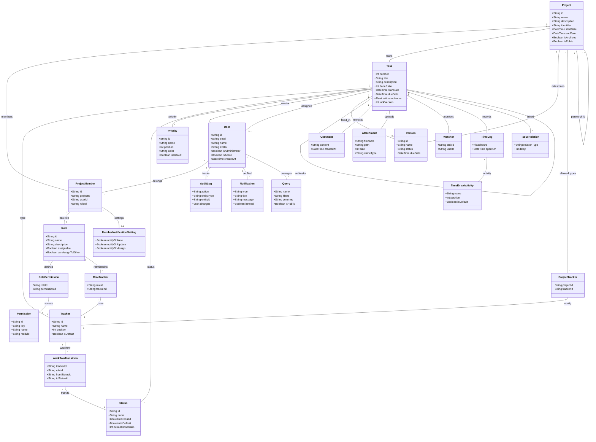

# Sơ đồ lớp chuẩn Schema dự án WorkSphere (Bản đầy đủ 100%)

File này mô tả toàn bộ cấu trúc lớp được ánh xạ trực tiếp 1-1 từ Prisma Schema của hệ thống.

## 1. Biểu đồ Mermaid
Bạn có thể xem trực quan bằng cách dán mã này vào [Mermaid Live Editor](https://mermaid.live/).

## 2. Giải thích thiết kế
- **RBAC & Security:** Hệ thống phân quyền đa lớp thông qua Role, Permission và các bảng trung gian như RoleTracker.
- **Project Structure:** Hỗ trợ cấu trúc dự án phân cấp và quản lý Tracker riêng biệt cho từng dự án.
- **Activity Tracking:** Mọi hành động đều được lưu nhật ký (Audit Log), theo dõi thời gian (Time Log) và thông báo (Notification) tới người dùng liên quan.

## 3. Tính nhất quán (Data Integrity)
- Sử dụng các bảng trung gian (RolePermission, RoleTracker, ProjectTracker) để đảm bảo mối quan hệ N-N được xử lý chuẩn xác theo lý thuyết Cơ sở dữ liệu quan hệ.
