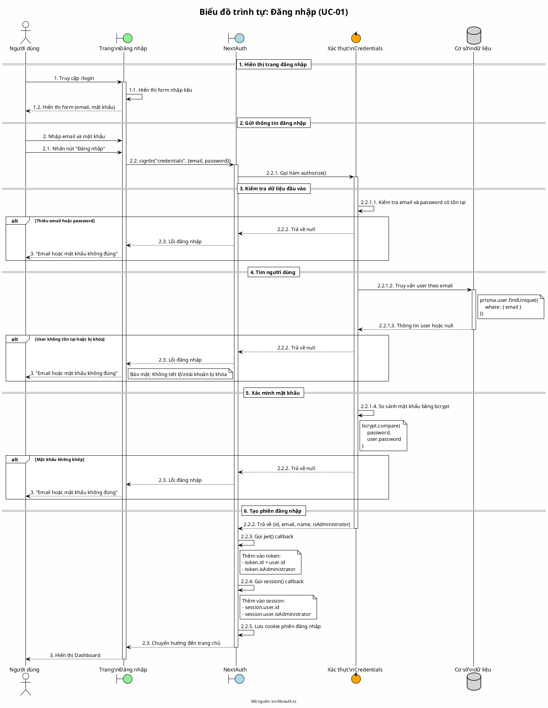

# Biểu đồ trình tự 01: Đăng nhập (UC-01)

> **Use Case**: UC-01 - Đăng nhập  
> **Module**: Xác thực  
> **Mã nguồn**: `src/lib/auth.ts`, `src/app/login/page.tsx`

---

## 1. Phân tích

| Thành phần | Xác định |
|------------|----------|
| **Tác nhân** | Người dùng (chưa đăng nhập) |
| **Biên** | Trang đăng nhập, NextAuth |
| **Điều khiển** | Xác thực thông tin đăng nhập |
| **Thực thể** | Cơ sở dữ liệu (bảng User) |

---

## 2. Các đối tượng tham gia

- **Tác nhân**: Người dùng
- **Biên**: Trang đăng nhập, NextAuth
- **Điều khiển**: Hàm authorize, bcrypt
- **Thực thể**: Prisma (User)

---

## 3. Mã PlantUML

---

## 4. Giải thích quy tắc đánh số

| Cấp độ | Ý nghĩa | Ví dụ |
|--------|---------|-------|
| 1, 2, 3 | Các giai đoạn chính | 1. Hiển thị trang, 2. Gửi form, 3. Kết quả |
| 2.1, 2.2 | Hành động con trong giai đoạn | 2.1. Nhấn nút, 2.2. Gọi API |
| 2.2.1, 2.2.2 | Chi tiết xử lý | 2.2.1. Gọi authorize, 2.2.2. Trả kết quả |
| 2.2.1.1, 2.2.1.2 | Xử lý sâu nhất | 2.2.1.1. Kiểm tra input, 2.2.1.2. Query DB |

---

## 5. Xử lý lỗi

| Trường hợp | Hành động | Thông báo |
|------------|-----------|-----------|
| Thiếu email/password | Trả về null | "Email hoặc mật khẩu không đúng" |
| User không tồn tại | Trả về null | "Email hoặc mật khẩu không đúng" |
| Tài khoản bị khóa | Trả về null | "Email hoặc mật khẩu không đúng" |
| Sai mật khẩu | Trả về null | "Email hoặc mật khẩu không đúng" |

> **Lưu ý bảo mật**: Tất cả lỗi đều trả về cùng thông báo để tránh kẻ tấn công đoán được email hợp lệ.

---

*Ngày tạo: 2026-01-16*
