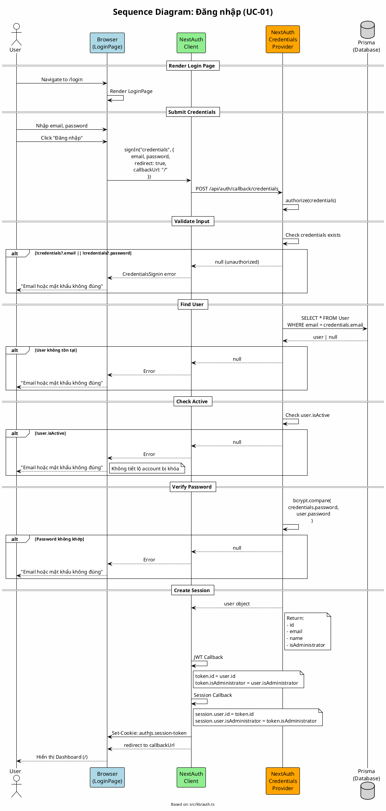

# Sequence Diagram 01: Đăng nhập (UC-01)

> **Use Case**: UC-01 - Đăng nhập  
> **Module**: Authentication  
> **Ngày**: 2026-01-16 (Updated from code review)

---

## 1. Thông tin chung

| Thuộc tính | Giá trị |
|------------|---------|
| **Participants** | Browser, NextAuth Client, NextAuth Server, Prisma |
| **Source Files** | `src/lib/auth.ts`, `src/app/api/auth/[...nextauth]/route.ts` |
| **Auth Method** | Credentials Provider với bcrypt |
| **Session** | JWT strategy |

---

## 2. Sequence Diagram (PlantUML)



---

## 3. Auth Configuration (từ code)

```typescript
// src/lib/auth.ts
export const { handlers, signIn, signOut, auth } = NextAuth({
    providers: [
        Credentials({
            name: 'credentials',
            credentials: {
                email: { label: 'Email', type: 'email' },
                password: { label: 'Password', type: 'password' },
            },
            async authorize(credentials) {
                if (!credentials?.email || !credentials?.password) {
                    return null;
                }

                const user = await prisma.user.findUnique({
                    where: { email: credentials.email as string },
                });

                if (!user || !user.isActive) {
                    return null;
                }

                const isValid = await bcrypt.compare(
                    credentials.password as string,
                    user.password
                );

                if (!isValid) {
                    return null;
                }

                return {
                    id: user.id,
                    email: user.email,
                    name: user.name,
                    isAdministrator: user.isAdministrator,
                };
            },
        }),
    ],
    callbacks: {
        async jwt({ token, user }) {
            if (user) {
                token.id = user.id;
                token.isAdministrator = user.isAdministrator;
            }
            return token;
        },
        async session({ session, token }) {
            if (session.user) {
                session.user.id = token.id as string;
                session.user.isAdministrator = token.isAdministrator as boolean;
            }
            return session;
        },
    },
    pages: {
        signIn: '/login',
    },
    session: {
        strategy: 'jwt',
    },
});
```

---

## 4. JWT Token Content

```json
{
  "id": "clxxxxx",
  "email": "user@example.com",
  "name": "User Name",
  "isAdministrator": false,
  "iat": 1705333200,
  "exp": 1707925200,
  "jti": "uuid"
}
```

---

## 5. Session Object

```typescript
// Accessible via auth() or useSession()
{
  user: {
    id: "clxxxxx",
    email: "user@example.com",
    name: "User Name",
    isAdministrator: false
  },
  expires: "2026-02-15T00:00:00.000Z"
}
```

---

## 6. Error Handling

| Scenario | Return | Displayed |
|----------|--------|-----------|
| Empty credentials | `null` | "Email hoặc mật khẩu không đúng" |
| User not found | `null` | "Email hoặc mật khẩu không đúng" |
| Account disabled | `null` | "Email hoặc mật khẩu không đúng" |
| Wrong password | `null` | "Email hoặc mật khẩu không đúng" |

> **Security Note**: Không phân biệt lỗi cụ thể để tránh enumeration attacks.

---

*Ngày cập nhật: 2026-01-16 - Based on actual code review*
