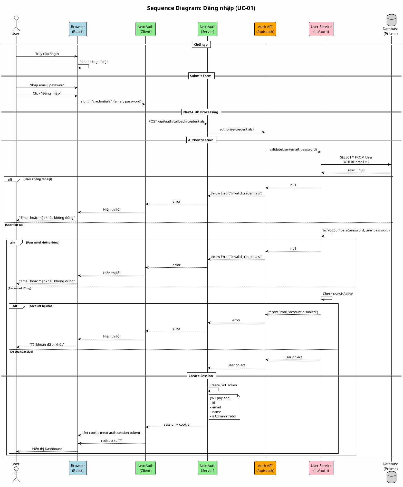

# Sequence Diagram 01: Đăng nhập (UC-01)

> **Use Case**: UC-01 - Đăng nhập  
> **Module**: Authentication  
> **Ngày**: 2026-01-15

---

## 1. Thông tin chung

| Thuộc tính | Giá trị |
|------------|---------|
| **Participants** | Browser, NextAuth, AuthAPI, UserService, Database |
| **Trigger** | User submit login form |
| **Precondition** | User có tài khoản trong hệ thống |
| **Postcondition** | JWT Session được tạo, User được redirect |

---

## 2. Sequence Diagram (PlantUML)



---

## 3. Participants Description

| Participant | Công nghệ | Chức năng |
|-------------|-----------|-----------|
| Browser | React/Next.js | UI, form handling |
| NextAuth Client | next-auth/react | signIn(), session management |
| NextAuth Server | next-auth | JWT creation, callback handling |
| Auth API | Next.js API Route | Credentials authorization |
| User Service | lib/auth.ts | User validation, bcrypt |
| Database | Prisma/SQLite | User storage |

---

## 4. Messages Detail

| # | From | To | Message | Type |
|---|------|----|---------|------|
| 1 | Browser | NextAuthClient | signIn("credentials", {email, password}) | sync call |
| 2 | NextAuthClient | NextAuthServer | POST /api/auth/callback/credentials | HTTP POST |
| 3 | NextAuthServer | AuthAPI | authorize(credentials) | callback |
| 4 | AuthAPI | UserService | validateUser(email, password) | async call |
| 5 | UserService | DB | SELECT * FROM User WHERE email = ? | query |
| 6 | UserService | UserService | bcrypt.compare() | internal |
| 7 | NextAuthServer | NextAuthServer | Create JWT Token | internal |
| 8 | NextAuthServer | Browser | Set-Cookie | HTTP header |

---

## 5. Error Handling

| Error | HTTP Status | Message | Handling |
|-------|-------------|---------|----------|
| Email not found | 401 | "Invalid credentials" | Show error, stay on login |
| Wrong password | 401 | "Invalid credentials" | Show error, stay on login |
| Account disabled | 401 | "Account disabled" | Show error, stay on login |
| Server error | 500 | "Server error" | Show error, retry |

---

## 6. JWT Token Structure

```json
{
  "id": "user-uuid",
  "email": "user@example.com",
  "name": "User Name",
  "isAdministrator": false,
  "iat": 1705333200,
  "exp": 1707925200
}
```

---

*Ngày tạo: 2026-01-15*
