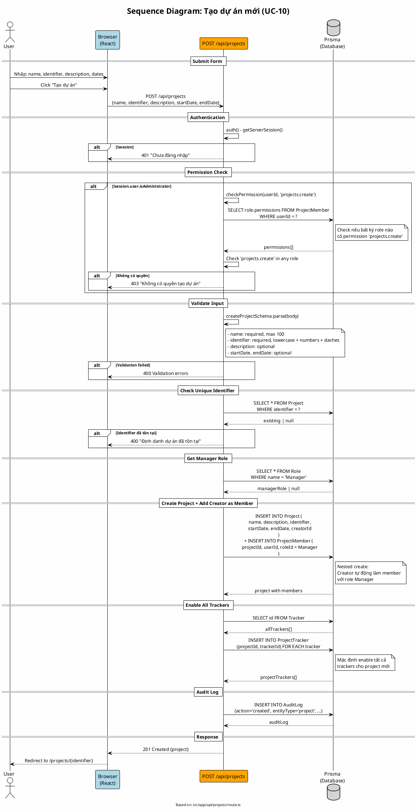

# Sequence Diagram 02: Tạo dự án (UC-10)

> **Use Case**: UC-10 - Tạo dự án mới  
> **Module**: Project Management  
> **Ngày**: 2026-01-16 (Updated from code review)

---

## 1. Thông tin chung

| Thuộc tính | Giá trị |
|------------|---------|
| **Participants** | Browser, API Route, Prisma |
| **API Endpoint** | POST /api/projects |
| **Source File** | `src/app/api/projects/route.ts` |

---

## 2. Sequence Diagram (PlantUML)



---

## 3. Permission Check Logic (từ code)

```typescript
// src/app/api/projects/route.ts - Line 88-93
if (!session.user.isAdministrator) {
    const hasPermission = await checkPermission(session.user.id, 'projects.create');
    if (!hasPermission) {
        return errorResponse('Không có quyền tạo dự án', 403);
    }
}

// Helper function - Line 170-192
async function checkPermission(userId: string, permissionKey: string): Promise<boolean> {
    const memberships = await prisma.projectMember.findMany({
        where: { userId },
        include: {
            role: {
                include: {
                    permissions: {
                        include: { permission: true },
                    },
                },
            },
        },
    });

    for (const membership of memberships) {
        const hasPermission = membership.role.permissions.some(
            (rp) => rp.permission.key === permissionKey
        );
        if (hasPermission) return true;
    }

    return false;
}
```

> **Note**: `projects.create` được check xem user có permission này trong **bất kỳ project nào** (không phải project-specific).

---

## 4. Auto-enable Trackers (từ code)

```typescript
// Line 146-155
const allTrackers = await prisma.tracker.findMany({ select: { id: true } });
if (allTrackers.length > 0) {
    await prisma.projectTracker.createMany({
        data: allTrackers.map(t => ({
            projectId: project.id,
            trackerId: t.id
        }))
    });
}
```

---

## 5. Request/Response

### Request
```http
POST /api/projects
Content-Type: application/json

{
  "name": "My New Project",
  "identifier": "my-new-project",
  "description": "Project description",
  "startDate": "2026-01-15",
  "endDate": "2026-06-30"
}
```

### Validation Rules (từ validations.ts)
```typescript
createProjectSchema = z.object({
    name: z.string().min(1).max(100),
    description: z.string().optional(),
    identifier: z.string().min(1).max(50)
        .regex(/^[a-z0-9-]+$/, 'chỉ chữ thường, số và dấu gạch ngang'),
    startDate: z.string().optional(),
    endDate: z.string().optional(),
});
```

### Success Response (201)
```json
{
  "id": "project-uuid",
  "name": "My New Project",
  "identifier": "my-new-project",
  "description": "...",
  "creator": {"id": "...", "name": "..."},
  "members": [
    {
      "user": {"id": "...", "name": "..."},
      "role": {"id": "...", "name": "Manager"}
    }
  ],
  "_count": {"tasks": 0, "members": 1}
}
```

---

## 6. Side Effects

| Action | Description |
|--------|-------------|
| Creator as Manager | Auto-add creator to ProjectMember with Manager role |
| Enable Trackers | Enable ALL system trackers for the new project |
| Audit Log | logCreate('project', ...) |

---

*Ngày cập nhật: 2026-01-16 - Based on actual code review*
