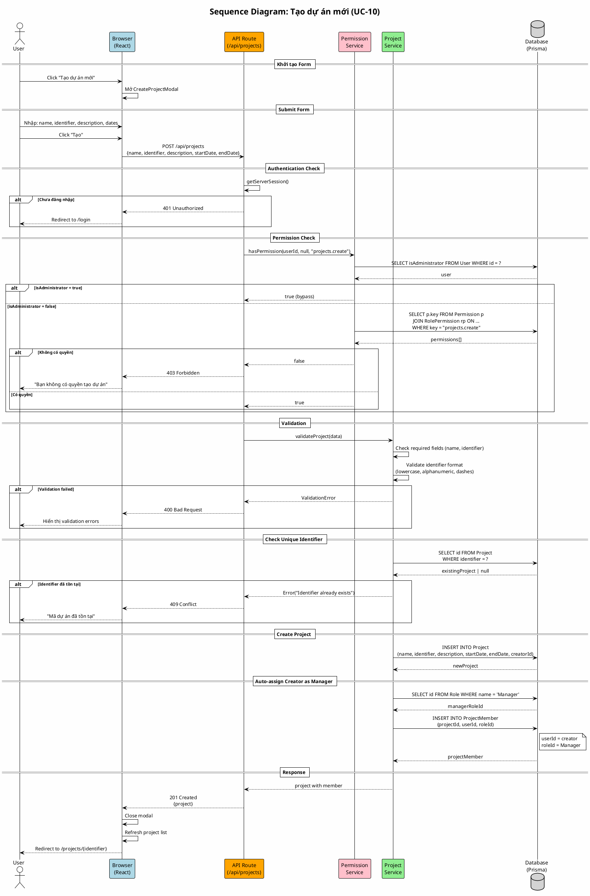

# Sequence Diagram 02: Tạo dự án (UC-10)

> **Use Case**: UC-10 - Tạo dự án mới  
> **Module**: Project Management  
> **Ngày**: 2026-01-15

---

## 1. Thông tin chung

| Thuộc tính | Giá trị |
|------------|---------|
| **Participants** | Browser, API Route, Permission Service, Project Service, Database |
| **Trigger** | User submit create project form |
| **Precondition** | User có quyền `projects.create` |
| **Postcondition** | Project được tạo, Creator thành member với role Manager |

---

## 2. Sequence Diagram (PlantUML)



---

## 3. Participants Description

| Participant | File/Module | Chức năng |
|-------------|-------------|-----------|
| Browser | React Components | UI, form handling |
| API Route | /api/projects/route.ts | HTTP endpoint |
| Permission Service | lib/permissions.ts | RBAC check |
| Project Service | lib/services/project.ts | Business logic |
| Database | Prisma | Data persistence |

---

## 4. Request/Response

### Request
```http
POST /api/projects
Content-Type: application/json
Cookie: next-auth.session-token=...

{
  "name": "My Project",
  "identifier": "my-project",
  "description": "Project description",
  "startDate": "2026-01-15",
  "endDate": "2026-06-30"
}
```

### Response (Success)
```http
HTTP/1.1 201 Created
Content-Type: application/json

{
  "id": "uuid",
  "name": "My Project",
  "identifier": "my-project",
  "description": "Project description",
  "startDate": "2026-01-15T00:00:00Z",
  "endDate": "2026-06-30T00:00:00Z",
  "creatorId": "user-uuid",
  "createdAt": "2026-01-15T16:50:00Z"
}
```

---

## 5. Error Responses

| Scenario | Status | Response |
|----------|--------|----------|
| Not authenticated | 401 | `{"error": "Unauthorized"}` |
| No permission | 403 | `{"error": "Forbidden"}` |
| Validation error | 400 | `{"error": "Name is required"}` |
| Duplicate identifier | 409 | `{"error": "Identifier already exists"}` |

---

*Ngày tạo: 2026-01-15*
