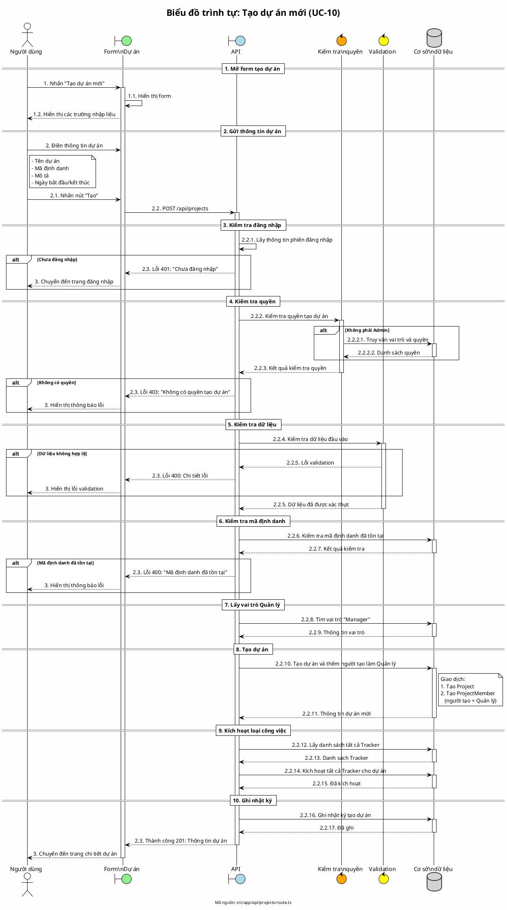

# Biểu đồ trình tự 02: Tạo dự án mới (UC-10)

> **Use Case**: UC-10 - Tạo dự án mới  
> **Module**: Quản lý dự án  
> **Mã nguồn**: `src/app/api/projects/route.ts` (POST)

---

## 1. Phân tích

| Thành phần | Xác định |
|------------|----------|
| **Tác nhân** | Người dùng (có quyền tạo dự án) |
| **Biên** | Form tạo dự án, API |
| **Điều khiển** | Kiểm tra quyền, Validation |
| **Thực thể** | Cơ sở dữ liệu (Project, Role, Tracker) |

---

## 2. Các đối tượng tham gia

- **Tác nhân**: Người dùng
- **Biên**: Form dự án, API /api/projects
- **Điều khiển**: Kiểm tra quyền, Zod validation
- **Thực thể**: Prisma (Project, ProjectMember, Role, Tracker)

---

## 3. Mã PlantUML

---

## 4. Giải thích quy tắc đánh số

- **1, 2, 3**: Các giai đoạn chính (Mở form, Gửi, Kết quả)
- **2.1, 2.2, 2.3**: Các hành động trong giai đoạn 2
- **2.2.1 - 2.2.17**: Chi tiết xử lý trong API
- **2.2.2.1, 2.2.2.2**: Xử lý lồng sâu (query DB trong kiểm tra quyền)

---

## 5. Quy tắc nghiệp vụ

| Quy tắc | Mô tả |
|---------|-------|
| Người tạo là Quản lý | Người tạo dự án tự động được gán vai trò Manager |
| Kích hoạt Tracker | Tất cả loại công việc được kích hoạt mặc định |
| Mã định danh duy nhất | Identifier phải là duy nhất trong hệ thống |
| Ghi nhật ký | Mọi thao tác tạo dự án đều được ghi log |

---

*Ngày tạo: 2026-01-16*
