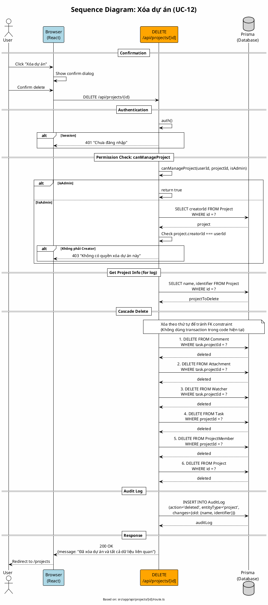

# Sequence Diagram 03: Xóa dự án (UC-12)

> **Use Case**: UC-12 - Xóa dự án  
> **Module**: Project Management  
> **Ngày**: 2026-01-16 (Updated from code review)

---

## 1. Thông tin chung

| Thuộc tính | Giá trị |
|------------|---------|
| **Participants** | Browser, API Route, Prisma |
| **API Endpoint** | DELETE /api/projects/[id] |
| **Source File** | `src/app/api/projects/[id]/route.ts` |

---

## 2. Sequence Diagram (PlantUML)



---

## 3. canManageProject Logic (từ code)

```typescript
// src/app/api/projects/[id]/route.ts - Line 24-33
async function canManageProject(userId: string, projectId: string, isAdmin: boolean) {
    if (isAdmin) return true;

    const project = await prisma.project.findUnique({
        where: { id: projectId },
        select: { creatorId: true },
    });

    return project?.creatorId === userId;
}
```

> **Chú ý**: Chỉ **Creator** hoặc **Admin** mới được xóa project. Không có permission-based check như `projects.delete`.

---

## 4. Cascade Delete Order (từ code)

```typescript
// Line 213-242
// 1. Xóa comments của tasks
await prisma.comment.deleteMany({
    where: { task: { projectId: id } },
});

// 2. Xóa attachments của tasks
await prisma.attachment.deleteMany({
    where: { task: { projectId: id } },
});

// 4. Xóa watchers của tasks
await prisma.watcher.deleteMany({
    where: { task: { projectId: id } },
});

// 5. Xóa tasks
await prisma.task.deleteMany({
    where: { projectId: id },
});

// 6. Xóa project members
await prisma.projectMember.deleteMany({
    where: { projectId: id },
});

// 7. Xóa project
await prisma.project.delete({
    where: { id },
});
```

---

## 5. Missing Cascade (Potential Issues)

| Table | Status | Notes |
|-------|--------|-------|
| Comment | ✅ Deleted | - |
| Attachment | ✅ Deleted | Physical files NOT deleted! |
| Watcher | ✅ Deleted | - |
| Task | ✅ Deleted | - |
| ProjectMember | ✅ Deleted | - |
| Version | ❌ **NOT deleted** | May cause FK constraint error |
| Notification | ❌ **NOT deleted** | Orphaned notifications |
| AuditLog | ❌ **NOT deleted** | Intentional - keep history |
| ProjectTracker | ❌ **NOT deleted** | May cause orphaned records |

---

## 6. Request/Response

### Request
```http
DELETE /api/projects/project-uuid
```

### Success Response (200)
```json
{
  "message": "Đã xóa dự án và tất cả dữ liệu liên quan"
}
```

### Error Responses

| Status | Condition |
|--------|-----------|
| 401 | Not authenticated |
| 403 | Not creator and not admin |
| 404 | Project not found |

---

*Ngày cập nhật: 2026-01-16 - Based on actual code review*
