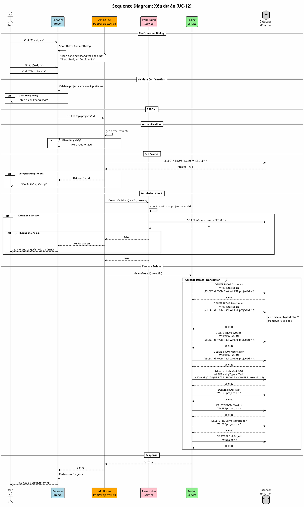

# Sequence Diagram 03: Xóa dự án (UC-12)

> **Use Case**: UC-12 - Xóa dự án  
> **Module**: Project Management  
> **Ngày**: 2026-01-15

---

## 1. Thông tin chung

| Thuộc tính | Giá trị |
|------------|---------|
| **Participants** | Browser, API Route, Permission Service, Project Service, Database |
| **Trigger** | User confirm delete project |
| **Precondition** | User là Creator hoặc Admin |
| **Postcondition** | Project và tất cả related data bị xóa |

---

## 2. Sequence Diagram (PlantUML)



---

## 3. Cascade Delete Order

| Order | Table | Condition | Notes |
|-------|-------|-----------|-------|
| 1 | Comment | taskId IN project tasks | - |
| 2 | Attachment | taskId IN project tasks | + Delete files |
| 3 | Watcher | taskId IN project tasks | - |
| 4 | Notification | taskId IN project tasks | - |
| 5 | AuditLog | entityType='Task' AND entityId IN tasks | - |
| 6 | Task | projectId = ? | Includes subtasks |
| 7 | Version | projectId = ? | - |
| 8 | ProjectMember | projectId = ? | - |
| 9 | Project | id = ? | Finally |

---

## 4. Request/Response

### Request
```http
DELETE /api/projects/uuid-project-id
Cookie: next-auth.session-token=...
```

### Response (Success)
```http
HTTP/1.1 200 OK
Content-Type: application/json

{
  "message": "Project deleted successfully"
}
```

---

## 5. Error Responses

| Scenario | Status | Response |
|----------|--------|----------|
| Not authenticated | 401 | `{"error": "Unauthorized"}` |
| Project not found | 404 | `{"error": "Project not found"}` |
| Not creator/admin | 403 | `{"error": "Forbidden"}` |
| Database error | 500 | `{"error": "Failed to delete project"}` |

---

*Ngày tạo: 2026-01-15*
