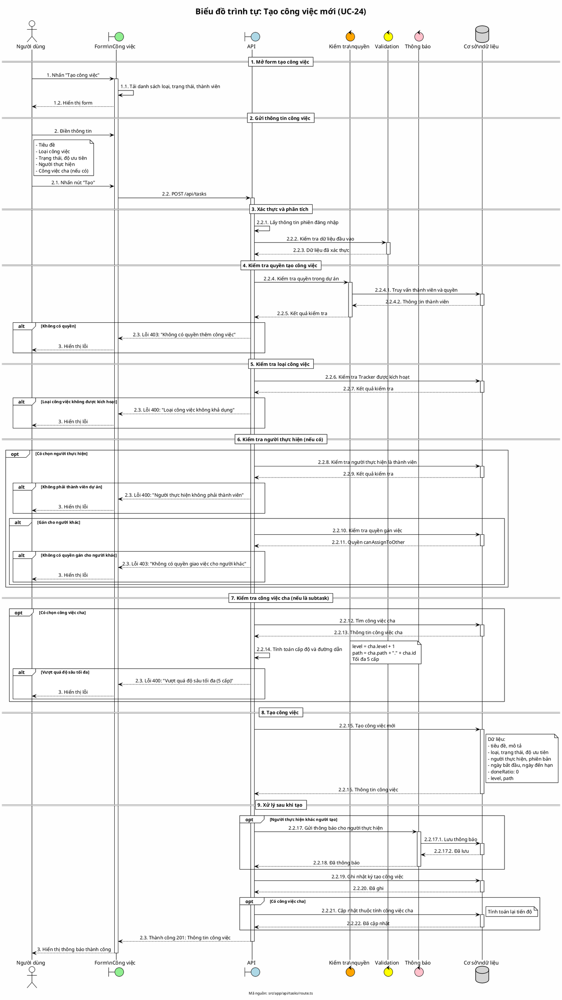

# Biểu đồ trình tự 03: Tạo công việc mới (UC-24)

> **Use Case**: UC-24 - Tạo công việc mới  
> **Module**: Quản lý công việc  
> **Mã nguồn**: `src/app/api/tasks/route.ts` (POST)

---

## 1. Phân tích

| Thành phần | Xác định |
|------------|----------|
| **Tác nhân** | Người dùng (có quyền tạo công việc) |
| **Biên** | Form tạo công việc, API |
| **Điều khiển** | Kiểm tra quyền, Validation, Thông báo |
| **Thực thể** | Cơ sở dữ liệu (Task, ProjectMember, Tracker) |

---

## 2. Các đối tượng tham gia

- **Tác nhân**: Người dùng
- **Biên**: Form công việc, API /api/tasks
- **Điều khiển**: Kiểm tra quyền, Zod, Thông báo
- **Thực thể**: Prisma (Task, ProjectTracker, ProjectMember)

---

## 3. Mã PlantUML

---

## 4. Giải thích quy tắc đánh số

| Cấp độ | Ví dụ | Ý nghĩa |
|--------|-------|---------|
| Cấp 1 | 1, 2, 3 | Giai đoạn chính |
| Cấp 2 | 2.1, 2.2, 2.3 | Hành động con |
| Cấp 3 | 2.2.1, 2.2.2 | Chi tiết xử lý API |
| Cấp 4 | 2.2.4.1, 2.2.17.1 | Xử lý sâu (DB trong service) |

---

## 5. Các quy tắc kiểm tra

| Kiểm tra | Mô tả |
|----------|-------|
| Quyền tạo | Cần quyền `tasks.create` trong dự án |
| Loại công việc | Tracker phải được kích hoạt cho dự án |
| Người thực hiện | Phải là thành viên dự án |
| Gán cho người khác | Cần quyền `canAssignToOther = true` |
| Công việc cha | Cùng dự án, tối đa 5 cấp lồng nhau |

---

## 6. Xử lý sau khi tạo

| Hành động | Điều kiện |
|-----------|-----------|
| Gửi thông báo | Người thực hiện khác người tạo |
| Ghi nhật ký | Luôn thực hiện |
| Cập nhật cha | Nếu là công việc con |

---

*Ngày tạo: 2026-01-16*
