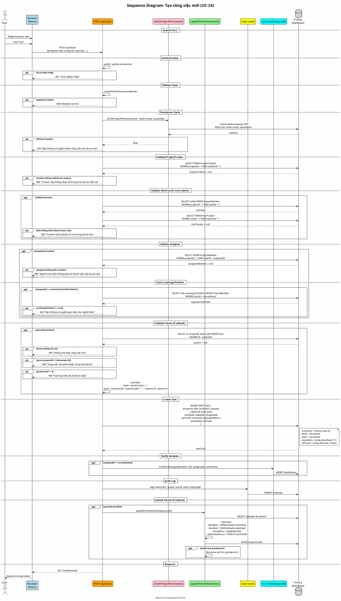

# Sequence Diagram 04: Tạo công việc (UC-24)

> **Use Case**: UC-24 - Tạo công việc mới  
> **Module**: Task Management  
> **Ngày**: 2026-01-16 (Updated from code review)

---

## 1. Thông tin chung

| Thuộc tính | Giá trị |
|------------|---------|
| **Participants** | Browser, API Route, Permission Service, Task Service, Database |
| **API Endpoint** | POST /api/tasks |
| **Source File** | `src/app/api/tasks/route.ts` |

---

## 2. Sequence Diagram (PlantUML)



---

## 3. Validation Layers (từ code)

| Layer | Check | Error |
|-------|-------|-------|
| 1 | Authentication | 401 |
| 2 | Schema validation | 400 |
| 3 | Permission 'tasks.create' | 403 |
| 4 | ProjectTracker enabled | 400 |
| 5 | RoleTracker allowed | 400 |
| 6 | Assignee is member | 400 |
| 7 | canAssignToOther check | 403 |
| 8 | Parent exists & same project | 400 |
| 9 | Max depth (5 levels) | 400 |

---

## 4. Hierarchy Calculation (từ code)

```typescript
// Line 265-282
if (validatedData.parentId) {
    const parent = await prisma.task.findUnique({
        where: { id: validatedData.parentId },
        select: { id: true, projectId: true, level: true, path: true }
    });

    if (!parent) return errorResponse('Không tìm thấy công việc cha', 400);
    if (parent.projectId !== validatedData.projectId) {
        return errorResponse('Công việc cha phải thuộc cùng một dự án', 400);
    }
    if (parent.level >= 4) {
        return errorResponse('Vượt quá độ sâu tối đa (5 cấp)', 400);
    }

    level = parent.level + 1;
    path = parent.path ? `${parent.path}.${parent.id}` : parent.id;
}
```

---

## 5. Request/Response

### Request
```http
POST /api/tasks
Content-Type: application/json

{
  "projectId": "project-uuid",
  "title": "Implement login feature",
  "trackerId": "tracker-uuid",
  "statusId": "status-uuid",
  "priorityId": "priority-uuid",
  "assigneeId": "user-uuid",
  "parentId": null,
  "versionId": "version-uuid",
  "startDate": "2026-01-15",
  "dueDate": "2026-01-20",
  "estimatedHours": 8,
  "doneRatio": 0,
  "isPrivate": false,
  "description": "..."
}
```

### Success Response (201)
```json
{
  "id": "new-task-uuid",
  "title": "Implement login feature",
  "project": {"id": "...", "name": "...", "identifier": "..."},
  "tracker": {"id": "...", "name": "Bug"},
  "status": {"id": "...", "name": "New"},
  "assignee": {"id": "...", "name": "John"}
}
```

---

## 6. Key Differences from Generic Design

| Aspect | Generic | Actual Code |
|--------|---------|-------------|
| Task Number | Auto-increment | Uses `number` field (auto in DB) |
| Tracker validation | None | ProjectTracker + RoleTracker |
| Assignee validation | Basic | + canAssignToOther check |
| Hierarchy | Simple | path + level with max 5 levels |

---

*Ngày cập nhật: 2026-01-16 - Based on actual code review*
