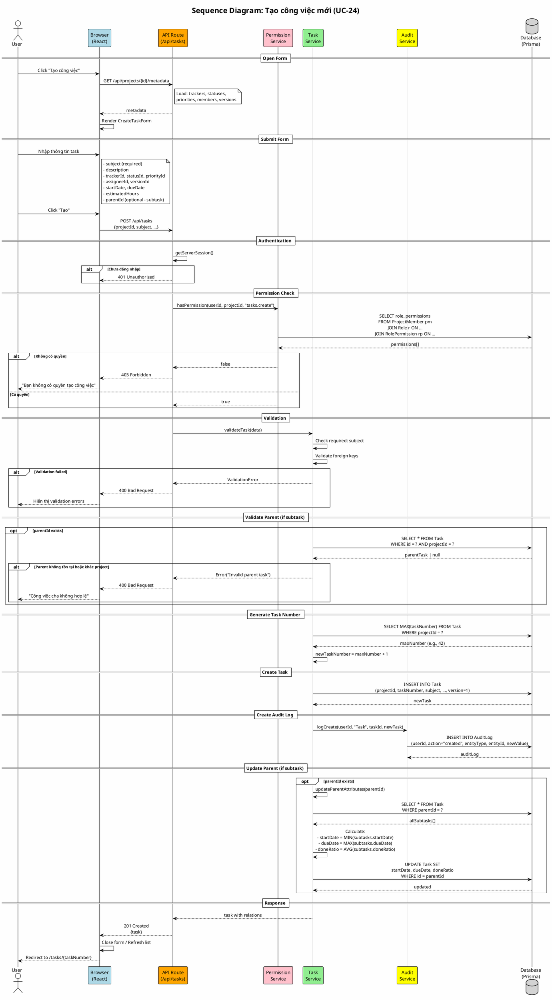

# Sequence Diagram 04: Tạo công việc (UC-24)

> **Use Case**: UC-24 - Tạo công việc mới  
> **Module**: Task Management  
> **Ngày**: 2026-01-15

---

## 1. Thông tin chung

| Thuộc tính | Giá trị |
|------------|---------|
| **Participants** | Browser, API Route, Permission Service, Task Service, Audit Service, Database |
| **Trigger** | User submit create task form |
| **Precondition** | User có quyền `tasks.create` trong project |
| **Postcondition** | Task được tạo, AuditLog được ghi, Parent được update (nếu có) |

---

## 2. Sequence Diagram (PlantUML)



---

## 3. Task Number Generation

```sql
-- Get max task number in project
SELECT COALESCE(MAX(taskNumber), 0) as maxNumber
FROM Task
WHERE projectId = 'project-uuid';

-- New task number = maxNumber + 1
-- E.g., if maxNumber = 42, new task = #43
```

---

## 4. Parent Update Logic

Khi tạo subtask, parent task được cập nhật:

| Field | Calculation | Config |
|-------|-------------|--------|
| startDate | MIN(subtasks.startDate) | If calculated mode |
| dueDate | MAX(subtasks.dueDate) | If calculated mode |
| doneRatio | AVG(subtasks.doneRatio) | If calculated mode |

---

## 5. Request/Response

### Request
```http
POST /api/tasks
Content-Type: application/json

{
  "projectId": "project-uuid",
  "subject": "Implement login feature",
  "description": "...",
  "trackerId": "tracker-uuid",
  "statusId": "status-uuid",
  "priorityId": "priority-uuid",
  "assigneeId": "user-uuid",
  "versionId": "version-uuid",
  "startDate": "2026-01-15",
  "dueDate": "2026-01-20",
  "estimatedHours": 8,
  "parentId": null
}
```

### Response (Success)
```http
HTTP/1.1 201 Created

{
  "id": "task-uuid",
  "taskNumber": 43,
  "subject": "Implement login feature",
  "project": {...},
  "tracker": {...},
  "status": {...},
  "createdAt": "2026-01-15T16:50:00Z"
}
```

---

*Ngày tạo: 2026-01-15*
