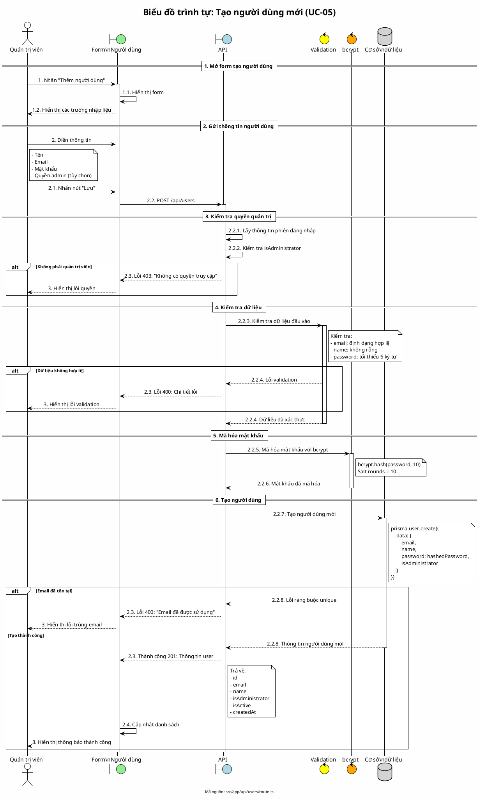

# Biểu đồ trình tự 04: Tạo người dùng mới (UC-05)

> **Use Case**: UC-05 - Tạo người dùng mới  
> **Module**: Quản lý người dùng  
> **Mã nguồn**: `src/app/api/users/route.ts` (POST)

---

## 1. Phân tích

| Thành phần | Xác định |
|------------|----------|
| **Tác nhân** | Quản trị viên |
| **Biên** | Form người dùng, API |
| **Điều khiển** | Kiểm tra quyền, Validation, Hash mật khẩu |
| **Thực thể** | Cơ sở dữ liệu (User) |

---

## 2. Các đối tượng tham gia

- **Tác nhân**: Quản trị viên
- **Biên**: Form người dùng, API /api/users
- **Điều khiển**: Zod, bcrypt
- **Thực thể**: Prisma (User)

---

## 3. Mã PlantUML

---

## 4. Giải thích quy tắc đánh số

| Số | Ý nghĩa |
|----|---------|
| 1, 2, 3 | Giai đoạn chính |
| 2.1, 2.2, 2.3, 2.4 | Hành động trong giai đoạn 2 |
| 2.2.1 - 2.2.8 | Chi tiết xử lý API |

---

## 5. Xử lý lỗi

| Trường hợp | Mã lỗi | Thông báo |
|------------|--------|-----------|
| Không phải admin | 403 | "Không có quyền truy cập" |
| Dữ liệu không hợp lệ | 400 | Chi tiết từ Zod |
| Email đã tồn tại | 400 | "Email đã được sử dụng" |

---

## 6. Quy tắc nghiệp vụ

| Quy tắc | Mô tả |
|---------|-------|
| Chỉ Admin | Chỉ quản trị viên mới được tạo user |
| Email duy nhất | Email phải là duy nhất trong hệ thống |
| Mã hóa mật khẩu | Sử dụng bcrypt với 10 salt rounds |
| Mặc định hoạt động | isActive = true khi tạo mới |

---

*Ngày tạo: 2026-01-16*
