# Sequence Diagram 05: Cập nhật công việc (UC-25)

> **Use Case**: UC-25 - Cập nhật công việc  
> **Module**: Task Management  
> **Ngày**: 2026-01-16 (Updated from code review)

---

## 1. Thông tin chung

| Thuộc tính | Giá trị |
|------------|---------|
| **Participants** | Browser, API Route, Permission Check, Task Service, Audit Log, Notification Service, Database |
| **API Endpoint** | PUT /api/tasks/[id] |
| **Source File** | `src/app/api/tasks/[id]/route.ts` |

---

## 2. Sequence Diagram (PlantUML)

```plantuml
@startuml
!theme plain
skinparam backgroundColor #FEFEFE
skinparam sequenceMessageAlign center

title Sequence Diagram: Cập nhật công việc (UC-25)
footer Based on: src/app/api/tasks/[id]/route.ts

actor "User" as User
participant "Browser\n(React)" as Browser #LightBlue
participant "PUT /api/tasks/[id]" as API #Orange
participant "canEditTask()" as CanEdit #Pink
participant "canTransitionStatus()" as WorkflowCheck #Pink
participant "updateParentAttributes()" as ParentUpdate #LightGreen
participant "logUpdate()" as AuditLog #Yellow
participant "notifyTaskAssigned()" as Notify #Cyan
database "Prisma\n(Database)" as DB #LightGray

== Load & Edit ==
User -> Browser: Edit task fields
User -> Browser: Click "Lưu"
Browser -> API: PUT /api/tasks/{id}\n{title, statusId, lockVersion, ...}

== Authentication ==
API -> API: auth() - getServerSession()
alt Chưa đăng nhập
    API --> Browser: 401 "Chưa đăng nhập"
end

== Resolve Task ID ==
API -> API: resolveTaskId(rawId)
note right: Support both CUID and number (#42)

== Permission Check ==
API -> CanEdit: canEditTask(userId, taskId, isAdmin)
CanEdit -> DB: SELECT creatorId, assigneeId, projectId FROM Task

CanEdit -> DB: SELECT role.permissions FROM ProjectMember\nWHERE userId = ? AND projectId = ?
DB --> CanEdit: permissions[]

alt Has 'tasks.edit_any'
    CanEdit --> API: true
else Is creator AND has 'tasks.edit_own'
    CanEdit --> API: true
else Is assignee AND has 'tasks.edit_assigned'
    CanEdit --> API: true
else
    CanEdit --> API: false
    API --> Browser: 403 "Không có quyền sửa task này"
end

== Get Current Task ==
API -> DB: SELECT * FROM Task WHERE id = ?
DB --> API: currentTask (with lockVersion, parentId, etc.)

== Workflow Validation (if status change) ==
opt statusId changed
    API -> WorkflowCheck: canTransitionStatus(user, taskId, newStatusId)
    WorkflowCheck -> DB: SELECT * FROM WorkflowTransition\nWHERE trackerId = ? AND fromStatusId = ?\nAND toStatusId = ?\nAND (roleId IS NULL OR roleId IN userRoles)
    DB --> WorkflowCheck: transition | null
    
    alt Transition NOT allowed
        WorkflowCheck --> API: false
        API --> Browser: 403 "Không được phép chuyển\ntrạng thái này theo Workflow"
    end
end

== Optimistic Locking ==
API -> API: Compare lockVersion
alt body.lockVersion !== currentTask.lockVersion
    API --> Browser: 409 "Dữ liệu đã bị thay đổi\nbởi người khác"
end

== Tracker Validation (if tracker change) ==
opt trackerId changed
    API -> DB: SELECT FROM ProjectTracker\nWHERE projectId = ? AND trackerId = ?
    alt Not enabled for project
        API --> Browser: 400 "Tracker không được kích hoạt"
    end
    
    API -> DB: SELECT FROM RoleTracker\nWHERE roleId = ? AND trackerId = ?
    alt Not allowed for role
        API --> Browser: 403 "Role không cho phép Tracker này"
    end
end

== Assignee Validation (if assignee change) ==
opt assigneeId changed
    API -> DB: SELECT FROM ProjectMember\nWHERE projectId = ? AND userId = newAssignee
    alt Not a member
        API --> Browser: 400 "Người thực hiện không phải thành viên"
    end
    
    alt Assigning to OTHER (not self)
        API -> DB: SELECT role.canAssignToOther FROM ProjectMember
        alt canAssignToOther !== true
            API --> Browser: 403 "Bạn không có quyền giao việc cho người khác"
        end
    end
end

== Handle Status Change ==
opt statusId changed
    API -> DB: SELECT isClosed, defaultDoneRatio FROM Status
    
    alt newStatus.isClosed = true
        API -> API: doneRatio = 100
        note right: FORCE 100% for closed
    else oldStatus.isClosed AND !newStatus.isClosed
        API -> API: doneRatio = defaultDoneRatio || 0
        note right: Reset when reopening
    end
end

== Update Task ==
API -> DB: UPDATE Task SET\n..., lockVersion = lockVersion + 1
DB --> API: updatedTask

== Update Parent (if subtask) ==
opt task.parentId exists OR parentId changed
    API -> ParentUpdate: updateParentAttributes(parentId)
    ParentUpdate -> DB: SELECT subtasks
    ParentUpdate -> ParentUpdate: Calculate:\n- startDate = MIN\n- dueDate = MAX\n- doneRatio = weighted AVG
    ParentUpdate -> DB: UPDATE parent task
    
    opt parent has grandparent
        ParentUpdate -> ParentUpdate: Recursive call
    end
end

== Notifications ==
opt assigneeId changed AND newAssignee !== currentUser
    API -> Notify: notifyTaskAssigned(taskId, title, newAssignee, actorName)
    Notify -> DB: INSERT Notification
end

opt statusId changed
    API -> API: notifyTaskStatusChanged(...)
end

== Audit Log ==
API -> AuditLog: logUpdate('task', id, userId, oldValues, newValues)
AuditLog -> DB: INSERT AuditLog for each changed field

== Response ==
API --> Browser: 200 OK {task}
Browser --> User: "Đã cập nhật công việc"

@enduml
```



---

## 3. Permission Check Logic (từ code)

```typescript
// src/app/api/tasks/[id]/route.ts - canEditTask()
async function canEditTask(userId, taskId, isAdmin) {
    if (isAdmin) return true;
    
    const task = await prisma.task.findUnique({...});
    const membership = await prisma.projectMember.findFirst({...});
    const permissions = membership.role.permissions.map(p => p.permission.key);
    
    // Priority order:
    if (permissions.includes('tasks.edit_any')) return true;
    if (task.creatorId === userId && permissions.includes('tasks.edit_own')) return true;
    if (task.assigneeId === userId && permissions.includes('tasks.edit_assigned')) return true;
    
    return false;
}
```

---

## 4. Optimistic Locking (từ code)

```typescript
// Line 276-279
if (validatedData.lockVersion !== undefined && 
    validatedData.lockVersion !== currentTask.lockVersion) {
    return errorResponse('Dữ liệu đã bị thay đổi bởi người khác...', 409);
}

// Line 342 - Increment on update
lockVersion: { increment: 1 }
```

---

## 5. Status Change + Done Ratio Logic (từ code)

```typescript
// Line 410-421
if (newStatus.isClosed) {
    updateData.doneRatio = 100;  // FORCE 100%
} else if (oldStatus?.isClosed && !newStatus.isClosed) {
    updateData.doneRatio = newStatus.defaultDoneRatio ?? 0;  // Reset
} else if (validatedData.doneRatio === undefined && 
           newStatus.defaultDoneRatio !== null) {
    updateData.doneRatio = newStatus.defaultDoneRatio;
}
```

---

## 6. Request/Response (từ validation schema)

### Request
```http
PUT /api/tasks/task-uuid
Content-Type: application/json

{
  "title": "Updated title",
  "statusId": "status-uuid",
  "assigneeId": "user-uuid",
  "lockVersion": 5,
  "doneRatio": 50
}
```

### Responses

| Status | Condition | Body |
|--------|-----------|------|
| 200 | Success | `{task object}` |
| 401 | Not logged in | `{"error": "Chưa đăng nhập"}` |
| 403 | No edit permission | `{"error": "Không có quyền sửa task này"}` |
| 403 | Workflow violation | `{"error": "Không được phép chuyển..."}` |
| 403 | Cannot assign to others | `{"error": "Bạn không có quyền giao việc..."}` |
| 409 | Version conflict | `{"error": "Dữ liệu đã bị thay đổi..."}` |
| 400 | Validation error | `{"error": "..."}` |

---

*Ngày cập nhật: 2026-01-16 - Based on actual code review*
