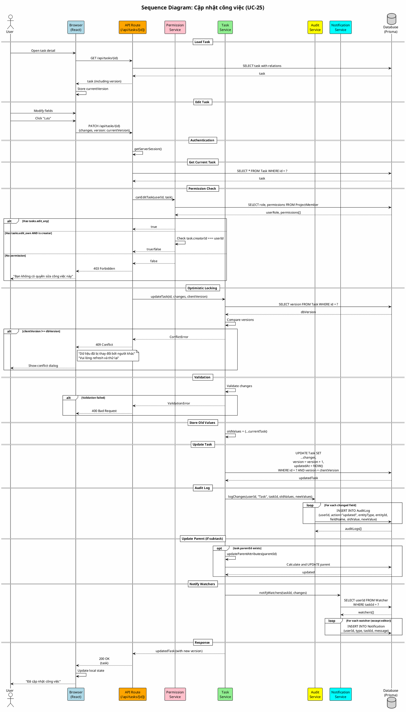

# Sequence Diagram 05: Cập nhật công việc (UC-25)

> **Use Case**: UC-25 - Cập nhật công việc  
> **Module**: Task Management  
> **Ngày**: 2026-01-15

---

## 1. Thông tin chung

| Thuộc tính | Giá trị |
|------------|---------|
| **Participants** | Browser, API, Permission Service, Task Service, Audit Service, Notification Service, Database |
| **Trigger** | User save task changes |
| **Precondition** | User có quyền edit task |
| **Postcondition** | Task updated, Version incremented, Audit logged, Watchers notified |

---

## 2. Sequence Diagram (PlantUML)



---

## 3. Optimistic Locking Flow

```
Timeline:
─────────────────────────────────────────────────────────────►

User A                                      User B
   │                                           │
   ├─► Load task (version=5)                   │
   │                                           ├─► Load task (version=5)
   │                                           │
   ├─► Edit & Save (version=5)                 │
   │   └─► DB: version becomes 6              │
   │                                           │
   │                                           ├─► Edit & Save (version=5)
   │                                           │   └─► CONFLICT! DB version=6
   │                                           │       Client version=5
   │                                           │       Return 409
```

---

## 4. Audit Log Structure

```json
{
  "id": "audit-uuid",
  "userId": "user-uuid",
  "action": "updated",
  "entityType": "Task",
  "entityId": "task-uuid",
  "fieldName": "status",
  "oldValue": "New",
  "newValue": "In Progress",
  "createdAt": "2026-01-15T16:50:00Z"
}
```

---

## 5. Request/Response

### Request
```http
PATCH /api/tasks/task-uuid
Content-Type: application/json

{
  "subject": "Updated title",
  "statusId": "status-uuid",
  "assigneeId": "user-uuid",
  "version": 5
}
```

### Response (Success)
```http
HTTP/1.1 200 OK

{
  "id": "task-uuid",
  "subject": "Updated title",
  "version": 6,
  "updatedAt": "2026-01-15T17:00:00Z"
}
```

### Response (Conflict)
```http
HTTP/1.1 409 Conflict

{
  "error": "Conflict",
  "message": "Task has been modified by another user",
  "currentVersion": 6,
  "yourVersion": 5
}
```

---

*Ngày tạo: 2026-01-15*
