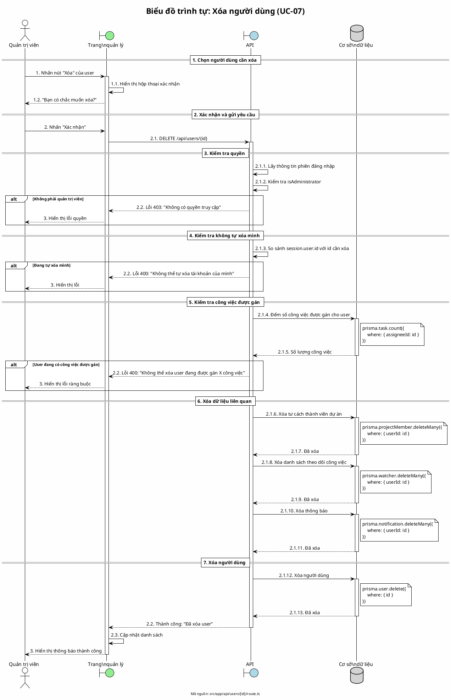

# Biểu đồ trình tự 05: Xóa người dùng (UC-07)

> **Use Case**: UC-07 - Xóa người dùng  
> **Module**: Quản lý người dùng  
> **Mã nguồn**: `src/app/api/users/[id]/route.ts` (DELETE)

---

## 1. Phân tích

| Thành phần | Xác định |
|------------|----------|
| **Tác nhân** | Quản trị viên |
| **Biên** | Danh sách người dùng, API |
| **Điều khiển** | Kiểm tra ràng buộc |
| **Thực thể** | Cơ sở dữ liệu (User, Task, ProjectMember) |

---

## 2. Các đối tượng tham gia

- **Tác nhân**: Quản trị viên
- **Biên**: Trang quản lý, API /api/users/[id]
- **Điều khiển**: Kiểm tra ràng buộc
- **Thực thể**: Prisma (User, Task, ProjectMember, Watcher, Notification)

---

## 3. Mã PlantUML

---

## 4. Giải thích quy tắc đánh số

| Số | Ý nghĩa |
|----|---------|
| 1, 2, 3 | Giai đoạn: Chọn, Xử lý, Kết quả |
| 2.1, 2.2, 2.3 | Hành động trong giai đoạn 2 |
| 2.1.1 - 2.1.13 | Chi tiết xử lý API từng bước |

---

## 5. Các ràng buộc kiểm tra

| Kiểm tra | Mã lỗi | Thông báo |
|----------|--------|-----------|
| Không phải Admin | 403 | "Không có quyền truy cập" |
| Tự xóa mình | 400 | "Không thể tự xóa tài khoản của mình" |
| Có công việc được gán | 400 | "Không thể xóa user đang được gán X công việc" |

---

## 6. Thứ tự xóa dữ liệu (Cascade)

| Thứ tự | Bảng | Mô tả |
|--------|------|-------|
| 1 | ProjectMember | Xóa tư cách thành viên |
| 2 | Watcher | Xóa danh sách theo dõi |
| 3 | Notification | Xóa thông báo |
| 4 | User | Xóa người dùng |

---

*Ngày tạo: 2026-01-16*
