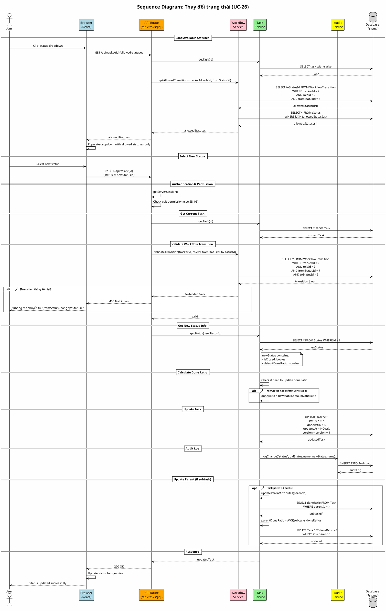

# Sequence Diagram 06: Thay đổi trạng thái (UC-26)

> **Use Case**: UC-26 - Thay đổi trạng thái  
> **Module**: Task Management  
> **Ngày**: 2026-01-15

---

## 1. Thông tin chung

| Thuộc tính | Giá trị |
|------------|---------|
| **Participants** | Browser, API, Workflow Service, Task Service, Database |
| **Trigger** | User select new status from dropdown |
| **Precondition** | User có quyền edit, Transition được phép trong Workflow |
| **Postcondition** | Status updated, doneRatio updated, Parent recalculated |

---

## 2. Sequence Diagram (PlantUML)



---

## 3. Workflow Transition Matrix Example

```
Tracker: Bug    Role: Developer

Current Status → Allowed Next Statuses
─────────────────────────────────────────
New            → In Progress, Rejected
In Progress    → Resolved, On Hold
Resolved       → (none - handled by QA role)
On Hold        → In Progress
Rejected       → Reopened
Closed         → Reopened
```

---

## 4. Status with Default Done Ratio

| Status | isClosed | defaultDoneRatio |
|--------|----------|------------------|
| New | false | 0 |
| In Progress | false | 10 |
| Resolved | false | 80 |
| Closed | true | 100 |
| Rejected | true | 0 |

---

## 5. Request/Response

### Request
```http
PATCH /api/tasks/task-uuid
Content-Type: application/json

{
  "statusId": "resolved-status-uuid",
  "version": 5
}
```

### Response (Success)
```http
HTTP/1.1 200 OK

{
  "id": "task-uuid",
  "status": {
    "id": "resolved-status-uuid",
    "name": "Resolved",
    "isClosed": false
  },
  "doneRatio": 80,
  "version": 6
}
```

### Response (Forbidden)
```http
HTTP/1.1 403 Forbidden

{
  "error": "Workflow violation",
  "message": "Cannot transition from 'New' to 'Closed' with role 'Developer'"
}
```

---

*Ngày tạo: 2026-01-15*
