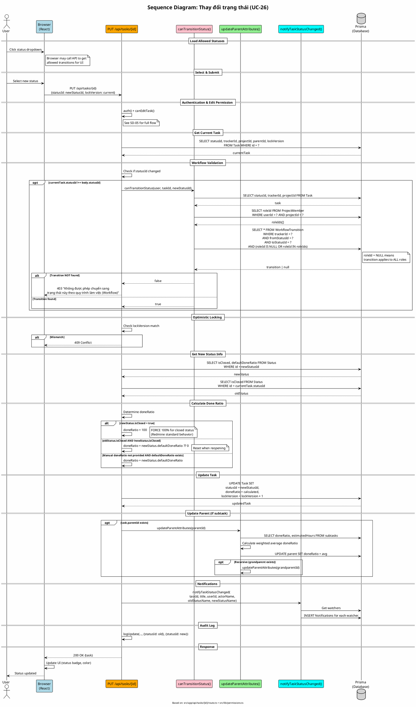

# Sequence Diagram 06: Thay đổi trạng thái (UC-26)

> **Use Case**: UC-26 - Thay đổi trạng thái  
> **Module**: Task Management  
> **Ngày**: 2026-01-16 (Updated from code review)

---

## 1. Thông tin chung

| Thuộc tính | Giá trị |
|------------|---------|
| **Participants** | Browser, API Route, Workflow Service, Task Service, Database |
| **API Endpoint** | PUT /api/tasks/[id] (with statusId change) |
| **Source Files** | `src/app/api/tasks/[id]/route.ts`, `src/lib/permissions.ts` |

---

## 2. Sequence Diagram (PlantUML)



---

## 3. Workflow Transition Logic (từ code)

```typescript
// src/lib/permissions.ts - canTransitionStatus()
export async function canTransitionStatus(
    user: PermissionUser,
    taskId: string,
    toStatusId: string
): Promise<boolean> {
    if (user.isAdministrator) return true;  // Admin bypasses workflow

    const task = await prisma.task.findUnique({
        where: { id: taskId },
        select: { statusId: true, trackerId: true, projectId: true },
    });

    const memberships = await prisma.projectMember.findMany({
        where: { userId: user.id, projectId: task.projectId },
        select: { roleId: true },
    });

    const roleIds = memberships.map((m) => m.roleId);

    // Check if transition is allowed
    const allowedTransition = await prisma.workflowTransition.findFirst({
        where: {
            trackerId: task.trackerId,
            fromStatusId: task.statusId,
            toStatusId: toStatusId,
            OR: [
                { roleId: null },           // NULL = applies to all roles
                { roleId: { in: roleIds } }, // OR role matches user's role
            ],
        },
    });

    return !!allowedTransition;
}
```

---

## 4. Auto Done Ratio Logic (từ code)

```typescript
// src/app/api/tasks/[id]/route.ts - Lines 410-421
if (newStatus.isClosed) {
    // FORCE doneRatio=100 for closed statuses (Redmine standard)
    updateData.doneRatio = 100;
} else if (oldStatus?.isClosed && !newStatus.isClosed) {
    // Chuyển từ CLOSED sang OPEN -> reset doneRatio
    updateData.doneRatio = newStatus.defaultDoneRatio ?? 0;
} else if (validatedData.doneRatio === undefined && 
           newStatus.defaultDoneRatio !== null) {
    // If done ratio not manually set, use status default
    updateData.doneRatio = newStatus.defaultDoneRatio;
}
```

---

## 5. WorkflowTransition Table

```sql
CREATE TABLE WorkflowTransition (
    id          TEXT PRIMARY KEY,
    trackerId   TEXT NOT NULL,
    roleId      TEXT NULL,         -- NULL = all roles
    fromStatusId TEXT NOT NULL,
    toStatusId   TEXT NOT NULL
);
```

| trackerId | roleId | fromStatusId | toStatusId |
|-----------|--------|--------------|------------|
| Bug | Developer | New | In Progress |
| Bug | Developer | In Progress | Resolved |
| Bug | NULL | Resolved | Closed |
| Bug | Tester | Closed | Reopened |

---

## 6. Request/Response

### Request
```http
PUT /api/tasks/task-uuid
Content-Type: application/json

{
  "statusId": "resolved-status-uuid",
  "lockVersion": 5
}
```

### Success Response (200)
```json
{
  "id": "task-uuid",
  "status": {
    "id": "resolved-status-uuid",
    "name": "Resolved",
    "isClosed": false
  },
  "doneRatio": 80,
  "lockVersion": 6
}
```

### Error Response (403 - Workflow)
```json
{
  "error": "Không được phép chuyển sang trạng thái này theo quy trình làm việc (Workflow)"
}
```

---

*Ngày cập nhật: 2026-01-16 - Based on actual code review*
