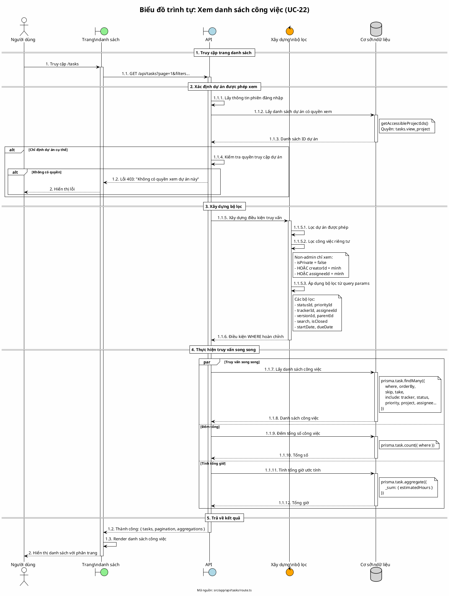

# Biểu đồ trình tự 06: Xem danh sách công việc (UC-22)

> **Use Case**: UC-22 - Xem danh sách công việc  
> **Module**: Quản lý công việc  
> **Mã nguồn**: `src/app/api/tasks/route.ts` (GET)

---

## 1. Phân tích

| Thành phần | Xác định |
|------------|----------|
| **Tác nhân** | Người dùng |
| **Biên** | Trang danh sách, API |
| **Điều khiển** | Kiểm tra quyền, Xây dựng bộ lọc |
| **Thực thể** | Cơ sở dữ liệu (Task, Project) |

---

## 2. Các đối tượng tham gia

- **Tác nhân**: Người dùng
- **Biên**: Trang danh sách công việc, API /api/tasks
- **Điều khiển**: Lọc quyền, Xây dựng truy vấn
- **Thực thể**: Prisma (Task, Project, ProjectMember)

---

## 3. Mã PlantUML

---

## 4. Giải thích quy tắc đánh số

| Số | Ý nghĩa |
|----|---------|
| 1, 2 | Giai đoạn: Truy vấn, Hiển thị |
| 1.1, 1.2, 1.3 | Các bước trong giai đoạn 1 |
| 1.1.1 - 1.1.12 | Chi tiết xử lý API |
| 1.1.5.1 - 1.1.5.3 | Chi tiết xây dựng bộ lọc |

---

## 5. Các bộ lọc hỗ trợ

| Bộ lọc | Mô tả |
|--------|-------|
| statusId | Trạng thái công việc |
| priorityId | Độ ưu tiên |
| trackerId | Loại công việc |
| assigneeId | Người thực hiện |
| creatorId | Người tạo |
| versionId | Phiên bản |
| parentId | Công việc cha |
| isClosed | Trạng thái đóng/mở |
| search | Tìm kiếm theo tiêu đề, mô tả |
| startDateFrom/To | Khoảng ngày bắt đầu |
| dueDateFrom/To | Khoảng ngày đến hạn |

---

## 6. Quy tắc nghiệp vụ

| Quy tắc | Mô tả |
|---------|-------|
| Quyền xem | Cần quyền `tasks.view_project` trong dự án |
| Công việc riêng tư | Non-admin chỉ xem của mình |
| Phân trang | Tối đa 100 công việc mỗi trang |
| Sắp xếp mặc định | Theo thời gian cập nhật giảm dần |

---

*Ngày tạo: 2026-01-16*
