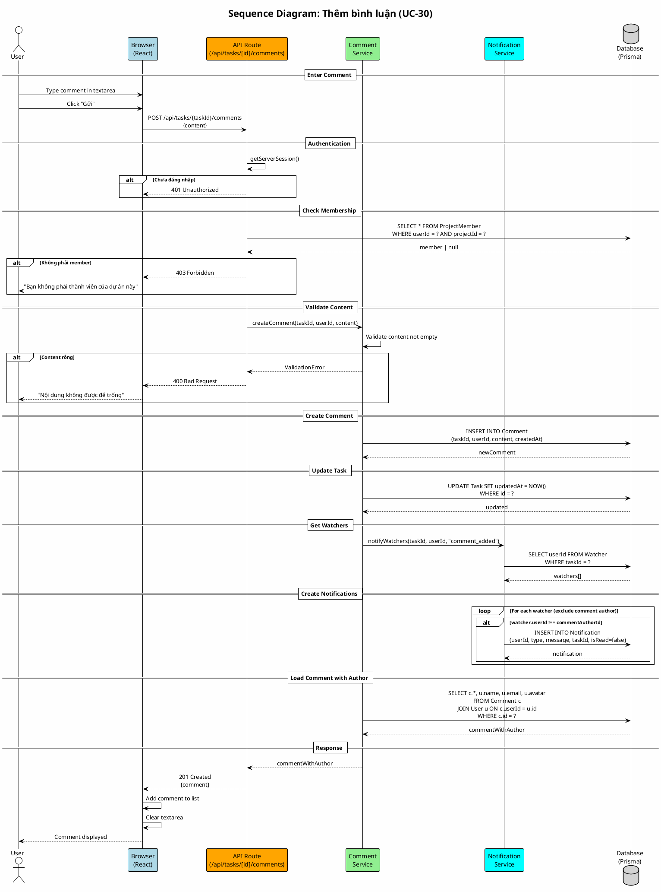

# Sequence Diagram 07: Thêm bình luận (UC-30)

> **Use Case**: UC-30 - Thêm bình luận  
> **Module**: Comments  
> **Ngày**: 2026-01-15

---

## 1. Thông tin chung

| Thuộc tính | Giá trị |
|------------|---------|
| **Participants** | Browser, API, Comment Service, Notification Service, Database |
| **Trigger** | User submit comment |
| **Precondition** | User là member của project |
| **Postcondition** | Comment created, Task updated, Watchers notified |

---

## 2. Sequence Diagram (PlantUML)



---

## 3. Notification Creation

```javascript
// For each watcher (except comment author)
watchers.filter(w => w.userId !== authorId).forEach(watcher => {
  createNotification({
    userId: watcher.userId,
    type: "comment_added",
    message: `${authorName} đã bình luận trên công việc #${taskNumber}`,
    taskId: taskId,
    isRead: false
  });
});
```

---

## 4. Request/Response

### Request
```http
POST /api/tasks/task-uuid/comments
Content-Type: application/json

{
  "content": "This is a comment on the task."
}
```

### Response (Success)
```http
HTTP/1.1 201 Created

{
  "id": "comment-uuid",
  "content": "This is a comment on the task.",
  "createdAt": "2026-01-15T17:00:00Z",
  "author": {
    "id": "user-uuid",
    "name": "John Doe",
    "avatar": "/uploads/avatar.jpg"
  }
}
```

---

## 5. Side Effects

| Action | Description |
|--------|-------------|
| Update Task | task.updatedAt = NOW() |
| Notify Watchers | Create notification for each watcher |
| Exclude Author | Author không nhận notification về comment của mình |

---

*Ngày tạo: 2026-01-15*
