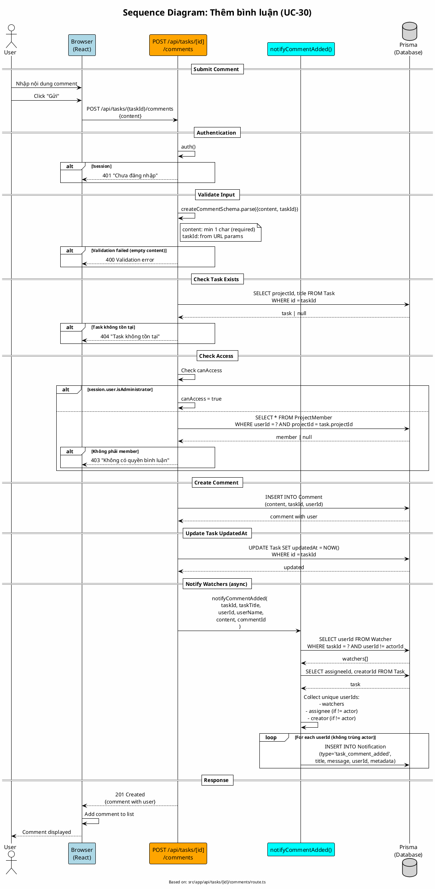

# Sequence Diagram 07: Thêm bình luận (UC-30)

> **Use Case**: UC-30 - Thêm bình luận  
> **Module**: Comments  
> **Ngày**: 2026-01-16 (Updated from code review)

---

## 1. Thông tin chung

| Thuộc tính | Giá trị |
|------------|---------|
| **Participants** | Browser, API Route, Notification Service, Prisma |
| **API Endpoint** | POST /api/tasks/[id]/comments |
| **Source File** | `src/app/api/tasks/[id]/comments/route.ts` |

---

## 2. Sequence Diagram (PlantUML)



---

## 3. Access Check Logic (từ code)

```typescript
// Line 65-73
const canAccess =
    session.user.isAdministrator ||
    (await prisma.projectMember.findFirst({
        where: { userId: session.user.id, projectId: task.projectId },
    }));

if (!canAccess) {
    return errorResponse('Không có quyền bình luận', 403);
}
```

> **Note**: Chỉ cần là **member của project** (bất kỳ role nào) là có thể comment. Không có permission-based check.

---

## 4. Notification Logic (từ lib/notifications.ts)

```typescript
// notifyTaskWatchers() - Line 60-106
export async function notifyTaskWatchers(taskId, actorId, type, title, message, metadata) {
    // 1. Get watchers (exclude actor)
    const watchers = await prisma.watcher.findMany({
        where: { taskId, userId: { not: actorId } },
    });

    // 2. Get task's assignee and creator
    const task = await prisma.task.findUnique({
        where: { id: taskId },
        select: { assigneeId: true, creatorId: true },
    });

    // 3. Collect unique userIds
    const userIds = new Set<string>();
    watchers.forEach((w) => userIds.add(w.userId));
    if (task?.assigneeId && task.assigneeId !== actorId) {
        userIds.add(task.assigneeId);
    }
    if (task?.creatorId && task.creatorId !== actorId) {
        userIds.add(task.creatorId);
    }

    // 4. Create notifications
    return createNotifications(
        Array.from(userIds).map((userId) => ({ type, title, message, userId, metadata }))
    );
}
```

---

## 5. Request/Response

### Request
```http
POST /api/tasks/task-uuid/comments
Content-Type: application/json

{
  "content": "This is my comment on the task."
}
```

### Success Response (201)
```json
{
  "id": "comment-uuid",
  "content": "This is my comment on the task.",
  "taskId": "task-uuid",
  "userId": "user-uuid",
  "createdAt": "2026-01-16T00:00:00Z",
  "user": {
    "id": "user-uuid",
    "name": "John Doe",
    "avatar": "/uploads/avatar.jpg"
  }
}
```

---

## 6. Side Effects

| Action | Description |
|--------|-------------|
| Update Task | task.updatedAt = NOW() |
| Notify | watchers + assignee + creator (exclude author) |

---

## 7. Who Gets Notified

| Role | Gets Notified? |
|------|---------------|
| Watchers | ✅ Yes (if not author) |
| Assignee | ✅ Yes (if not author) |
| Creator | ✅ Yes (if not author) |
| Other members | ❌ No |
| Author | ❌ No (excluded) |

---

*Ngày cập nhật: 2026-01-16 - Based on actual code review*
