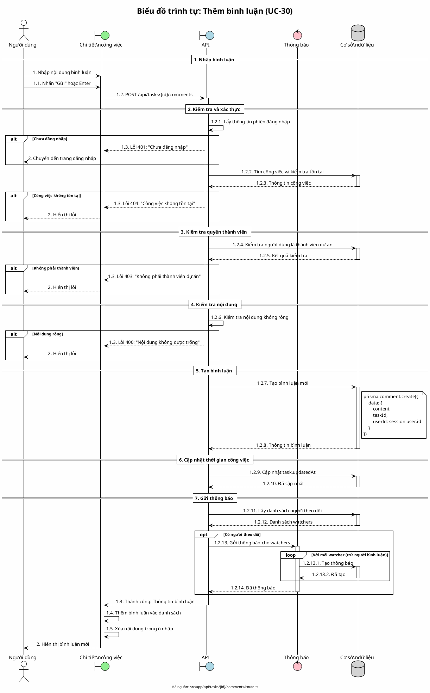

# Biểu đồ trình tự 07: Thêm bình luận (UC-30)

> **Use Case**: UC-30 - Thêm bình luận  
> **Module**: Bình luận  
> **Mã nguồn**: `src/app/api/tasks/[id]/comments/route.ts` (POST)

---

## 1. Phân tích

| Thành phần | Xác định |
|------------|----------|
| **Tác nhân** | Người dùng (thành viên dự án) |
| **Biên** | Chi tiết công việc, API |
| **Điều khiển** | Kiểm tra quyền, Thông báo |
| **Thực thể** | Cơ sở dữ liệu (Comment, Task, Watcher) |

---

## 2. Các đối tượng tham gia

- **Tác nhân**: Người dùng
- **Biên**: Trang chi tiết công việc, API
- **Điều khiển**: Kiểm tra thành viên, Thông báo
- **Thực thể**: Prisma (Comment, Task, Watcher, Notification)

---

## 3. Mã PlantUML

---

## 4. Giải thích quy tắc đánh số

| Số | Ý nghĩa |
|----|---------|
| 1, 2 | Giai đoạn: Gửi, Hiển thị kết quả |
| 1.1 - 1.5 | Các bước trong giai đoạn 1 |
| 1.2.1 - 1.2.14 | Chi tiết xử lý API |
| 1.2.13.1, 1.2.13.2 | Vòng lặp gửi thông báo |

---

## 5. Quy tắc nghiệp vụ

| Quy tắc | Mô tả |
|---------|-------|
| Chỉ thành viên | Chỉ thành viên dự án mới được bình luận |
| Nội dung bắt buộc | Bình luận không được rỗng |
| Cập nhật timestamp | Task.updatedAt được cập nhật khi có bình luận |
| Thông báo watchers | Gửi thông báo cho người theo dõi (trừ người bình luận) |

---

*Ngày tạo: 2026-01-16*
