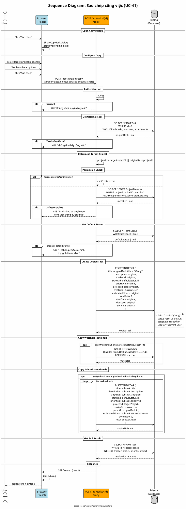

# Sequence Diagram 08: Sao chép công việc (UC-41)

> **Use Case**: UC-41 - Sao chép công việc  
> **Module**: Task Copy  
> **Ngày**: 2026-01-16 (Updated from code review)

---

## 1. Thông tin chung

| Thuộc tính | Giá trị |
|------------|---------|
| **Participants** | Browser, API Route, Prisma |
| **API Endpoint** | POST /api/tasks/[id]/copy |
| **Source File** | `src/app/api/tasks/[id]/copy/route.ts` |

---

## 2. Sequence Diagram (PlantUML)



---

## 3. Copy Logic (từ code)

```typescript
// Line 68-84 - Main task copy
const copiedTask = await prisma.task.create({
    data: {
        title: `${originalTask.title} (Copy)`,  // Add suffix
        description: originalTask.description,
        trackerId: originalTask.trackerId,
        statusId: defaultStatus.id,              // Reset to default
        priorityId: originalTask.priorityId,
        projectId,                               // Target project
        creatorId: session.user.id,              // Current user
        estimatedHours: originalTask.estimatedHours,
        doneRatio: 0,                            // Reset to 0
        startDate: originalTask.startDate,
        dueDate: originalTask.dueDate,
        isPrivate: originalTask.isPrivate,
    },
});
```

---

## 4. What Gets Copied

| Field | Copied? | Notes |
|-------|---------|-------|
| title | ✅ + "(Copy)" | Suffix added |
| description | ✅ | As-is |
| trackerId | ✅ | As-is |
| statusId | ❌ Reset | Uses defaultStatus |
| priorityId | ✅ | As-is |
| projectId | ⚙️ | Target or original |
| creatorId | ❌ New | Current user |
| assigneeId | ❌ | NOT copied |
| estimatedHours | ✅ | As-is |
| doneRatio | ❌ Reset | Always 0 |
| startDate | ✅ | As-is |
| dueDate | ✅ | As-is |
| isPrivate | ✅ | As-is |
| versionId | ❌ | NOT copied |
| parentId | ❌ | NOT copied (top-level) |

---

## 5. Copy Options

| Option | Default | Description |
|--------|---------|-------------|
| targetProjectId | original | Copy to same or different project |
| copySubtasks | false | Copy subtasks with new parentId |
| copyWatchers | false | Copy watcher list |
| copyAttachments | ❌ N/A | NOT implemented in code |

---

## 6. Request/Response

### Request
```http
POST /api/tasks/original-task-uuid/copy
Content-Type: application/json

{
  "targetProjectId": "target-project-uuid",
  "copySubtasks": true,
  "copyWatchers": false
}
```

### Success Response (201)
```json
{
  "id": "new-task-uuid",
  "title": "Original Title (Copy)",
  "status": {"name": "New", "isDefault": true},
  "project": {"id": "...", "name": "..."},
  "_count": {"subtasks": 2}
}
```

---

*Ngày cập nhật: 2026-01-16 - Based on actual code review*
