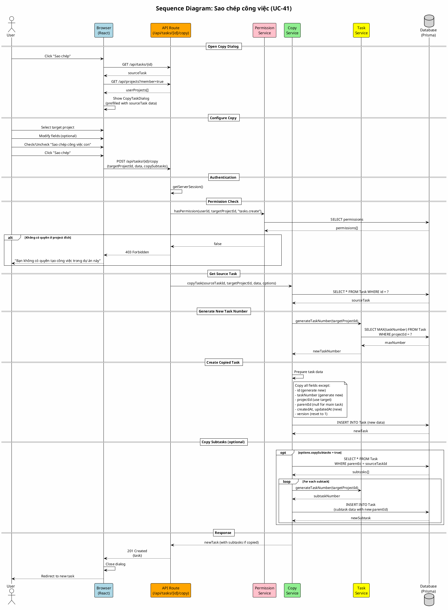

# Sequence Diagram 08: Sao chép công việc (UC-41)

> **Use Case**: UC-41 - Sao chép công việc  
> **Module**: Task Copy  
> **Ngày**: 2026-01-15

---

## 1. Thông tin chung

| Thuộc tính | Giá trị |
|------------|---------|
| **Participants** | Browser, API, Permission Service, Copy Service, Task Service, Database |
| **Trigger** | User submit copy task form |
| **Precondition** | User có quyền `tasks.create` ở project đích |
| **Postcondition** | New task created, Subtasks copied (optional) |

---

## 2. Sequence Diagram (PlantUML)



---

## 3. Copy Field Mapping

| Field | Source | Target | Behavior |
|-------|--------|--------|----------|
| id | source.id | UUID.new() | Generate new |
| taskNumber | source.taskNumber | max+1 | Generate per project |
| projectId | source.projectId | targetProjectId | Use target |
| subject | source.subject | copied | Copy |
| description | source.description | copied | Copy |
| trackerId | source.trackerId | mapped* | Map if exists in target |
| statusId | source.statusId | mapped* | Map or use default |
| priorityId | source.priorityId | copied | Copy |
| assigneeId | source.assigneeId | null/mapped | Clear or map if member |
| parentId | source.parentId | null/newParentId | null for main, new for sub |
| version | any | 1 | Reset |
| createdAt | any | NOW() | New |

---

## 4. Request/Response

### Request
```http
POST /api/tasks/source-task-uuid/copy
Content-Type: application/json

{
  "targetProjectId": "target-project-uuid",
  "data": {
    "subject": "Copied: Original subject",
    "description": "..."
  },
  "options": {
    "copySubtasks": true
  }
}
```

### Response (Success)
```http
HTTP/1.1 201 Created

{
  "id": "new-task-uuid",
  "taskNumber": 15,
  "subject": "Copied: Original subject",
  "projectId": "target-project-uuid",
  "subtasks": [
    {"id": "sub1", "taskNumber": 16},
    {"id": "sub2", "taskNumber": 17}
  ]
}
```

---

*Ngày tạo: 2026-01-15*
