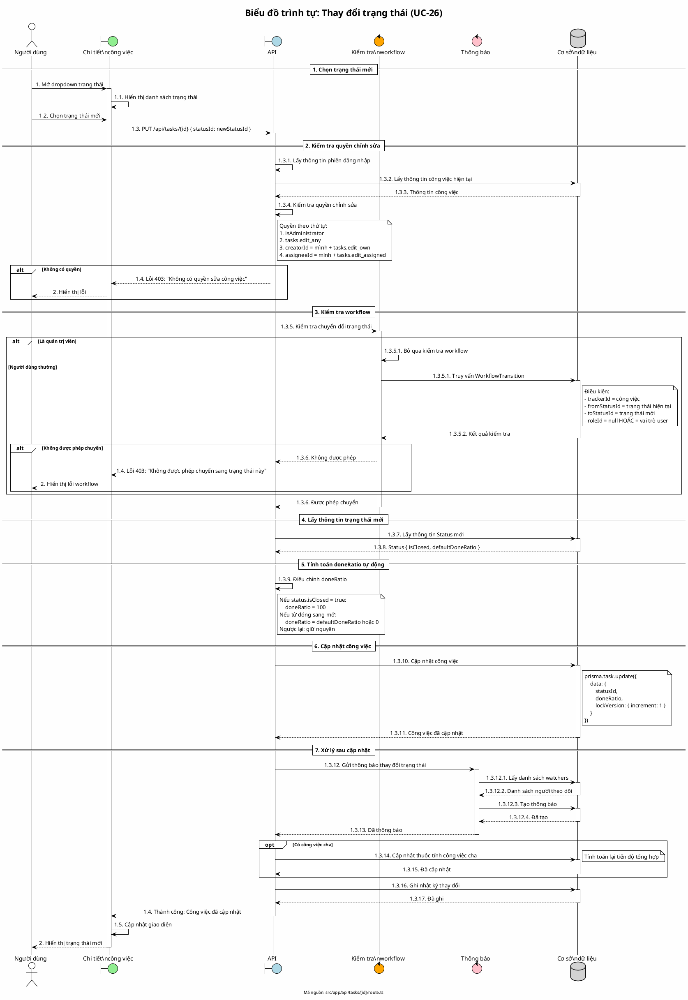

# Biểu đồ trình tự 08: Thay đổi trạng thái công việc (UC-26)

> **Use Case**: UC-26 - Thay đổi trạng thái  
> **Module**: Quản lý công việc  
> **Mã nguồn**: `src/app/api/tasks/[id]/route.ts` (PUT)

---

## 1. Phân tích

| Thành phần | Xác định |
|------------|----------|
| **Tác nhân** | Người dùng (có quyền chỉnh sửa) |
| **Biên** | Chi tiết công việc, API |
| **Điều khiển** | Kiểm tra workflow, Cập nhật |
| **Thực thể** | Cơ sở dữ liệu (Task, WorkflowTransition, Status) |

---

## 2. Các đối tượng tham gia

- **Tác nhân**: Người dùng
- **Biên**: Dropdown trạng thái, API
- **Điều khiển**: Kiểm tra workflow, Thông báo
- **Thực thể**: Prisma (Task, WorkflowTransition, Status)

---

## 3. Mã PlantUML

---

## 4. Giải thích quy tắc đánh số

| Số | Ý nghĩa |
|----|---------|
| 1, 2 | Giai đoạn: Xử lý, Hiển thị |
| 1.1 - 1.5 | Các bước giao diện và API |
| 1.3.1 - 1.3.17 | Chi tiết xử lý API |
| 1.3.5.1, 1.3.5.2 | Xử lý trong kiểm tra workflow |
| 1.3.12.1 - 1.3.12.4 | Xử lý gửi thông báo |

---

## 5. Quy tắc workflow

| Trường hợp | Hành vi |
|------------|---------|
| Quản trị viên | Bỏ qua kiểm tra workflow |
| Người dùng thường | Kiểm tra WorkflowTransition |
| roleId = null | Áp dụng cho tất cả vai trò |

---

## 6. Quy tắc doneRatio tự động

| Điều kiện | doneRatio |
|-----------|-----------|
| Trạng thái đóng (isClosed = true) | 100% |
| Từ đóng sang mở | defaultDoneRatio hoặc 0 |
| Khác | Giữ nguyên |

---

*Ngày tạo: 2026-01-16*
