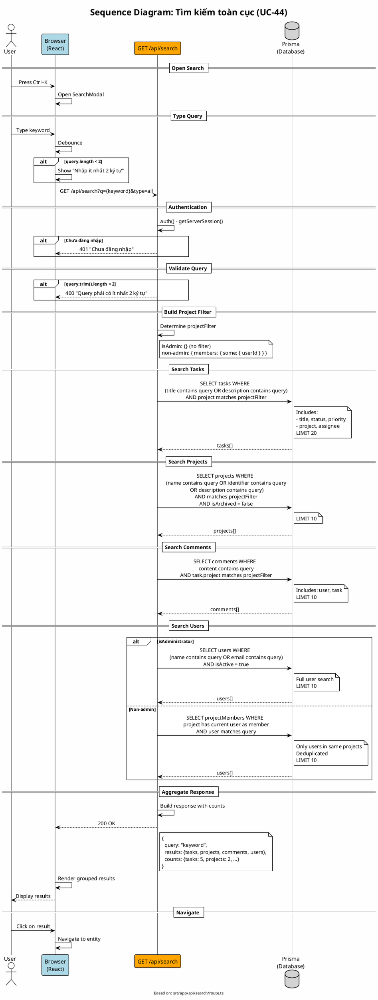

# Sequence Diagram 09: Tìm kiếm toàn cục (UC-44)

> **Use Case**: UC-44 - Tìm kiếm toàn cục  
> **Module**: Global Search  
> **Ngày**: 2026-01-16 (Updated from code review)

---

## 1. Thông tin chung

| Thuộc tính | Giá trị |
|------------|---------|
| **Participants** | Browser, API Route, Database |
| **API Endpoint** | GET /api/search |
| **Source File** | `src/app/api/search/route.ts` |

---

## 2. Sequence Diagram (PlantUML)



---

## 3. Project Filter Logic (từ code)

```typescript
// Line 28-30
const projectFilter = isAdmin
    ? {}  // Admin sees all
    : { members: { some: { userId } } };  // Only member projects
```

---

## 4. User Search Logic (từ code)

```typescript
// Admin: Full search
if (isAdmin) {
    results.users = await prisma.user.findMany({
        where: {
            OR: [
                { name: { contains: searchQuery } },
                { email: { contains: searchQuery } },
            ],
            isActive: true,
        },
        take: 10,
    });
} else {
    // Non-admin: Only users in same projects
    const projectMembers = await prisma.projectMember.findMany({
        where: {
            project: { members: { some: { userId } } },
            user: {
                OR: [
                    { name: { contains: searchQuery } },
                    { email: { contains: searchQuery } },
                ],
                isActive: true,
            },
        },
        ...
    });
    // Deduplicate users
    const uniqueUsers = new Map();
    projectMembers.forEach((pm) => {
        if (!uniqueUsers.has(pm.user.id)) {
            uniqueUsers.set(pm.user.id, pm.user);
        }
    });
    results.users = Array.from(uniqueUsers.values());
}
```

---

## 5. Request/Response

### Request
```http
GET /api/search?q=login&type=all
```

### Response
```json
{
  "query": "login",
  "results": {
    "tasks": [
      {
        "id": "task-uuid",
        "title": "Implement login feature",
        "status": {"name": "In Progress", "isClosed": false},
        "priority": {"name": "High", "color": "#ff0000"},
        "project": {"id": "...", "name": "My Project"},
        "assignee": {"id": "...", "name": "John"}
      }
    ],
    "projects": [...],
    "comments": [...],
    "users": [...]
  },
  "counts": {
    "tasks": 5,
    "projects": 2,
    "comments": 3,
    "users": 1
  }
}
```

---

## 6. Key Differences from Generic Design

| Aspect | Generic | Actual Code |
|--------|---------|-------------|
| User search | Admin only | Non-admin CAN search users in same projects |
| Query method | ILIKE | `contains` (Prisma) |
| Private task filter | Explicit | NOT implemented in search (potential issue) |
| Type filter | All | Supports `?type=tasks\|projects\|comments\|users\|all` |

---

*Ngày cập nhật: 2026-01-16 - Based on actual code review*
