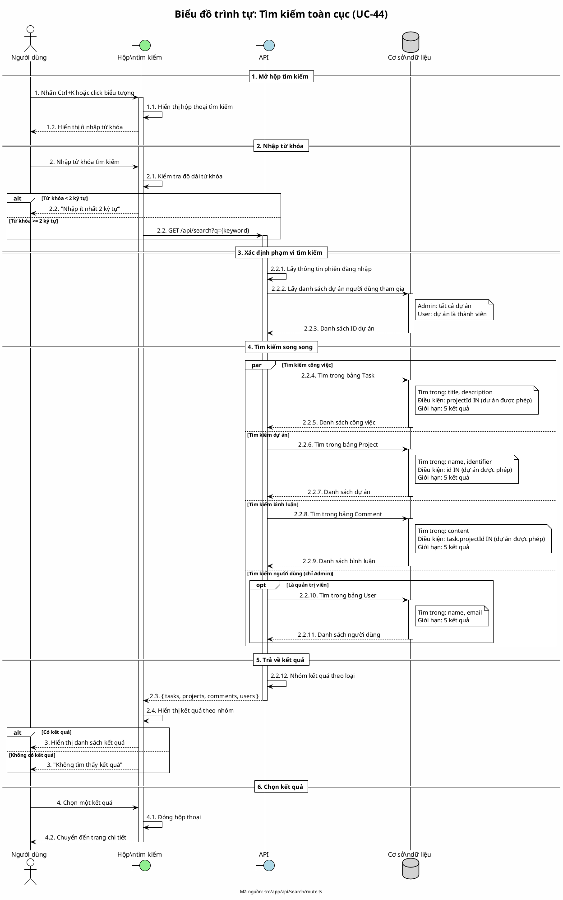

# Biểu đồ trình tự 09: Tìm kiếm toàn cục (UC-44)

> **Use Case**: UC-44 - Tìm kiếm toàn cục  
> **Module**: Tìm kiếm  
> **Mã nguồn**: `src/app/api/search/route.ts`

---

## 1. Phân tích

| Thành phần | Xác định |
|------------|----------|
| **Tác nhân** | Người dùng đã đăng nhập |
| **Biên** | Hộp tìm kiếm, API |
| **Điều khiển** | Xây dựng truy vấn, Lọc quyền |
| **Thực thể** | Cơ sở dữ liệu (Task, Project, Comment, User) |

---

## 2. Các đối tượng tham gia

- **Tác nhân**: Người dùng
- **Biên**: Global Search, API /api/search
- **Điều khiển**: Xây dựng truy vấn
- **Thực thể**: Prisma (Task, Project, Comment, User)

---

## 3. Mã PlantUML

---

## 4. Giải thích quy tắc đánh số

| Số | Ý nghĩa |
|----|---------|
| 1, 2, 3, 4 | Giai đoạn chính |
| 2.1, 2.2, 2.3, 2.4 | Các bước trong nhập từ khóa |
| 2.2.1 - 2.2.12 | Chi tiết xử lý API |

---

## 5. Phạm vi tìm kiếm

| Đối tượng | Trường tìm kiếm | Điều kiện |
|-----------|-----------------|-----------|
| Công việc | title, description | Dự án được phép |
| Dự án | name, identifier | Dự án được phép |
| Bình luận | content | Công việc trong dự án được phép |
| Người dùng | name, email | Chỉ Admin |

---

## 6. Quy tắc nghiệp vụ

| Quy tắc | Mô tả |
|---------|-------|
| Tối thiểu 2 ký tự | Phải nhập ít nhất 2 ký tự |
| Giới hạn 5 kết quả | Mỗi loại tối đa 5 kết quả |
| Lọc theo quyền | Non-admin chỉ thấy dự án mình tham gia |
| User search chỉ Admin | Chỉ Admin mới tìm được người dùng |

---

*Ngày tạo: 2026-01-16*
