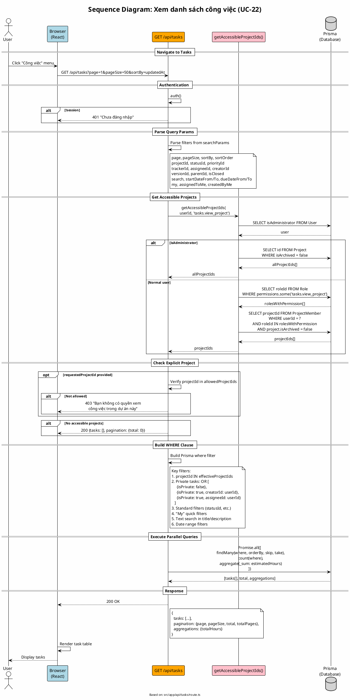

# Sequence Diagram 10: Xem danh sách công việc (UC-22)

> **Use Case**: UC-22 - Xem danh sách công việc  
> **Module**: Task Management  
> **Ngày**: 2026-01-16 (Updated from code review)

---

## 1. Thông tin chung

| Thuộc tính | Giá trị |
|------------|---------|
| **Participants** | Browser, API Route, Permission Service, Prisma |
| **API Endpoint** | GET /api/tasks |
| **Source File** | `src/app/api/tasks/route.ts` |

---

## 2. Sequence Diagram (PlantUML)



---

## 3. Accessible Projects Logic (từ code)

```typescript
// src/lib/permissions.ts - getAccessibleProjectIds()
export async function getAccessibleProjectIds(
    userId: string,
    permissionKey: string
): Promise<string[]> {
    const user = await prisma.user.findUnique({...});

    // Admin has access to all
    if (user.isAdministrator) {
        const projects = await prisma.project.findMany({
            where: { isArchived: false },
        });
        return projects.map(p => p.id);
    }

    // Get roles that have the permission
    const rolesWithPermission = await prisma.role.findMany({
        where: {
            permissions: {
                some: { permission: { key: permissionKey } }
            },
            isActive: true
        },
    });

    // Get user's memberships with those roles
    const memberships = await prisma.projectMember.findMany({
        where: {
            userId,
            roleId: { in: rolesWithPermission.map(r => r.id) },
            project: { isArchived: false }
        },
    });

    return memberships.map(m => m.projectId);
}
```

---

## 4. Private Task Filter (từ code)

```typescript
// Line 56-63
if (!session.user.isAdministrator) {
    where.OR = [
        { isPrivate: false },
        { isPrivate: true, creatorId: userId },
        { isPrivate: true, assigneeId: userId },
    ];
}
```

> **Admin**: Xem được tất cả private tasks
> **User**: Chỉ xem private tasks mà mình là creator hoặc assignee

---

## 5. Quick Filters

| Param | Filter Logic |
|-------|--------------|
| `my=true` | assigneeId = userId OR creatorId = userId |
| `assignedToMe=true` | assigneeId = userId |
| `createdByMe=true` | creatorId = userId |

---

## 6. Request/Response

### Request
```http
GET /api/tasks?projectId=xxx&statusId=yyy&page=1&pageSize=25&sortBy=dueDate&sortOrder=asc
```

### Response
```json
{
  "tasks": [
    {
      "id": "...",
      "number": 42,
      "title": "...",
      "tracker": {"id": "...", "name": "Bug"},
      "status": {"id": "...", "name": "In Progress", "isClosed": false},
      "priority": {"id": "...", "name": "High", "color": "#ff0000"},
      "project": {"id": "...", "name": "...", "identifier": "..."},
      "assignee": {"id": "...", "name": "...", "avatar": "..."},
      "subtasks": [...],
      "_count": {"subtasks": 2, "comments": 5}
    }
  ],
  "pagination": {
    "page": 1,
    "pageSize": 25,
    "total": 150,
    "totalPages": 6
  },
  "aggregations": {
    "totalHours": 120.5
  }
}
```

---

*Ngày cập nhật: 2026-01-16 - Based on actual code review*
