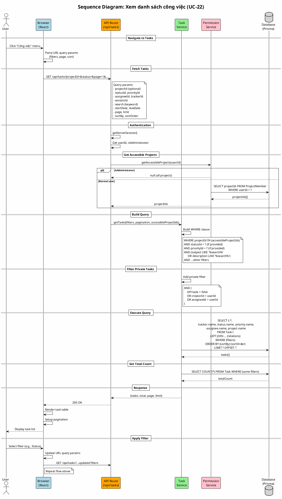

# Sequence Diagram 10: Xem danh sách công việc (UC-22)

> **Use Case**: UC-22 - Xem danh sách công việc  
> **Module**: Task Management  
> **Ngày**: 2026-01-15

---

## 1. Thông tin chung

| Thuộc tính | Giá trị |
|------------|---------|
| **Participants** | Browser, API, Task Service, Permission Service, Database |
| **Trigger** | User access tasks page |
| **Precondition** | User đã đăng nhập |
| **Postcondition** | Filtered task list displayed with pagination |

---

## 2. Sequence Diagram (PlantUML)



---

## 3. Filter Parameters

| Param | Type | Description |
|-------|------|-------------|
| projectId | UUID | Filter by project |
| statusId | UUID | Filter by status |
| priorityId | UUID | Filter by priority |
| trackerId | UUID | Filter by tracker |
| assigneeId | UUID | Filter by assignee |
| versionId | UUID | Filter by version |
| search | string | Search in subject/description |
| startDateFrom | date | Start date range |
| dueDateTo | date | Due date range |
| isOpen | boolean | Only open tasks |
| page | number | Page number (default: 1) |
| limit | number | Items per page (default: 25) |
| sortBy | string | Sort field (default: createdAt) |
| sortOrder | asc/desc | Sort direction |

---

## 4. Request/Response

### Request
```http
GET /api/tasks?projectId=uuid&statusId=uuid&page=1&limit=25&sortBy=dueDate&sortOrder=asc
```

### Response
```http
HTTP/1.1 200 OK

{
  "tasks": [
    {
      "id": "task-uuid",
      "taskNumber": 42,
      "subject": "Task title",
      "tracker": {"name": "Bug"},
      "status": {"name": "In Progress"},
      "priority": {"name": "High"},
      "assignee": {"name": "John"},
      "dueDate": "2026-01-20"
    }
  ],
  "pagination": {
    "total": 150,
    "page": 1,
    "limit": 25,
    "totalPages": 6
  }
}
```

---

*Ngày tạo: 2026-01-15*
