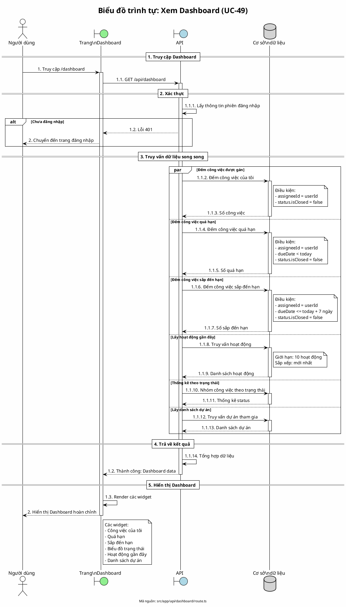

# Biểu đồ trình tự 10: Xem Dashboard (UC-49)

> **Use Case**: UC-49 - Xem Dashboard  
> **Module**: Dashboard  
> **Mã nguồn**: `src/app/api/dashboard/route.ts`

---

## 1. Phân tích

| Thành phần | Xác định |
|------------|----------|
| **Tác nhân** | Người dùng đã đăng nhập |
| **Biên** | Trang Dashboard, API |
| **Điều khiển** | Tổng hợp dữ liệu |
| **Thực thể** | Cơ sở dữ liệu (Task, Project, Activity) |

---

## 2. Mã PlantUML

---

## 3. Giải thích

### Các widget hiển thị:
| Widget | Dữ liệu |
|--------|---------|
| Công việc của tôi | Số công việc đang mở được gán cho mình |
| Quá hạn | Số công việc đã quá ngày đến hạn |
| Sắp đến hạn | Số công việc đến hạn trong 7 ngày |
| Biểu đồ trạng thái | Thống kê theo nhóm status |
| Hoạt động gần đây | 10 hoạt động mới nhất |
| Dự án | Danh sách dự án đang tham gia |

---

*Ngày tạo: 2026-01-16*
