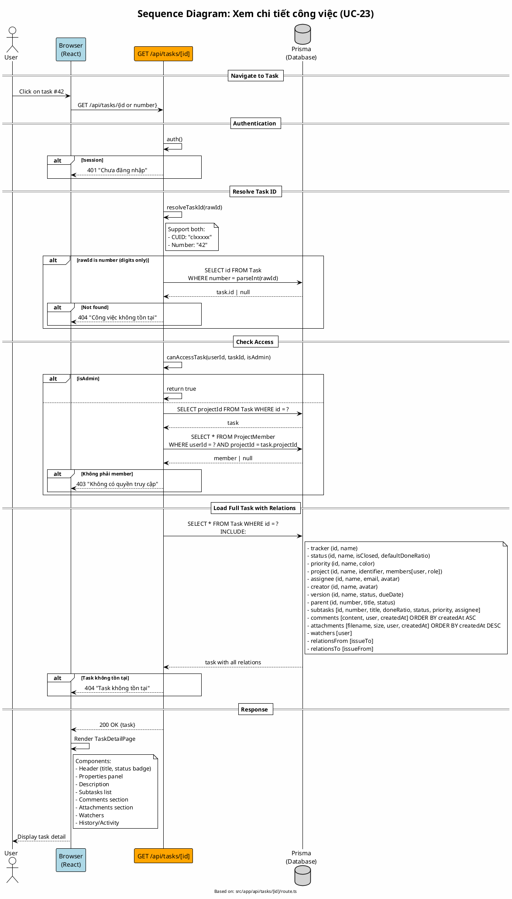

# Sequence Diagram 11: Xem chi tiết công việc (UC-23)

> **Use Case**: UC-23 - Xem chi tiết công việc  
> **Module**: Task Management  
> **Ngày**: 2026-01-16 (Updated from code review)

---

## 1. Thông tin chung

| Thuộc tính | Giá trị |
|------------|---------|
| **Participants** | Browser, API Route, Prisma |
| **API Endpoint** | GET /api/tasks/[id] |
| **Source File** | `src/app/api/tasks/[id]/route.ts` |

---

## 2. Sequence Diagram (PlantUML)



---

## 3. resolveTaskId Logic (từ code)

```typescript
// Line 18-28
async function resolveTaskId(idStr: string) {
    // Check if it's a number (task number like #42)
    if (/^\d+$/.test(idStr)) {
        const task = await prisma.task.findUnique({
            where: { number: parseInt(idStr) },
            select: { id: true }
        });
        return task?.id || null;
    }
    // Otherwise treat as CUID
    return idStr;
}
```

> **Convenience Feature**: User có thể truy cập `/tasks/42` thay vì `/tasks/clxxxxx`.

---

## 4. canAccessTask Logic (từ code)

```typescript
// Line 32-47
async function canAccessTask(userId: string, taskId: string, isAdmin: boolean) {
    if (isAdmin) return true;

    const task = await prisma.task.findUnique({
        where: { id: taskId },
        select: { projectId: true },
    });

    if (!task) return false;

    const membership = await prisma.projectMember.findFirst({
        where: { userId, projectId: task.projectId },
    });

    return !!membership;
}
```

> **Note**: Chỉ cần là **member của project**. Không check specific permission như `tasks.view_project`.

---

## 5. Included Relations

| Relation | Fields | Notes |
|----------|--------|-------|
| tracker | id, name | - |
| status | id, name, isClosed, defaultDoneRatio | For UI logic |
| priority | id, name, color | For badge color |
| project | id, name, identifier, members | Members for assignee dropdown |
| assignee | id, name, email, avatar | - |
| creator | id, name, avatar | - |
| version | id, name, status, dueDate | Milestone info |
| parent | id, number, title, status | Breadcrumb link |
| subtasks[] | id, number, title, doneRatio, status, priority, assignee | Subtask list |
| comments[] | + user | Ordered by createdAt ASC |
| attachments[] | + user | Ordered by createdAt DESC |
| watchers[] | + user | - |
| relationsFrom[] | + issueTo | Related tasks |
| relationsTo[] | + issueFrom | Related tasks |

---

## 6. Request/Response

### Request (by ID)
```http
GET /api/tasks/clxxxxx
```

### Request (by Number)
```http
GET /api/tasks/42
```

### Response
```json
{
  "id": "clxxxxx",
  "number": 42,
  "title": "Implement login feature",
  "description": "...",
  "doneRatio": 50,
  "estimatedHours": 8,
  "startDate": "2026-01-15",
  "dueDate": "2026-01-20",
  "lockVersion": 5,
  "isPrivate": false,
  "tracker": {"id": "...", "name": "Feature"},
  "status": {"id": "...", "name": "In Progress", "isClosed": false},
  "priority": {"id": "...", "name": "High", "color": "#ff0000"},
  "project": {
    "id": "...", 
    "name": "My Project",
    "members": [...]
  },
  "assignee": {"id": "...", "name": "John", "avatar": "..."},
  "creator": {"id": "...", "name": "Jane"},
  "parent": null,
  "subtasks": [...],
  "comments": [...],
  "attachments": [...],
  "watchers": [...],
  "relationsFrom": [...],
  "relationsTo": [...]
}
```

---

*Ngày cập nhật: 2026-01-16 - Based on actual code review*
