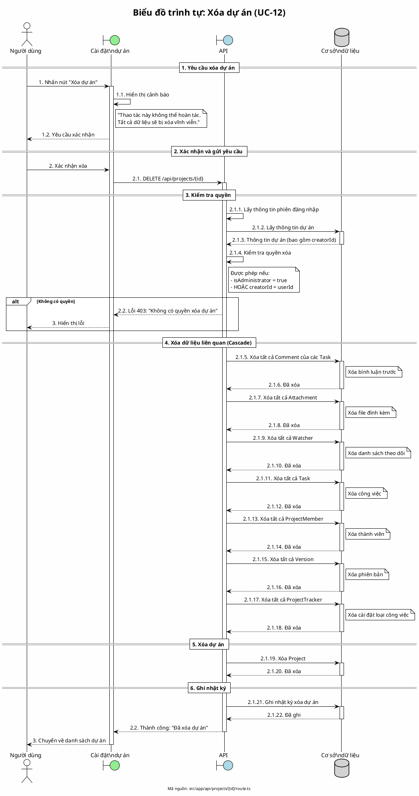

# Biểu đồ trình tự 11: Xóa dự án (UC-12)

> **Use Case**: UC-12 - Xóa dự án  
> **Module**: Quản lý dự án  
> **Mã nguồn**: `src/app/api/projects/[id]/route.ts` (DELETE)

---

## 1. Phân tích

| Thành phần | Xác định |
|------------|----------|
| **Tác nhân** | Người tạo dự án hoặc Quản trị viên |
| **Biên** | Cài đặt dự án, API |
| **Điều khiển** | Kiểm tra quyền |
| **Thực thể** | Cơ sở dữ liệu (Project, Task, Comment, ...) |

---

## 2. Mã PlantUML

---

## 3. Thứ tự xóa dữ liệu

| Thứ tự | Bảng | Lý do |
|--------|------|-------|
| 1 | Comment | Phụ thuộc Task |
| 2 | Attachment | Phụ thuộc Task |
| 3 | Watcher | Phụ thuộc Task |
| 4 | Task | Phụ thuộc Project |
| 5 | ProjectMember | Phụ thuộc Project |
| 6 | Version | Phụ thuộc Project |
| 7 | ProjectTracker | Phụ thuộc Project |
| 8 | Project | Bảng chính |

---

## 4. Quy tắc nghiệp vụ

| Quy tắc | Mô tả |
|---------|-------|
| Quyền xóa | Chỉ Admin hoặc người tạo |
| Không hoàn tác | Xóa vĩnh viễn, không thể khôi phục |
| Xóa cascade | Xóa tất cả dữ liệu liên quan |

---

*Ngày tạo: 2026-01-16*
