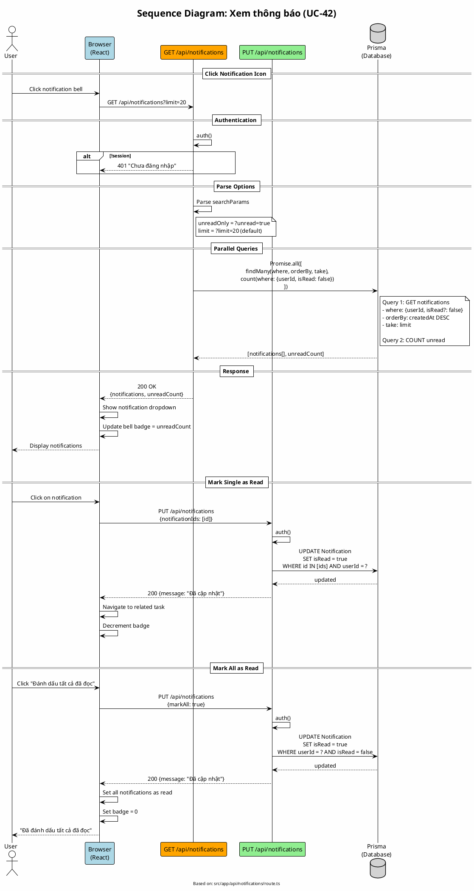

# Sequence Diagram 12: Xem thông báo (UC-42)

> **Use Case**: UC-42 - Xem danh sách thông báo  
> **Module**: Notifications  
> **Ngày**: 2026-01-16 (Updated from code review)

---

## 1. Thông tin chung

| Thuộc tính | Giá trị |
|------------|---------|
| **Participants** | Browser, API Route, Prisma |
| **API Endpoints** | GET /api/notifications, PUT /api/notifications |
| **Source File** | `src/app/api/notifications/route.ts` |

---

## 2. Sequence Diagram (PlantUML)



---

## 3. GET /api/notifications (từ code)

```typescript
// Line 7-41
export async function GET(req: NextRequest) {
    const session = await auth();
    if (!session) return errorResponse('Chưa đăng nhập', 401);

    const { searchParams } = new URL(req.url);
    const unreadOnly = searchParams.get('unread') === 'true';
    const limit = parseInt(searchParams.get('limit') || '20');

    const where = {
        userId: session.user.id,
        ...(unreadOnly && { isRead: false }),
    };

    const [notifications, unreadCount] = await Promise.all([
        prisma.notification.findMany({
            where,
            orderBy: { createdAt: 'desc' },
            take: limit,
        }),
        prisma.notification.count({
            where: { userId: session.user.id, isRead: false },
        }),
    ]);

    return successResponse({ notifications, unreadCount });
}
```

---

## 4. PUT /api/notifications (từ code)

```typescript
// Line 44-77
export async function PUT(req: NextRequest) {
    const session = await auth();
    if (!session) return errorResponse('Chưa đăng nhập', 401);

    const body = await req.json();
    const { notificationIds, markAll } = body;

    if (markAll) {
        // Mark all as read
        await prisma.notification.updateMany({
            where: { userId: session.user.id, isRead: false },
            data: { isRead: true },
        });
    } else if (notificationIds && Array.isArray(notificationIds)) {
        // Mark specific notifications as read
        await prisma.notification.updateMany({
            where: {
                id: { in: notificationIds },
                userId: session.user.id,  // Security: only own notifications
            },
            data: { isRead: true },
        });
    }

    return successResponse({ message: 'Đã cập nhật' });
}
```

---

## 5. Notification Types (từ lib/notifications.ts)

| Type | Description | Created By |
|------|-------------|------------|
| `task_assigned` | Bạn được gán công việc | notifyTaskAssigned() |
| `task_updated` | Công việc được cập nhật | notifyTaskWatchers() |
| `task_status_changed` | Trạng thái thay đổi | notifyTaskStatusChanged() |
| `task_comment_added` | Bình luận mới | notifyCommentAdded() |
| `task_mentioned` | Được nhắc đến | Future |
| `task_due_soon` | Sắp đến hạn | Future |
| `project_member_added` | Được thêm vào project | Future |
| `project_member_removed` | Bị xóa khỏi project | Future |

---

## 6. Request/Response

### GET Notifications
```http
GET /api/notifications?limit=20&unread=true
```

```json
{
  "notifications": [
    {
      "id": "notif-uuid",
      "type": "task_comment_added",
      "title": "Bình luận mới",
      "message": "John đã bình luận về \"Login feature\"...",
      "isRead": false,
      "createdAt": "2026-01-16T00:00:00Z",
      "metadata": {
        "taskId": "task-uuid",
        "commentId": "comment-uuid"
      }
    }
  ],
  "unreadCount": 5
}
```

### PUT Mark as Read
```http
PUT /api/notifications
{"notificationIds": ["notif-1", "notif-2"]}
```

### PUT Mark All
```http
PUT /api/notifications
{"markAll": true}
```

---

*Ngày cập nhật: 2026-01-16 - Based on actual code review*
