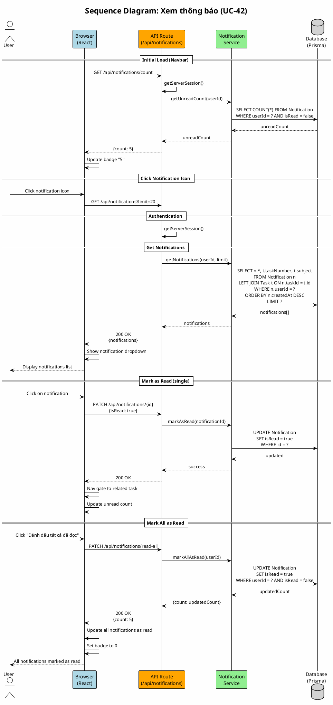

# Sequence Diagram 12: Xem thông báo (UC-42)

> **Use Case**: UC-42 - Xem danh sách thông báo  
> **Module**: Notifications  
> **Ngày**: 2026-01-15

---

## 1. Thông tin chung

| Thuộc tính | Giá trị |
|------------|---------|
| **Participants** | Browser, API, Notification Service, Database |
| **Trigger** | User click notification icon |
| **Precondition** | User đã đăng nhập |
| **Postcondition** | Notifications list displayed with unread count |

---

## 2. Sequence Diagram (PlantUML)



---

## 3. Notification Types

| Type | Message Template | Link |
|------|------------------|------|
| task_assigned | "{user} đã gán công việc #{taskNumber} cho bạn" | /tasks/{id} |
| task_updated | "{user} đã cập nhật công việc #{taskNumber}" | /tasks/{id} |
| comment_added | "{user} đã bình luận trên #{taskNumber}" | /tasks/{id} |
| status_changed | "Trạng thái #{taskNumber} đã chuyển sang {status}" | /tasks/{id} |
| mentioned | "{user} đã nhắc đến bạn trong #{taskNumber}" | /tasks/{id} |

---

## 4. Request/Response

### Get Notifications
```http
GET /api/notifications?limit=20&unreadOnly=false
```

```json
{
  "notifications": [
    {
      "id": "notif-uuid",
      "type": "comment_added",
      "message": "John đã bình luận trên #42",
      "taskId": "task-uuid",
      "taskNumber": 42,
      "taskSubject": "Login feature",
      "isRead": false,
      "createdAt": "2026-01-15T17:00:00Z"
    }
  ],
  "unreadCount": 5
}
```

### Mark as Read
```http
PATCH /api/notifications/notif-uuid
{"isRead": true}
```

### Mark All as Read
```http
PATCH /api/notifications/read-all
```

---

## 5. Polling / Real-time

```javascript
// Option 1: Polling every 30s
setInterval(() => {
  fetchUnreadCount();
}, 30000);

// Option 2: SSE (future enhancement)
const eventSource = new EventSource('/api/notifications/stream');
eventSource.onmessage = (e) => updateCount(e.data);
```

---

*Ngày tạo: 2026-01-15*
