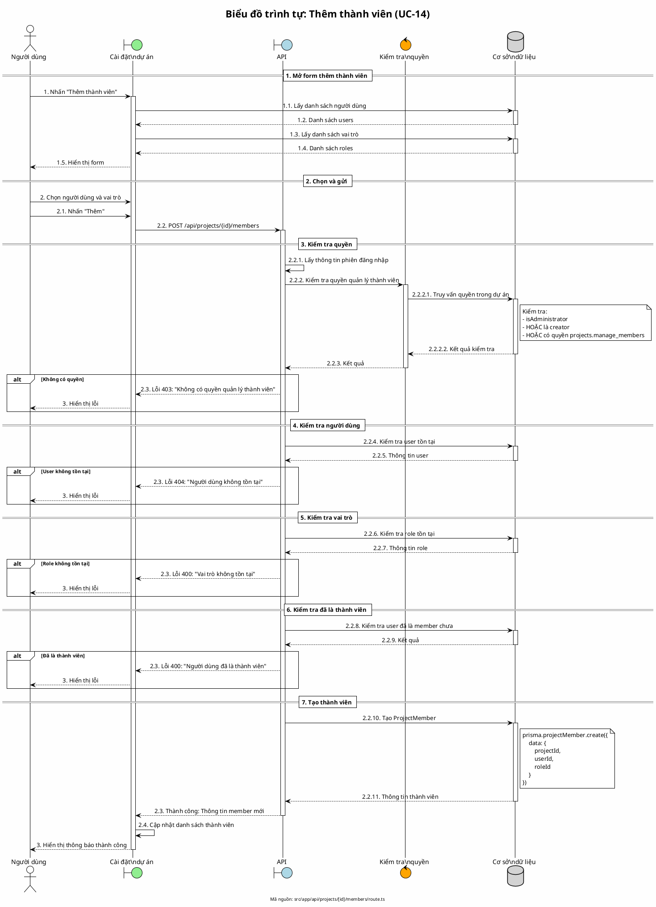

# Biểu đồ trình tự 12: Thêm thành viên vào dự án (UC-14)

> **Use Case**: UC-14 - Thêm thành viên vào dự án  
> **Module**: Quản lý thành viên  
> **Mã nguồn**: `src/app/api/projects/[id]/members/route.ts` (POST)

---

## 1. Phân tích

| Thành phần | Xác định |
|------------|----------|
| **Tác nhân** | Người có quyền quản lý thành viên |
| **Biên** | Cài đặt dự án, API |
| **Điều khiển** | Kiểm tra quyền, Validation |
| **Thực thể** | Cơ sở dữ liệu (ProjectMember, User, Role) |

---

## 2. Mã PlantUML

---

## 3. Các kiểm tra thực hiện

| Thứ tự | Kiểm tra | Lỗi nếu thất bại |
|--------|----------|------------------|
| 1 | Quyền quản lý | 403: Không có quyền |
| 2 | User tồn tại | 404: User không tồn tại |
| 3 | Role tồn tại | 400: Role không tồn tại |
| 4 | Chưa là member | 400: Đã là thành viên |

---

## 4. Quy tắc nghiệp vụ

| Quy tắc | Mô tả |
|---------|-------|
| Quyền cần thiết | Admin, Creator, hoặc có quyền manage_members |
| User hợp lệ | Phải là user tồn tại trong hệ thống |
| Role hợp lệ | Phải chọn role có sẵn |
| Không trùng | Mỗi user chỉ có một membership trong dự án |

---

*Ngày tạo: 2026-01-16*
