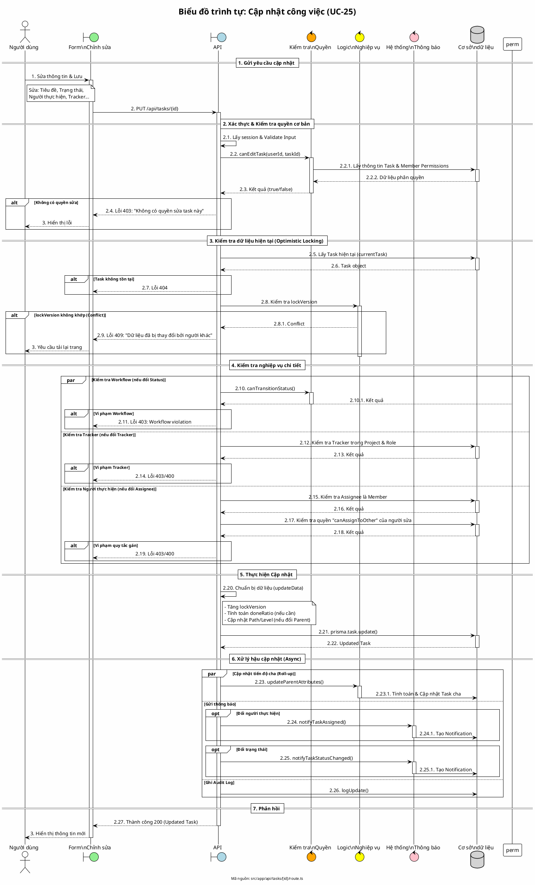

# Biểu đồ trình tự 13: Cập nhật công việc (UC-25)

> **Use Case**: UC-25 - Cập nhật công việc  
> **Module**: Quản lý công việc  
> **Mã nguồn**: `src/app/api/tasks/[id]/route.ts` (PUT)

---

## 1. Phân tích

| Thành phần | Xác định |
|------------|----------|
| **Tác nhân** | Người dùng (có quyền chỉnh sửa) |
| **Biên** | Form chỉnh sửa, API |
| **Điều khiển** | Kiểm tra quyền, Workflow, Optimistic Lock |
| **Thực thể** | Cơ sở dữ liệu (Task, ProjectMember, Status, Notification) |

---

## 2. Các đối tượng tham gia

- **Tác nhân**: Người dùng
- **Biên**: TaskEditPage, API `/api/tasks/[id]`
- **Điều khiển**: `canEditTask`, `canTransitionStatus`, `notifyTaskAssigned`
- **Thực thể**: Prisma (Task, Member, Status)

---

## 3. Mã PlantUML

---

## 4. Giải thích quy tắc đánh số

| Cấp độ | Ý nghĩa |
|--------|---------|
| 1, 2, 3 | Các giai đoạn chính (Gửi, Xử lý, Phản hồi) |
| 2.1, 2.2... | Các bước xử lý trong API |
| 2.2.1, 2.2.2... | Chi tiết gọi hàm con hoặc DB |

---

## 5. Các cơ chế bảo vệ quan trọng

| Cơ chế | Mục đích |
|--------|----------|
| **Optimistic Locking** | Ngăn chặn việc ghi đè dữ liệu khi nhiều người cùng sửa (dựa trên `lockVersion`). |
| **Workflow Check** | Đảm bảo chuyển trạng thái tuân thủ quy trình đã định nghĩa. |
| **RBAC Check** | Kiểm tra quyền sửa (`edit_any`, `edit_own`, `edit_assigned`) và quyền gán (`canAssignToOther`). |
| **Consistency Check** | Đảm bảo Assignee là thành viên dự án, Parent task hợp lệ (không vòng lặp, max level). |

---

*Ngày tạo: 2026-01-16*
