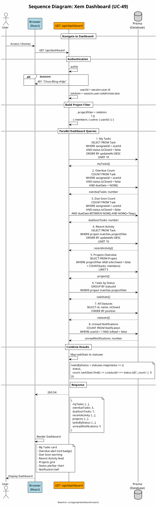

# Sequence Diagram 13: Xem Dashboard (UC-49)

> **Use Case**: UC-49 - Xem Dashboard  
> **Module**: Dashboard  
> **Ngày**: 2026-01-16 (Updated from code review)

---

## 1. Thông tin chung

| Thuộc tính | Giá trị |
|------------|---------|
| **Participants** | Browser, API Route, Prisma |
| **API Endpoint** | GET /api/dashboard |
| **Source File** | `src/app/api/dashboard/route.ts` |

---

## 2. Sequence Diagram (PlantUML)



---

## 3. Dashboard Data Structure (từ code)

```typescript
// Return structure - Line 125-133
return successResponse({
    myTasks,           // Task[] - Assigned to me, open, limit 10
    overdueTasks,      // number - Count of overdue
    dueSoonTasks,      // number - Count due in 7 days
    recentActivity,    // Task[] - Recently updated, limit 10
    projects,          // Project[] - My projects, limit 5
    tasksByStatus,     // {status, count}[] - For pie chart
    unreadNotifications, // number - Badge count
});
```

---

## 4. Key Queries (từ code)

### My Tasks
```typescript
// Line 23-38
const myTasks = await prisma.task.findMany({
    where: {
        assigneeId: userId,
        status: { isClosed: false },
    },
    orderBy: { updatedAt: 'desc' },
    take: 10,
    select: {
        id: true, title: true, dueDate: true,
        status: { select: { id: true, name: true } },
        priority: { select: { id: true, name: true, color: true } },
        project: { select: { id: true, name: true } },
    },
});
```

### Overdue Tasks
```typescript
// Line 41-47
const overdueTasks = await prisma.task.count({
    where: {
        assigneeId: userId,
        status: { isClosed: false },
        dueDate: { lt: new Date() },
    },
});
```

### Due Soon (7 days)
```typescript
// Line 50-61
const nextWeek = new Date();
nextWeek.setDate(nextWeek.getDate() + 7);

const dueSoonTasks = await prisma.task.count({
    where: {
        assigneeId: userId,
        status: { isClosed: false },
        dueDate: { gte: new Date(), lte: nextWeek },
    },
});
```

---

## 5. Request/Response

### Request
```http
GET /api/dashboard
```

### Response
```json
{
  "myTasks": [
    {
      "id": "...",
      "title": "Fix login bug",
      "dueDate": "2026-01-20",
      "status": {"id": "...", "name": "In Progress"},
      "priority": {"id": "...", "name": "High", "color": "#ff0000"},
      "project": {"id": "...", "name": "Main App"}
    }
  ],
  "overdueTasks": 3,
  "dueSoonTasks": 7,
  "recentActivity": [...],
  "projects": [
    {
      "id": "...",
      "name": "Main App",
      "_count": {"tasks": 42, "members": 5}
    }
  ],
  "tasksByStatus": [
    {"status": {"id": "...", "name": "New", "isClosed": false}, "count": 10},
    {"status": {"id": "...", "name": "In Progress", "isClosed": false}, "count": 25},
    {"status": {"id": "...", "name": "Closed", "isClosed": true}, "count": 50}
  ],
  "unreadNotifications": 5
}
```

---

## 6. Dashboard Cards Mapping

| Card | Data Source | Display |
|------|-------------|---------|
| My Tasks | myTasks[] | Task list with priority colors |
| Overdue | overdueTasks | Red badge number |
| Due Soon | dueSoonTasks | Yellow badge number |
| Activity | recentActivity[] | Timeline of recent changes |
| Projects | projects[] | Project cards with progress |
| Chart | tasksByStatus[] | Pie or bar chart |
| Bell | unreadNotifications | Notification bell badge |

---

*Ngày cập nhật: 2026-01-16 - Based on actual code review*
