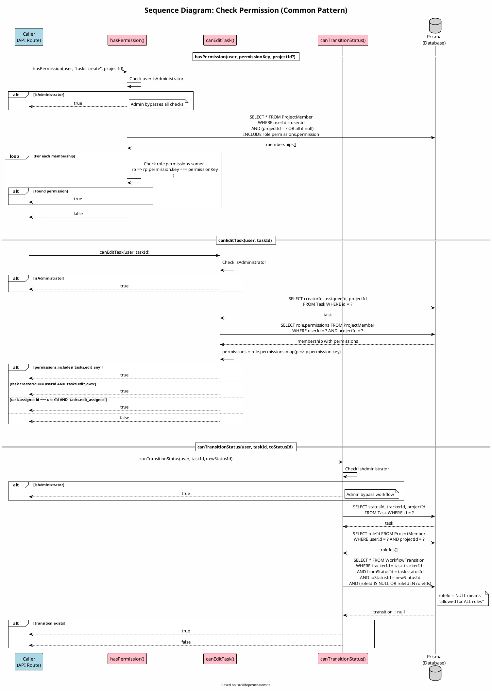

# Sequence Diagram 14: Check Permission (Common Pattern)

> **Use Case**: Common - Được gọi từ nhiều UC  
> **Module**: RBAC System  
> **Ngày**: 2026-01-16 (Updated from code review)

---

## 1. Thông tin chung

| Thuộc tính | Giá trị |
|------------|---------|
| **Participants** | Caller (API Route), Permission Service, Prisma |
| **Source File** | `src/lib/permissions.ts` |
| **Export Functions** | hasPermission, canEditTask, canTransitionStatus, getAccessibleProjectIds, etc. |

---

## 2. Sequence Diagram (PlantUML)



---

## 3. Permission Functions Overview

| Function | Purpose | Used By |
|----------|---------|---------|
| `hasPermission()` | Check specific permission in project | Create task, manage members |
| `hasAnyPermission()` | Check ANY of permissions | Multiple permission check |
| `hasAllPermissions()` | Check ALL permissions | Strict permission check |
| `getUserPermissions()` | Get all user's permissions | UI display |
| `isProjectMember()` | Check membership | Basic access check |
| `canViewTask()` | Can view task (incl. private) | Task detail |
| `canEditTask()` | Can edit task | Task update |
| `canTransitionStatus()` | Workflow validation | Status change |
| `getAccessibleProjectIds()` | Get projects with permission | Task list filter |
| `checkProjectPermission()` | Wrapper for cleaner code | API routes |

---

## 4. hasPermission Logic (từ code)

```typescript
// Line 27-67
export async function hasPermission(
    user: PermissionUser,
    permissionKey: string,
    projectId?: string
): Promise<boolean> {
    // 1. Administrator bypass
    if (user.isAdministrator) {
        return true;
    }

    // 2. Get user's memberships (in specific project or all)
    const memberships = await prisma.projectMember.findMany({
        where: {
            userId: user.id,
            ...(projectId ? { projectId } : {}),
        },
        include: {
            role: {
                include: {
                    permissions: {
                        include: { permission: true },
                    },
                },
            },
        },
    });

    // 3. Check if any role has the permission
    for (const membership of memberships) {
        const hasPermission = membership.role.permissions.some(
            (rp) => rp.permission.key === permissionKey
        );
        if (hasPermission) return true;
    }

    return false;
}
```

---

## 5. canEditTask Logic (từ code)

```typescript
// Line 237-274
export async function canEditTask(
    user: PermissionUser,
    taskId: string
): Promise<boolean> {
    if (user.isAdministrator) return true;

    const task = await prisma.task.findUnique({
        where: { id: taskId },
        select: { projectId: true, assigneeId: true, creatorId: true },
    });

    if (!task) return false;

    // Check permissions in priority order
    if (await hasPermission(user, 'tasks.edit_any', task.projectId)) {
        return true;
    }
    if (task.assigneeId === user.id) {
        if (await hasPermission(user, 'tasks.edit_assigned', task.projectId)) {
            return true;
        }
    }
    if (task.creatorId === user.id) {
        if (await hasPermission(user, 'tasks.edit_own', task.projectId)) {
            return true;
        }
    }

    return false;
}
```

---

## 6. Workflow Transition Logic (từ code)

```typescript
// Line 279-322
export async function canTransitionStatus(
    user: PermissionUser,
    taskId: string,
    toStatusId: string
): Promise<boolean> {
    if (user.isAdministrator) return true;

    const task = await prisma.task.findUnique({...});
    if (!task) return false;

    // Get user's roles in the project
    const memberships = await prisma.projectMember.findMany({
        where: { userId: user.id, projectId: task.projectId },
        select: { roleId: true },
    });
    const roleIds = memberships.map((m) => m.roleId);

    // Check if transition is allowed for any of user's roles
    const allowedTransition = await prisma.workflowTransition.findFirst({
        where: {
            trackerId: task.trackerId,
            fromStatusId: task.statusId,
            toStatusId: toStatusId,
            OR: [
                { roleId: null },           // NULL = all roles
                { roleId: { in: roleIds } }, // OR specific role
            ],
        },
    });

    return !!allowedTransition;
}
```

---

## 7. Permission Key Reference

| Key | Description |
|-----|-------------|
| `projects.create` | Tạo dự án mới |
| `projects.manage_members` | Quản lý thành viên |
| `projects.manage_versions` | Quản lý phiên bản |
| `projects.manage_trackers` | Quản lý tracker |
| `tasks.create` | Tạo công việc (Add Issues) |
| `tasks.edit_own` | Sửa công việc do mình tạo |
| `tasks.edit_any` | Sửa mọi công việc |
| `tasks.edit_assigned` | Sửa công việc được gán |
| `tasks.delete` | Xóa công việc |
| `tasks.move` | Di chuyển công việc |
| `tasks.view_project` | Xem công việc trong dự án |
| `queries.manage_public` | Tạo bộ lọc công khai |

---

*Ngày cập nhật: 2026-01-16 - Based on actual code review*
