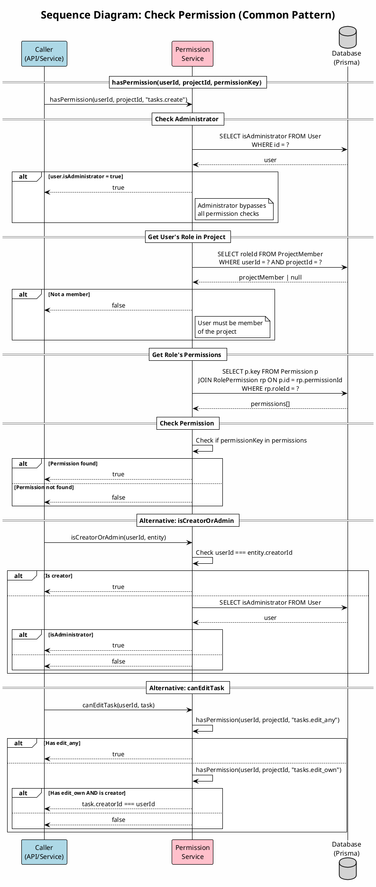

# Sequence Diagram 14: Check Permission (Common Pattern)

> **Use Case**: Common - Được gọi từ nhiều UC  
> **Module**: RBAC System  
> **Ngày**: 2026-01-15

---

## 1. Thông tin chung

| Thuộc tính | Giá trị |
|------------|---------|
| **Participants** | Caller (any service/API), Permission Service, Database |
| **Trigger** | Any protected operation |
| **Purpose** | Centralized RBAC check for all operations |

---

## 2. Sequence Diagram (PlantUML)



---

## 3. Permission Check Methods

| Method | Parameters | Description |
|--------|------------|-------------|
| `hasPermission` | userId, projectId, key | Check specific permission in project |
| `isCreatorOrAdmin` | userId, entity | Check if creator or admin |
| `canEditTask` | userId, task | Check task edit permission |
| `canViewTask` | userId, task | Check task view (including private) |
| `getAccessibleProjects` | userId | Get all accessible projectIds |

---

## 4. Permission Keys

```typescript
const PERMISSION_KEYS = {
  // Projects
  'projects.create': 'Tạo dự án',
  'projects.manage_members': 'Quản lý thành viên',
  'projects.manage_versions': 'Quản lý phiên bản',
  'projects.manage_trackers': 'Quản lý loại công việc',
  
  // Tasks
  'tasks.create': 'Tạo công việc',
  'tasks.edit_own': 'Sửa công việc của mình',
  'tasks.edit_any': 'Sửa mọi công việc',
  'tasks.delete': 'Xóa công việc',
  'tasks.move': 'Di chuyển công việc',
  
  // Time/Workload
  'timelogs.view_own': 'Xem workload cá nhân',
  'timelogs.view_all': 'Xem workload tất cả',
  
  // Queries
  'queries.manage_public': 'Tạo bộ lọc công khai',
};
```

---

## 5. Implementation (lib/permissions.ts)

```typescript
export async function hasPermission(
  userId: string,
  projectId: string | null,
  permissionKey: string
): Promise<boolean> {
  // 1. Check admin
  const user = await prisma.user.findUnique({
    where: { id: userId },
    select: { isAdministrator: true }
  });
  
  if (user?.isAdministrator) return true;
  
  // 2. Check membership
  if (!projectId) return false;
  
  const member = await prisma.projectMember.findUnique({
    where: { userId_projectId: { userId, projectId } },
    include: {
      role: {
        include: {
          permissions: {
            include: { permission: true }
          }
        }
      }
    }
  });
  
  if (!member) return false;
  
  // 3. Check permission
  return member.role.permissions.some(
    rp => rp.permission.key === permissionKey
  );
}
```

---

## 6. Usage in API Routes

```typescript
// Example: Create Task API
export async function POST(req: Request) {
  const session = await getServerSession(authOptions);
  if (!session) return new Response('Unauthorized', { status: 401 });
  
  const { projectId, ...taskData } = await req.json();
  
  // Permission check
  const canCreate = await hasPermission(
    session.user.id,
    projectId,
    'tasks.create'
  );
  
  if (!canCreate) {
    return new Response('Forbidden', { status: 403 });
  }
  
  // Proceed with task creation...
}
```

---

## 7. RBAC Database Schema

```
┌─────────┐     ┌───────────────┐     ┌────────────┐
│  User   │────<│ ProjectMember │>────│   Role     │
└─────────┘     └───────────────┘     └────────────┘
     │                                       │
     │                                       │
     │               ┌────────────────┐      │
     │               │ RolePermission │──────┘
     │               └────────────────┘
     │                       │
     │               ┌───────────────┐
     └───────────────│  Permission   │
                     └───────────────┘
```

---

*Ngày tạo: 2026-01-15*
