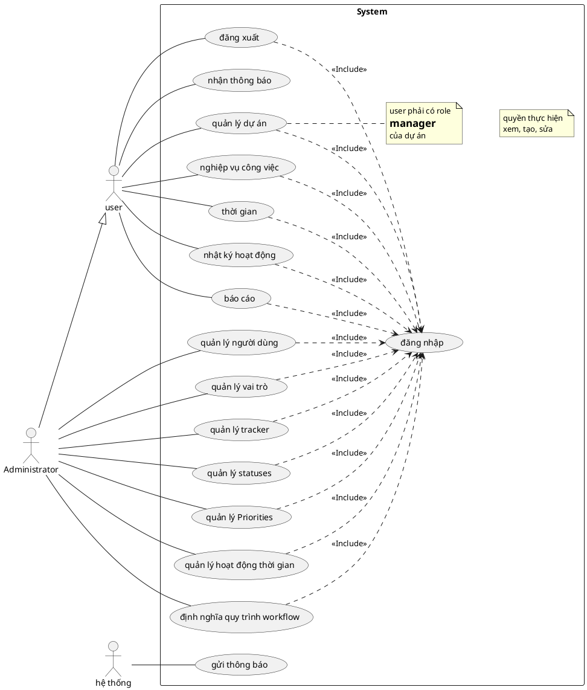

# Use Case Tổng Quan Hệ Thống

Biểu đồ mô tả tổng quan các chức năng của hệ thống Worksphere, bám sát thiết kế gốc.

```plantuml
@startuml
left to right direction
skinparam packageStyle rectangle

actor "Administrator" as Admin
actor "user" as User
actor "hệ thống" as SystemActor

' Quan hệ kế thừa: Administrator là một user
Admin --|> User

rectangle "System" {
    
    usecase "đăng nhập" as UC_Login
    usecase "đăng xuất" as UC_Logout
    usecase "nhận thông báo" as UC_ReceiveNotify
    usecase "gửi thông báo" as UC_SendNotify

    ' Hàng trên: Administrator Functions
    usecase "quản lý người dùng" as UC_User
    usecase "quản lý vai trò" as UC_Role
    usecase "quản lý tracker" as UC_Tracker
    usecase "quản lý statuses" as UC_Status
    usecase "quản lý Priorities" as UC_Priority
    usecase "quản lý hoạt động thời gian" as UC_ActivityType
    usecase "định nghĩa quy trình workflow" as UC_Workflow

    ' Hàng dưới: User Functions
    usecase "quản lý dự án" as UC_Project
    usecase "nghiệp vụ công việc" as UC_Task
    usecase "thời gian" as UC_TimeLog
    usecase "nhật ký hoạt động" as UC_ActivityLog
    usecase "báo cáo" as UC_Report
    
    ' Note
    note "user phải có role \n= manager \ncủa dự án" as N1
    note "quyền thực hiện \nxem, tạo, sửa" as N2
    
    ' Connect notes to Project UC
    UC_Project .. N1
    N1 -[hidden]- N2
}

' Administrator Relations (Các chức năng riêng của Admin)
Admin -- UC_User
Admin -- UC_Role
Admin -- UC_Tracker
Admin -- UC_Status
Admin -- UC_Priority
Admin -- UC_ActivityType
Admin -- UC_Workflow

' User Relations (Các chức năng chung)
User -- UC_ReceiveNotify
User -- UC_Logout
User -- UC_Project
User -- UC_Task
User -- UC_TimeLog
User -- UC_ActivityLog
User -- UC_Report

' System Relations
SystemActor -- UC_SendNotify

' Include Login Relations (Hàng trên)
UC_User ..> UC_Login : <<Include>>
UC_Role ..> UC_Login : <<Include>>
UC_Tracker ..> UC_Login : <<Include>>
UC_Status ..> UC_Login : <<Include>>
UC_Priority ..> UC_Login : <<Include>>
UC_ActivityType ..> UC_Login : <<Include>>
UC_Workflow ..> UC_Login : <<Include>>

' Include Login Relations (Hàng dưới)
UC_Project ..> UC_Login : <<Include>>
UC_Task ..> UC_Login : <<Include>>
UC_TimeLog ..> UC_Login : <<Include>>
UC_ActivityLog ..> UC_Login : <<Include>>
UC_Report ..> UC_Login : <<Include>>

' Logout include Login
UC_Logout ..> UC_Login : <<Include>>

@enduml
```
