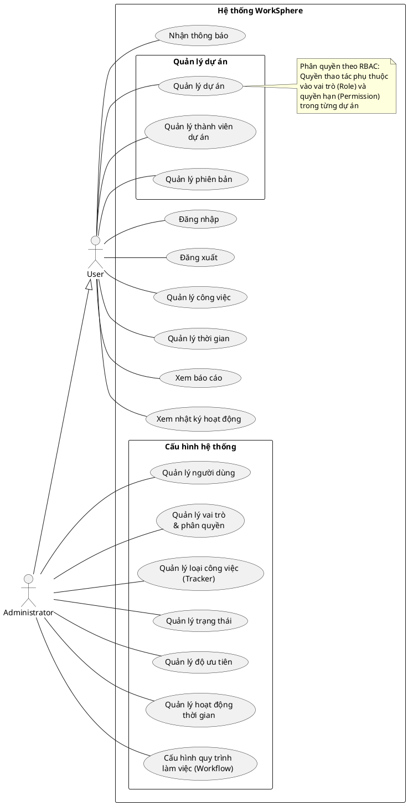

# Use Case Tổng Quan Hệ Thống

Biểu đồ mô tả tổng quan các chức năng của hệ thống WorkSphere.
Hệ thống sử dụng phân quyền RBAC (Role-Based Access Control) — quyền thao tác phụ thuộc vào vai trò được gán trong từng dự án.

## Actors

| Actor | Mô tả |
|---|---|
| **Administrator** | Người dùng có cờ `isAdministrator = true`. Toàn quyền hệ thống, bao gồm cấu hình và quản trị. Kế thừa toàn bộ chức năng của User. |
| **User** | Người dùng bình thường (Employee, Developer, Manager...). Quyền thao tác được xác định bởi vai trò (Role) và danh sách quyền (Permission) trong từng dự án. |

## Biểu đồ

## Danh sách Use Case

| Mã | Tên Use Case | Actor | Mô tả tóm tắt | Chi tiết |
|---|---|---|---|---|
| UC01 | Đăng nhập | User | Xác thực bằng email/mật khẩu để truy cập hệ thống | [01_dang_nhap.md](./01_dang_nhap.md) |
| — | Đăng xuất | User | Kết thúc phiên làm việc | — |
| UC02 | Quản lý người dùng | Administrator | Tạo, sửa, kích hoạt/vô hiệu hóa tài khoản | [02_quan_ly_nguoi_dung.md](./02_quan_ly_nguoi_dung.md) |
| UC03 | Quản lý vai trò & phân quyền | Administrator | Tạo vai trò, gán quyền hạn (RBAC), cấu hình tracker cho vai trò | [03_quan_ly_vai_tro_phan_quyen.md](./03_quan_ly_vai_tro_phan_quyen.md) |
| UC04 | Quản lý loại công việc (Tracker) | Administrator | CRUD loại công việc (Feature, Bug, Support...) | [04_quan_ly_tracker.md](./04_quan_ly_tracker.md) |
| UC05 | Quản lý trạng thái | Administrator | CRUD trạng thái công việc (Mới, Đang làm, Đóng...) | [05_quan_ly_trang_thai.md](./05_quan_ly_trang_thai.md) |
| UC06 | Quản lý độ ưu tiên | Administrator | CRUD mức độ ưu tiên (Thấp, Bình thường, Cao, Khẩn cấp) | [06_quan_ly_do_uu_tien.md](./06_quan_ly_do_uu_tien.md) |
| UC07 | Quản lý hoạt động thời gian | Administrator | CRUD loại hoạt động thời gian (Lập trình, Thiết kế, Kiểm thử) | [07_quan_ly_hoat_dong.md](./07_quan_ly_hoat_dong.md) |
| UC08 | Cấu hình quy trình làm việc | Administrator | Thiết lập workflow: trạng thái nào được chuyển sang trạng thái nào, theo vai trò và loại công việc | [08_quan_ly_quy_trinh.md](./08_quan_ly_quy_trinh.md) |
| UC09 | Quản lý dự án | User | Tạo, sửa, lưu trữ, xóa dự án. Cấu hình tracker cho dự án | [09_quan_ly_du_an.md](./09_quan_ly_du_an.md) |
| UC10 | Quản lý thành viên dự án | User | Thêm/xóa thành viên, thay đổi vai trò trong dự án | [10_quan_ly_thanh_vien.md](./10_quan_ly_thanh_vien.md) |
| UC11 | Quản lý phiên bản | User | CRUD phiên bản (Version), theo dõi tiến độ lộ trình (Roadmap) | [11_quan_ly_phien_ban.md](./11_quan_ly_phien_ban.md) |
| UC12 | Quản lý công việc | User | CRUD công việc, subtask, bình luận, đính kèm, theo dõi, sao chép, bộ lọc | [12_quan_ly_cong_viec.md](./12_quan_ly_cong_viec.md) |
| UC13 | Quản lý thời gian | User | Ghi nhận, sửa, xóa thời gian làm việc theo hoạt động | [13_quan_ly_thoi_gian.md](./13_quan_ly_thoi_gian.md) |
| UC14 | Báo cáo & thống kê | User | Xem Dashboard, thống kê theo dự án/nhân sự/thời gian, xuất CSV | [14_bao_cao_thong_ke.md](./14_bao_cao_thong_ke.md) |
| — | Nhật ký hoạt động | User | Xem lịch sử thao tác (Audit Log) trên toàn hệ thống và trong dự án | — |
| UC15 | Nhận thông báo | User | Nhận thông báo realtime khi được gán việc, cập nhật trạng thái, bình luận mới | [15_thong_bao.md](./15_thong_bao.md) |

## Giải thích mô hình phân quyền

Hệ thống WorkSphere sử dụng **hai tầng phân quyền**:

### 1. Phân quyền cấp hệ thống
- Người dùng có cờ `isAdministrator = true` là **Administrator**, có toàn quyền trên hệ thống.
- Administrator truy cập được tất cả dự án mà không cần là thành viên.

### 2. Phân quyền RBAC cấp dự án
- Mỗi thành viên dự án được gán **một vai trò (Role)** trong dự án đó.
- Mỗi vai trò chứa **danh sách quyền hạn (Permissions)**.
- Quyền thao tác (xem, tạo, sửa, xóa) được xác định bởi permissions của vai trò.

**Ví dụ:**
- Vai trò `Manager` có đầy đủ quyền: tạo/sửa/xóa công việc, giao việc cho người khác, quản lý thành viên...
- Vai trò `Developer` chỉ có quyền: xem công việc trong dự án, sửa công việc được gán, ghi nhận thời gian...
