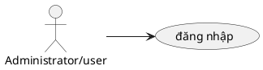

# Use Case: Đăng nhập

Chức năng xác thực người dùng vào hệ thống.

## Đặc tả Use Case: Đăng nhập (UC-001)

| Mục | Nội dung |
| :--- | :--- |
| **Tên Use Case** | Đăng nhập (Login) |
| **Mô tả** | Cho phép người dùng (Administrator/User) xác thực danh tính bằng Email và Mật khẩu để truy cập vào hệ thống Worksphere và sử dụng các chức năng theo phân quyền. |
| **Tác nhân chính** | Administrator, User (Thành viên) |
| **Tác nhân phụ** | Hệ thống (System) - Xử lý xác thực |
| **Tiền điều kiện** | - Người dùng truy cập được vào website Worksphere. - Tài khoản người dùng đã được tạo trước đó trong cơ sở dữ liệu. |
| **Đảm bảo tối thiểu** | - Người dùng vẫn ở lại trang đăng nhập nếu thông tin không hợp lệ. - Hiển thị thông báo lỗi rõ ràng. |
| **Đảm bảo thành công** | - Phiên làm việc (Session) của người dùng được khởi tạo. - Người dùng được chuyển hướng vào trang Dashboard (Bảng điều khiển). |

### Chuỗi sự kiện chính (Main Flow)

1.  **Người dùng** truy cập vào trang chủ hoặc đường dẫn `/login`.
2.  **Hệ thống** hiển thị Form đăng nhập gồm:
    *   Trường nhập Email.
    *   Trường nhập Mật khẩu.
    *   Nút "Đăng nhập".
3.  **Người dùng** nhập Email và Mật khẩu, sau đó nhấn nút "Đăng nhập".
4.  **Hệ thống (Frontend)** thực hiện kiểm tra sơ bộ (Validation):
    *   Email không được để trống và phải đúng định dạng.
    *   Mật khẩu không được để trống.
5.  **Hệ thống** gửi yêu cầu xác thực (`POST` request) đến API xác thực (NextAuth Credentials Provider).
6.  **Hệ thống (Backend)** thực hiện xác thực:
    *   Tìm kiếm người dùng trong cơ sở dữ liệu dựa trên Email.
    *   Nếu tìm thấy, so sánh Mật khẩu nhập vào với Mật khẩu đã mã hóa (BCrypt) trong cơ sở dữ liệu.
    *   Kiểm tra trạng thái tài khoản (`isActive`).
7.  **Hệ thống** xác thực thành công:
    *   Tạo phiên làm việc và Token phiên.
    *   Trả về thông tin người dùng cơ bản (ID, Email, Tên, Role).
8.  **Hệ thống (Frontend)** nhận kết quả thành công:
    *   Hiển thị thông báo (Toast) "Đăng nhập thành công".
    *   Chuyển hướng người dùng đến trang `/dashboard`.
9.  **Kết thúc Use Case.**

### Luồng thay thế (Alternate Flows)

**A1. Người dùng đã đăng nhập từ trước**
*   *Rẽ nhánh từ Bước 1:*
    *   **A1.1.** Hệ thống phát hiện phiên làm việc (Session) hợp lệ còn tồn tại.
    *   **A1.2.** Hệ thống tự động chuyển hướng người dùng thẳng vào trang `/dashboard` mà không hiển thị Form đăng nhập.
    *   **Kết thúc Use Case.**

**A2. Đăng xuất**
*   *Sự kiện độc lập sau khi đã đăng nhập:*
    *   **A2.1.** Người dùng nhấn vào Avatar/Menu cá nhân và chọn "Đăng xuất".
    *   **A2.2.** Hệ thống hủy phiên làm việc hiện tại.
    *   **A2.3.** Hệ thống chuyển hướng người dùng về trang Đăng nhập.

### Luồng ngoại lệ (Exception Flows)

**E1. Sai Email hoặc Mật khẩu**
*   *Rẽ nhánh tại Bước 6 (Backend xác thực):*
    *   **E1.1.** Backend không tìm thấy Email hoặc Mật khẩu không khớp.
    *   **E1.2.** Backend trả về lỗi xác thực (`Invalid credentials`).
    *   **E1.3.** Frontend hiển thị thông báo lỗi: "Email hoặc mật khẩu không chính xác."
    *   **Quay lại Bước 3** để người dùng thử lại.

**E2. Tài khoản bị vô hiệu hóa (Inactive)**
*   *Rẽ nhánh tại Bước 6 (Backend kiểm tra trạng thái):*
    *   **E2.1.** Backend xác thực mật khẩu đúng, nhưng phát hiện trường `isActive = false` (hoặc `status` không active).
    *   **E2.2.** Backend từ chối đăng nhập và trả về thông báo lỗi cụ thể.
    *   **E2.3.** Frontend hiển thị thông báo: "Tài khoản của bạn đã bị khóa hoặc ngừng hoạt động. Vui lòng liên hệ quản trị viên."
    *   **Kết thúc Use Case** (Người dùng không thể đăng nhập).

**E3. Dữ liệu đầu vào không hợp lệ (Validation Error)**
*   *Rẽ nhánh tại Bước 4 (Frontend Validation):*
    *   **E3.1.** Người dùng nhập Email sai định dạng hoặc để trống Mật khẩu.
    *   **E3.2.** Hệ thống hiển thị thông báo lỗi ngay dưới trường nhập liệu tương ứng (ví dụ: "Email không hợp lệ", "Mật khẩu là bắt buộc").
    *   **Dừng lại ở Bước 3** (Không gửi yêu cầu lên Server).

**E4. Lỗi kết nối hoặc lỗi Server**
*   *Rẽ nhánh tại Bước 5 (Gửi yêu cầu):*
    *   **E4.1.** Server không phản hồi hoặc trả về lỗi 500.
    *   **E4.2.** Frontend hiển thị thông báo: "Có lỗi xảy ra, vui lòng thử lại sau."
    *   **Quay lại Bước 3.**

### Ghi chú (Notes)
*   Mật khẩu được mã hóa một chiều bằng thuật toán BCrypt trước khi lưu vào cơ sở dữ liệu để đảm bảo an toàn.
*   Cơ chế xác thực sử dụng `NextAuth.js` để quản lý Session và Security.
