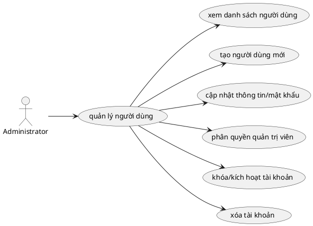

# Use Case: Quản lý Người dùng

Chi tiết các chức năng liên quan đến quản lý tài khoản người dùng trong hệ thống (Dành cho Quản trị viên).

## Đặc tả Use Case: Quản lý Người dùng (UC-002)

| Mục | Nội dung |
| :--- | :--- |
| **Tên Use Case** | Quản lý Người dùng (System User Management) |
| **Mô tả** | Cho phép **Quản trị viên hệ thống (Administrator)** quản lý toàn bộ tài khoản người dùng trong hệ thống: bao gồm tạo mới, cấp lại mật khẩu, phân quyền quản trị và xóa tài khoản. Chức năng này độc lập với việc quản lý thành viên trong từng dự án. |
| **Tác nhân chính** | Administrator (Quản trị viên cấp cao) |
| **Tác nhân phụ** | Hệ thống (Database, Auth Service) |
| **Tiền điều kiện** | - Người dùng đã đăng nhập. - Tài khoản phải có cờ `isAdministrator = true` trong cơ sở dữ liệu. |
| **Đảm bảo tối thiểu** | - Không cho phép tạo email trùng lặp. - Không cho phép Admin xóa chính tài khoản mình đang đăng nhập. - Không cho phép xóa user đang được gán công việc. |
| **Đảm bảo thành công** | - User mới có thể đăng nhập ngay lập tức. - User bị xóa/khóa sẽ mất quyền truy cập hệ thống ngay lập tức (hoặc sau khi hết hạn session). |

### Chuỗi sự kiện chính (Main Flow)

**Ngữ cảnh:** Admin truy cập vào menu **"Users" (Người dùng)** trên thanh điều hướng bên trái (Sidebar).

#### A. Xem danh sách người dùng
1.  **Administrator** truy cập trang `/users`.
2.  **Hệ thống** hiển thị danh sách tất cả tài khoản có trong bảng `User` của database.
    *   Thông tin hiển thị: Avatar, Tên (Name), Email, Vai trò hệ thống (Admin/User), Số dự án tham gia, Số công việc được gán, Trạng thái (Hoạt động/Đã khóa).
3.  **Administrator** có thể tìm kiếm người dùng theo Tên hoặc Email thông qua thanh tìm kiếm.

#### B. Tạo tài khoản mới (Manually Create User)
4.  **Administrator** nhấn nút **"New User"** (hoặc dấu `+`).
5.  **Hệ thống** hiển thị Modal/Form tạo người dùng:
    *   Name (Bắt buộc).
    *   Email (Bắt buộc, Duy nhất).
    *   Password (Bắt buộc).
    *   Is Administrator? (Checkbox - Tùy chọn cấp quyền Admin ngay lập tức).
6.  **Administrator** điền thông tin và nhấn **"Create"**.
7.  **Hệ thống (API POST /api/users)**:
    *   Validate: Email hợp lệ, Mật khẩu đủ độ dài.
    *   Kiểm tra trùng Email trong DB.
    *   Mã hóa mật khẩu bằng BCrypt (`bcrypt.hash`).
    *   Lưu bản ghi vào bảng `User`.
8.  **Hệ thống** đóng Modal, hiển thị thông báo "User created successfully" và tự động làm mới danh sách (Re-fetch).

#### C. Cập nhật & Cấp lại mật khẩu (Update/Reset Password)
9.  **Administrator** nhấn vào nút **"Edit"** (hoặc icon bút chì) trên dòng của một user.
10. **Hệ thống** hiển thị Modal chỉnh sửa với thông tin hiện tại.
11. **Administrator** thực hiện thay đổi:
    *   Sửa tên hiển thị.
    *   Nhập mật khẩu mới vào ô "New Password" (nếu muốn reset mật khẩu cho user).
    *   Thay đổi quyền Admin (Toggle `is_admin`).
12. **Administrator** nhấn **"Update"**.
13. **Hệ thống (API PUT /api/users/[id])**:
    *   Cập nhật thông tin xuống DB.
    *   (Nếu có đổi pass) Mã hóa lại mật khẩu mới.
14. **Hệ thống** thông báo thành công.

#### E. Khóa/Kích hoạt tài khoản (Toggle Active)
15. **Administrator** nhấn nút toggle **Switch** trên cột "Trạng thái" của user cần thay đổi.
16. **Hệ thống (API PUT /api/users/[id])**: Cập nhật trường `isActive` (đảo ngược giá trị hiện tại).
17. **Hệ thống** cập nhật giao diện và hiển thị thông báo "Đã kích hoạt/khóa người dùng".

#### F. Xóa tài khoản (Delete User)
18. **Administrator** nhấn nút **"Delete"** (icon thùng rác) trên dòng user cần xóa.
19. **Hệ thống (Frontend)** kiểm tra: nếu user đang được gán công việc (`assignedTasks > 0`) → hiển thị lỗi ngay, không cho xóa.
20. **Hệ thống** hiển thị hộp thoại xác nhận: "Bạn có chắc muốn xóa người dùng [tên]? Thao tác này không thể hoàn tác."
21. **Administrator** xác nhận **"Xóa ngay"**.
22. **Hệ thống (API DELETE /api/users/[id])**:
    *   Kiểm tra user đó có phải là chính người đang thao tác không (Prevent self-delete).
    *   Kiểm tra lại số lượng task đang được gán (backend double-check).
    *   Dọn dẹp dữ liệu liên quan: `ProjectMember`, `Watcher`, `Notification`.
    *   Thực hiện xóa bản ghi khỏi bảng `User`.
23. **Hệ thống** xóa dòng đó khỏi giao diện và thông báo thành công.

### Luồng ngoại lệ (Exception Flows)

**E1. Email đã tồn tại**
*   *Tại bước B7:* API Backend phát hiện email trùng. Trả về lỗi 409 Conflict hoặc 400 Bad Request. Frontend hiển thị lỗi "Email already exists".

**E2. Xóa chính mình (Self-Delete)**
*   *Tại bước F22:* Backend so sánh `user_id` cần xóa với `current_user.id`. Nếu trùng, trả về lỗi 403 Forbidden: "Không có quyền xóa người dùng này hoặc bạn đang tự xóa chính mình". Frontend hiển thị thông báo lỗi tương ứng.

**E3. User đang được gán công việc**
*   *Tại bước F19 (Frontend) hoặc F22 (Backend):* Nếu user đang được gán task (`assignedTasks > 0`), hệ thống từ chối xóa và hiển thị thông báo: "Không thể xóa user đang được gán [N] công việc. Vui lòng reassign trước."

### Quy tắc nghiệp vụ (Business Rules)
*   User được tạo ở đây là tài khoản đăng nhập vào hệ thống (**System Account**). Nó khác với **Project Member**. Sau khi có tài khoản này, User mới có thể được thêm vào các Dự án (Project) thông qua chức năng Quản lý thành viên.
*   Chỉ có Admin mới thấy menu "Users". Người dùng thường sẽ không truy cập được trang này (Middleware chặn).
