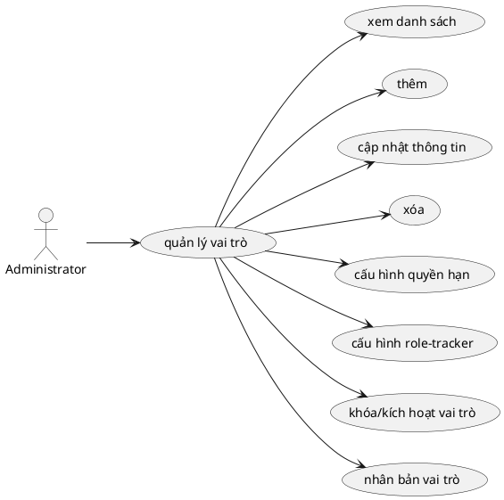

# Use Case: Quản lý Vai trò & Phân quyền

Chi tiết chức năng định nghĩa Roles và Permissions.

## Đặc tả Use Case: Quản lý Vai trò & Phân quyền (UC-003)

| Mục | Nội dung |
| :--- | :--- |
| **Tên Use Case** | Quản lý Vai trò & Phân quyền (Role & Permission Management) |
| **Mô tả** | Cho phép Administrator định nghĩa các Vai trò (Role) trong hệ thống và thiết lập ma trận Quyền hạn (Permissions) chi tiết cho từng vai trò đó để kiểm soát truy cập. |
| **Tác nhân chính** | Administrator (Quản trị viên) |
| **Tác nhân phụ** | Hệ thống (Kiểm tra quyền truy cập runtime) |
| **Tiền điều kiện** | - Đã đăng nhập với tài khoản Administrator. |
| **Đảm bảo thành công** | - Cấu hình quyền hạn mới được áp dụng ngay lập tức cho tất cả người dùng đang nắm giữ vai trò đó. |

### Chuỗi sự kiện chính (Main Flow)

**Ngữ cảnh:** Trang Administration -> Roles & Permissions.

#### A. Quản lý danh sách Vai trò (CRUD Role)
1.  **Administrator** truy cập trang `/roles` để xem danh sách các Role hiện có. Mỗi Role hiển thị: Tên, Mô tả, Số lượng quyền, Số người đang sử dụng, và Trạng thái.
2.  **Thêm mới**: Nhấn "Thêm vai trò", nhập Tên và Mô tả. Nhấn "Tạo vai trò". Hệ thống gọi `POST /api/roles`.
3.  **Cập nhật**: Administrator nhấn icon Sửa (Pencil) của một Role để mở form chỉnh sửa nội tuyến. Cập nhật Tên/Mô tả và gọi `PUT /api/roles/[id]`.
4.  **Nhân bản (Clone)**: Administrator nhấn icon Nhân bản (Copy). Hệ thống tự động tạo một role mới với tên "[Tên Role] (Copy)" và sao chép toàn bộ mô tả cũng như danh sách quyền hạn sang role mới.

#### B. Khóa/Kích hoạt Vai trò (Toggle Active)
5.  **Administrator** nhấn nút Toggle (Switch) trên role tương ứng.
6.  **Hệ thống** gọi `PUT /api/roles/[id]` để cập nhật cờ `isActive`.

#### C. Cấu hình Quyền hạn và Tracker
7.  **Administrator** click vào dòng của Role để mở rộng panel cấu hình nội tuyến (Inline Expansion).
8.  **Hệ thống** hiển thị panel với 2 tab: "Thông tin chung" và "Trackers".
9.  **Tab Thông tin chung (Permissions)**:
    *   Hệ thống hiển thị danh sách quyền được nhóm theo module (Dự án, Công việc, Ghi nhận thời gian, Truy vấn & Bộ lọc).
    *   Administrator tích chọn các quyền cụ thể hoặc chọn cả nhóm module.
    *   Nhấn "Lưu thay đổi", hệ thống gọi `POST /api/roles/[id]/permissions` để ghi đè `Role_Permissions`.
10. **Tab Trackers**:
    *   Administrator chọn các loại công việc (Tracker) mà Role này được phép thao tác.
    *   Hệ thống cập nhật bảng map `Role_Tracker` qua `PUT /api/roles/[id]/trackers`.

### Luồng ngoại lệ (Exception Flows)

**E1. Xóa Role đang sử dụng**
*   Nếu Administrator cố gắng xóa một Role bằng cách nhấn nút Xóa (Trash).
*   **Hệ thống (Frontend + Backend)** kiểm tra số lượng thành viên đang dùng Role này (`projectMembers`).
*   Nếu > 0: Hệ thống năng chặn và báo lỗi `"Không thể xóa role đang được sử dụng bởi [N] thành viên"`.
*   *Lưu ý backend (DELETE /api/roles/[id]):* Khi xóa thành công, hệ thống cũng tự động dọn dẹp các rule workflow (bảng `WorkflowTransition`) và sơ đồ quyền (`RolePermission`) liên quan đến Role này.

### Quy tắc nghiệp vụ (Business Rules)
*   **Non-Admin Roles:** Role được tạo ở đây áp dụng trong phạm vi Dự án (Project-level roles).
*   **System Admin:** Quyền Quản trị viên hệ thống (`is_admin`) là một cờ đặc biệt trên bảng User, không bị quản lý bởi module này (nó vượt qua mọi kiểm tra permission).
