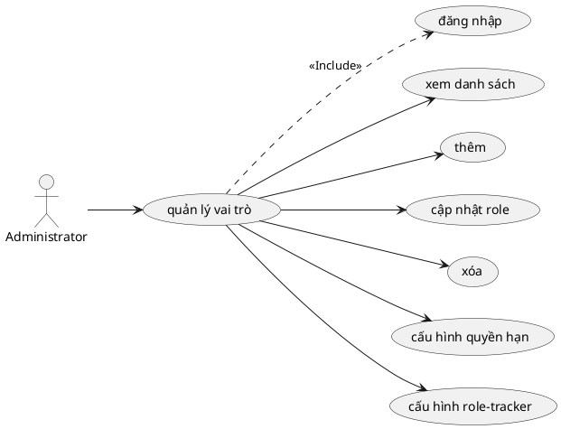

# Use Case: Quản lý Vai trò & Phân quyền

Chi tiết chức năng định nghĩa Roles và Permissions.

## Đặc tả Use Case: Quản lý Vai trò & Phân quyền (UC-003)

| Mục | Nội dung |
| :--- | :--- |
| **Tên Use Case** | Quản lý Vai trò & Phân quyền (Role & Permission Management) |
| **Mô tả** | Cho phép Administrator định nghĩa các Vai trò (Role) trong hệ thống và thiết lập ma trận Quyền hạn (Permissions) chi tiết cho từng vai trò đó để kiểm soát truy cập. |
| **Tác nhân chính** | Administrator (Quản trị viên) |
| **Tác nhân phụ** | Hệ thống (Kiểm tra quyền truy cập runtime) |
| **Tiền điều kiện** | - Đã đăng nhập với tài khoản Administrator. |
| **Đảm bảo thành công** | - Cấu hình quyền hạn mới được áp dụng ngay lập tức cho tất cả người dùng đang nắm giữ vai trò đó. |

### Chuỗi sự kiện chính (Main Flow)

**Ngữ cảnh:** Trang Administration -> Roles & Permissions.

#### A. Quản lý danh sách Vai trò (CRUD Role)
1.  **Administrator** xem danh sách các Role hiện có (ví dụ: Manager, Developer, Reporter).
2.  **Administrator** chọn "Tạo vai trò mới" (Create new role).
3.  **Hệ thống** hiển thị form nhập Tên vai trò.
4.  **Hệ thống** cung cấp tùy chọn: "Copy workflow từ vai trò khác" để tiết kiệm thời gian cấu hình.
5.  **Administrator** nhấn "Lưu".

#### B. Cấu hình Quyền hạn (Permissions Matrix)
6.  **Administrator** nhấn vào "Permissions Report" hoặc "Cấu hình quyền" của một Role.
7.  **Hệ thống** hiển thị danh sách tất cả các quyền (Permissions) được chia theo nhóm chức năng:
    *   **Project:** Create project, Edit project...
    *   **Task:** View tasks, Add tasks, Edit own tasks, Edit others' tasks...
    *   **Time Tracking:** Log time, View time entries...
    *   **Wiki/Documents:** Manage wiki, View documents...
8.  **Administrator** tích chọn (Check) các quyền muốn cấp cho Role này.
9.  **Administrator** nhấn "Lưu".
10. **Hệ thống** cập nhật bảng map `Role_Permissions`.

### Luồng ngoại lệ (Exception Flows)

**E1. Xóa Role đang sử dụng**
*   Nếu Admin cố gắng xóa một Role đang được gán cho bất kỳ thành viên nào trong bất kỳ dự án nào.
*   **Hệ thống** ngăn chặn và báo lỗi: "Không thể xóa vai trò này vì đang có thành viên sử dụng".
*   *Giải pháp:* Admin phải gán lại Role khác cho các thành viên đó trước khi xóa.

### Quy tắc nghiệp vụ (Business Rules)
*   **Non-Admin Roles:** Role được tạo ở đây áp dụng trong phạm vi Dự án (Project-level roles).
*   **System Admin:** Quyền Quản trị viên hệ thống (`is_admin`) là một cờ đặc biệt trên bảng User, không bị quản lý bởi module này (nó vượt qua mọi kiểm tra permission).
