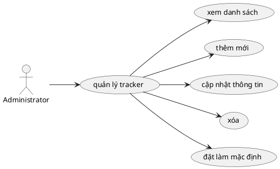

# Use Case: Quản lý Loại công việc (Trackers)

Chi tiết chức năng cấu hình và quản lý các loại công việc (Tracker) trong hệ thống (như Bug, Feature, Support...).

## Đặc tả Use Case: Quản lý Loại công việc (UC-004)

| Mục | Nội dung |
| :--- | :--- |
| **Tên Use Case** | Quản lý Loại công việc (Tracker Management) |
| **Mô tả** | Cho phép Administrator tạo, chỉnh sửa, xóa và cài đặt Tracker mặc định để phân loại task trong hệ thống. |
| **Tác nhân chính** | Administrator (Quản trị viên) |
| **Tiền điều kiện** | - Đã đăng nhập với tài khoản hợp lệ có quyền hệ thống (`isAdministrator = true`). |
| **Đảm bảo tối thiểu** | - Ngăn chặn xóa Tracker nếu đang có task sử dụng. |
| **Đảm bảo thành công** | - Danh sách Tracker được cập nhật, thông tin phản ánh ngay lập tức trên hệ thống để người dùng sử dụng khi giao việc. |

### Chuỗi sự kiện chính (Main Flow)

**Ngữ cảnh:** Trang Configurations -> Trackers (`/settings/trackers`).

#### A. Xem danh sách Tracker
1.  **Administrator** truy cập trang danh sách Tracker. 
2.  **Hệ thống** hiển thị toàn bộ loại công việc sắp xếp theo `position`. Mỗi dòng hiển thị: Tên, Mô tả, Số lượng task đang sử dụng, và Badge "Mặc định" (nếu có).

#### B. Thêm Tracker mới
3.  **Administrator** nhấn nút "Thêm loại công việc" (hoặc Plus icon).
4.  **Hệ thống** hiển thị dòng nhập liệu mới ngay trên đầu danh sách (Inline Form).
5.  **Administrator** nhập Tên (bắt buộc) và Mô tả (tùy chọn), sau đó nhấn "Lưu".
6.  **Hệ thống (API POST /api/trackers)**:
    *   Tự động tính toán giá trị `position` (tăng dần).
    *   Lưu vào DB. Nếu là mặc định, sẽ clear default các Tracker khác.
7.  **Hệ thống** ẩn form nhập và thêm Tracker vào danh sách giao diện.

#### C. Cập nhật Tracker
8.  **Administrator** nhấn vào biểu tượng Sửa (Pencil) tại dòng Tracker muốn đổi.
9.  **Hệ thống** chuyển dòng đó thành form nhập liệu (Inline View).
10. **Administrator** cập nhật thông tin và nhấn "Lưu".
11. **Hệ thống** gọi `PUT /api/trackers/[id]` để lưu lại bản ghi.

#### D. Đặt Mặc định (Set Default)
12. **Administrator** nhấn "Đặt mặc định" tại một Tracker trong danh sách.
13. **Hệ thống** cập nhật qua backend (`PUT /api/trackers/[id]` kèm `isDefault = true`). Khi đó backend tự động bỏ cờ `isDefault` của báo cáo cũ đang là mặc định để đảm bảo tính duy nhất.
14. **Hệ thống** cập nhật lại Badge "Mặc định" cho đúng đối tượng.

#### E. Xóa Tracker
15. **Administrator** nhấn icon Xóa (Trash) trên dòng Tracker cần xóa.
16. **Hệ thống (Frontend)** hiển thị hộp thoại cảnh báo: "Bạn có chắc muốn xóa tracker [tên]? Thao tác này không thể hoàn tác."
17. **Administrator** nhấn "Xóa ngay".
18. **Hệ thống (API DELETE /api/trackers/[id])**:
    *   Kiểm tra nếu Tracker này đang được gán cho Task nào không (`taskCount > 0`). Nếu có, trả về 400 Bad Request.
    *   Trường hợp không có task, thực hiện xóa Tracker khỏi bảng `Tracker`.
19. **Hệ thống** cập nhật lại giao diện và thông báo thành công.

### Luồng ngoại lệ (Exception Flows)

**E1. Xóa Tracker đang được sử dụng**
*   *Rẽ nhánh tại bước E18 (hoặc E16 nếu Frontend tự check).*
*   Nếu có task đang dùng Tracker, hệ thống thông báo lỗi: `"Không thể xóa tracker đang được sử dụng bởi [N] công việc"`.
*   *Giải pháp:* Administrator cần cập nhật/sửa các Tracker của task đó sang Tracker khác mới được xóa.

**E2. Không điền tên khi Thêm/Sửa**
*   *Rẽ nhánh tại bước B5 hoặc C10.*
*   Nếu Administrator bỏ trống tên, nút Lưu trên UI (`disabled={... || !formData.name.trim()}`) sẽ bị vô hiệu hóa, ngăn chặn gửi lên Backend.

### Quy tắc nghiệp vụ (Business Rules)
*   **Mặc định:** Hệ thống chỉ có 1 Tracker đóng vai trò mặc định cùng lúc.
*   **Quyền hạn cấu hình:** Các thao tác (POST, PUT, DELETE) này trên API đều được bảo vệ bởi middleware `withAdmin`, chỉ Administrator mới có quyền thao tác.
