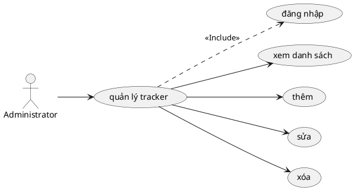

# Use Case: Quản lý Loại công việc (Trackers)

Cấu hình các loại công việc trong hệ thống (Bug, Feature, Support...).

```plantuml
@startuml
left to right direction
actor "Administrator" as Admin

usecase "đăng nhập" as UC_Login
usecase "quản lý tracker" as UC_ManageTracker

' Các use case con
usecase "xem danh sách" as UC01
usecase "thêm" as UC02
usecase "sửa" as UC03
usecase "xóa" as UC04

Admin --> UC_ManageTracker

UC_ManageTracker --> UC01
UC_ManageTracker --> UC02
UC_ManageTracker --> UC03
UC_ManageTracker --> UC04

UC_ManageTracker ..> UC_Login : <<Include>>

@enduml
```
