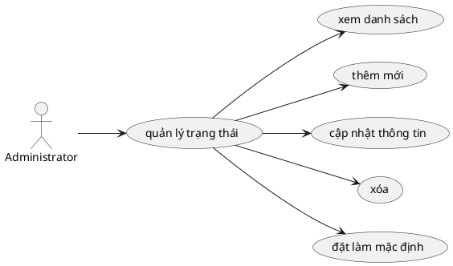

# Use Case: Quản lý Trạng thái (Statuses)

Cấu hình các trạng thái của quy trình (New, In Progress, Done...).

```plantuml
@startuml
left to right direction
actor "Administrator" as Admin

usecase "quản lý trạng thái" as UC_ManageStatus

' Các use case con
usecase "xem danh sách" as UC01
usecase "thêm mới" as UC02
usecase "cập nhật thông tin" as UC03
usecase "xóa" as UC04
usecase "đặt làm mặc định" as UC05

Admin --> UC_ManageStatus

UC_ManageStatus --> UC01
UC_ManageStatus --> UC02
UC_ManageStatus --> UC03
UC_ManageStatus --> UC04
UC_ManageStatus --> UC05

@enduml
```
