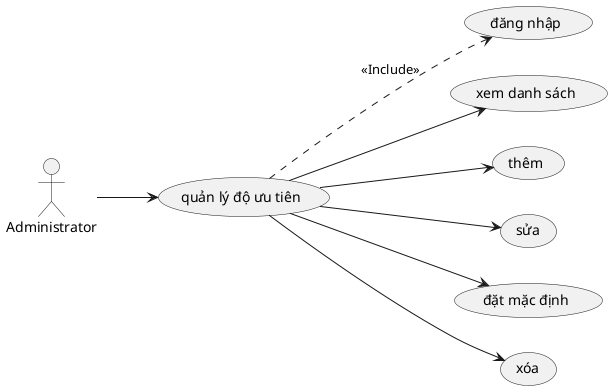

# Use Case: Quản lý Độ ưu tiên (Priorities)

Cấu hình các mức độ ưu tiên (Low, Normal, High, Urgent...).

```plantuml
@startuml
left to right direction
actor "Administrator" as Admin

usecase "đăng nhập" as UC_Login
usecase "quản lý độ ưu tiên" as UC_ManagePriority

' Các use case con
usecase "xem danh sách" as UC01
usecase "thêm" as UC02
usecase "sửa" as UC03
usecase "đặt mặc định" as UC04
usecase "xóa" as UC05

Admin --> UC_ManagePriority

UC_ManagePriority --> UC01
UC_ManagePriority --> UC02
UC_ManagePriority --> UC03
UC_ManagePriority --> UC04
UC_ManagePriority --> UC05

UC_ManagePriority ..> UC_Login : <<Include>>

@enduml
```
